ISTQB 初级参考书

V1.0

2019年

SWTBOK的ISTQB初级参考书小组编著

**版权说明**

本参考书是针对ISTQB初级大纲2018版本而编写的。ISTQB大纲版权归ISTQB所有，可以在ISTQB官方网站下载。

本参考书旨在帮助大家更好的学习ISTQB初级大纲的内容，在尊重和注明来源的情况下，可以自由的使用和传播。

本参考书编写过程中，参考了大量的资料。文中尽可能的将所有参考的资料的来源做了标注。但是仍然可能存在一些遗漏的地方，如果对此有异议，可以及时联系我们进行更新。

本参考书会持续更新，最新版本的获得方式参见联系方式。

**历史记录：**

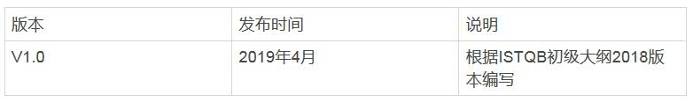

**作者（以姓名拼音顺序）：**

V1.0的作者包括：董昌丽、黄蓺戈、林海、马均飞、史颜英、涂春燕、王丽丽、许颖媚、袁道合、周广昌

**联系方式：**

本文档主要用于个人学习用途。因为测试知识的广泛性以及编者的局限，我们无法保证本参考书的完全正确，请广大读者以“测试”的视角来阅读。如果大家有任何意见，可以通过以下两种方式联系我们：

1.  知乎上关注我们：https://www.zhihu.com/people/swtbok

2.  加入QQ群：群号217032022

1 软件测试基础

**关键字**

覆盖率（coverage）， 调试（debugging）， 缺陷（defect），错误（ error），
失效（failure）， 质量（quality）， 质量保证（quality assurance），根本原因（
root cause）， 测试分析（test analysis）， 测试依据（test basis），
测试用例（test case）， 测试完成（test completion），测试条件（ test
condition）， 测试控制（test control）， 测试数据（test data）， 测试设计（test
design）， 测试执行（test execution）， 测试执行进度（test execution
schedule）， 测试实现（test implementation）， 测试监视（test monitoring），
测试对象（test object）， 测试目标（test objective）， 测试准则（test oracle），
测试计划（test planning）， 测试规程（test procedure）， 测试套件（test
suite）， 测试（testing）， 测试件（testware）， 可追溯性（traceability），
确认（validation）， 验证（verification）

**软件测试基础的学习目标**

**1.1 什么是测试**

FL-1.1.1 (K1)识别典型的测试目标

FL-1.1.2 (K2)区分测试和调试

**1.2 为什么需要测试**

FL-1.2.1 (K2)举例说明为什么测试是必须的

FL-1.2.2 (K2)描述测试和质量保证的关系，并举例说明测试如何提高质量

FL-1.2.3 (K2)区分错误、缺陷和失效

FL-1.2.4 (K2)区分缺陷的根本原因和它的影响

**1.3 七个测试原则**

FL-1.3.1 (K2)解释七个测试原则

**1.4 测试过程**

FL-1.4.1 (K2)解释测试过程的上下文的影响

FL-1.4.2 (K2)描述测试过程中的活动和相关任务

FL-1.4.3 (K2)区分支持测试过程的工作产品

FL-1.4.4 (K2)解释维护测试依据和测试工作产品之间的可追溯性的价值

**1.5 测试心理学**

FL-1.5.1 (K1)识别影响测试成功的心理因素

FL-1.5.2 (K2)解释测试活动和开发活动所需要的思维的不同

*1.1 什么是测试*

从商业应用（例如：银行）到消费类产品（例如：汽车），软件系统已经成为人们生活的一部分。很多人都经历过软件没有按照预期工作的情况。软件没有正常工作会导致各种各样的问题，例如：金钱、时间或者商誉的损失，更有甚者会导致人员的伤亡。软件测试是评估软件并降低软件在运行过程中发生失效风险的一种方法。

对测试的一个常见误解是认为测试只包括测试执行，即执行软件并检查结果。正如1.4节中所描述的，软件测试是由多个不同测试活动组成的过程，测试执行（包括结果检查）只是这些活动中的一个。测试过程还包括很多活动，例如：测试计划、分析、设计和实现，报告测试进度和结果，以及评估测试对象的质量。

如果测试涉及被测试组件或系统的执行，该测试称为动态测试。如果测试不涉及被测试组件或系统的执行，这样的测试称为静态测试。因此，测试也包括评审工作产品，例如：需求、用户故事和源代码等。

对测试的另外一个常见误解是它只关注需求、用户故事或者其它规格说明的验证。虽然测试确实涉及检查系统是否满足特定的需求，但是测试还涉及确认，即检查系统是否满足用户和其它利益相关者在其运行环境下的要求。

不同生命周期中，测试活动的组织和执行是不同的（见2.1节）。

1.1.1 典型的测试目标

软件测试在过去几十年里有了长足的发展。整个历史可以追溯到计算机起源的时候。根据David和Bill在1988年的文章的总结，软件测试的历史可以分为以下几个时期：

-   1956年前 --
    以调试为目的：这个时期，测试并没有被单独从开发活动中区分开来，和测试相关的活动更多的以调试的形式出现的；

-   1957年到1978年 --
    以证明为目的：这个时期，测试和调试已经分开了，测试的主要目的是为了证明软件是能够工作的；

-   1979年到1982年 --
    以破坏为目的：这个时期开始的标识是Myer出版的《软件测试艺术》一书，在书中Myer明确提出发现缺陷是软件测试的目的；

-   1983年到1987年 --
    以评估为目的：这个时期，测试用于对被测试的软件或者系统进行评估，进而提供各种有用的信息；

-   1988年以后 --
    以预防为目的：这个时期开始，越来越多的测试活动前移，更多的从需求和设计阶段就开展相关的测试活动。

David Gelperin， Bill Hetzel， THE GROWTH OF SOFTWARE TESTING， 1988

从不区分测试和调试，到通过测试来预防缺陷，软件测试得到了非常大的发展，期间各种测试技术、工具和思想大量涌现。

从测试目标这个角度来说，了解了上面的软件测试的历史后，我们应该可以更好的理解测试目标的多样性。不同的项目中测试的目标可能是不同的。即使同一个项目中，测试也可以有多个目标。针对任何给定项目，其测试目标可能包括：

-   评估工作产品，例如：需求、用户故事、设计和代码

-   验证是否已满足所有描述的需求

-   确认测试对象是否完整，并按照用户和其它利益相关者的预期工作

-   建立对测试对象质量级别的信心

-   预防缺陷

-   发现失效和缺陷

-   为利益相关者提供足够的信息帮助他们做出合适的决定，尤其是考虑测试对象的质量级别

-   降低软件质量低下的风险级别（例如：运行环境中出现了之前未被发现的失效）

-   符合合同、法律或者法规的需求或者标准，和/或验证测试对象符合这些需求或者标准

测试的目标可以有所不同，这取决于被测组件或系统的上下文、测试级别和软件开发生命周期模型。例如：

-   组件测试时，一个目标可能是发现尽可能多的失效，以便及早识别和修复潜在的缺陷。另一个目标可能是增加组件测试的代码覆盖率。

-   验收测试时，一个目标可能是确认系统按照预期工作并满足要求。测试的另一个目标可能是向利益相关者提供在指定时间发布系统的风险信息。

1.1.2 测试和调试

软件调试（debug）是软件实现过程的一部分，与软件编码过程同步进行。软件调试的目的是保证程序正常运行，排除编码的语法、语义和逻辑错误，保证程序稳定运行，并符合设计要求。软件调试的特点包括：

-   软件调试主要是程序员自己参与，对程序（设计、编码）进行修改、排除错误，主要是在开发阶段；

-   具体的调试任务没有办法提前计划，具有随机性，不受时间约束，是开发人员为了程序可运行而进行的，其进度不可度量；

-   调试的对像只能是代码；

-   调试从未知的条件开始，其结局不可预知；

-   调试时，开发人员能利用的工具主要是调试器；

-   调试必须由了解详细设计的开发人员完成。 

软件测试（test）是检验程序的手段，在软件编码基本完成后进行，分模块测试和整体测试。目的是保证程序的功能符合要求，排除设计错误，对程序进行系统全面的检查，保证程序整体的功能、性能和可靠性等。相对于软件调试，软件测试的特点包括：

-   软件测试是软件测试人员和程序员都参与的一项工作，是贯穿整个生命周期的；

-   软件测试可以计划，可以预先制定测试用例和过程，工作进度可以度量；

-   测试的对像可以是文档和代码；

-   软件测试从一个已知的条件开始，有预知的结局；

-   大量的测试的执行和设计可以由工具支持；

-   测试经常是由独立的测试组完成。

*1.2 为什么需要测试*

**1.2.1 测试对成功的贡献**

由软件缺陷所导致的事故在人们的生活中并不少见，网站承受不了大量用户访问而奔溃；ATM机由于提款机内部软件缺陷导致用户提款操作失败，但是帐户上的余额却被意外的扣除；还有大家非常熟悉的手机，由于手机软件缺陷导致手机经常死机或者通话中断的现象比比皆是，不仅影响了用户的正常使用，而且一定程度上降低了商家的信誉度。可见，日常生活中软件缺陷无处不在，由它导致的不良后果也在时刻影响着人们的方方面面，因此，软件测试的重要性不容忽视。

2013年美国联邦政府的在线保险网站已经成为IT领域出错的一个典型事件。这次事件已经不单单是一次简单的停机事件。该故障导致了一系列的硬中断和软中断，最终使该网站的功能几乎全部丧失。联邦政府曾尝试增加更多硬件设施来做弥补，但该网站在十二月初直到奥巴马管理的“IT团队”正确定位软件和解决数据瓶颈时才恢复其功能。之后，又通过正式成立医疗改革法案以及政治审查，该网站的性能才趋于完备。恢复之后的网站在一些会导致系统崩溃的关键点上加强了防备。

http://server.zdnet.com.cn/server/2014/0103/3007608.shtml，2013年度全球市场十大服务器宕机事件

在IT的整个历史中，软件和系统投入运行后，由于存在缺陷，随后导致故障或无法满足利害关系方的需要，这种现象很常见。但是，使用适当的测试技术可以减少这种有问题交付的频率，只要这些技术是在适当的测试技能、适当的测试级别和软件开发生命周期的适当时间点上应用的。例如：

-   测试人员参与需求评审或用户故事优化能够发现这些工作产品中的缺陷。识别并移除需求中的缺陷能够降低开发错误或者功能出问题的风险。

-   在系统设计时，测试人员与系统设计人员紧密合作，可以提高双方对设计和如何测试的理解。这种理解的增加可以减少基本设计出现缺陷的风险，并能在早期识别相关的测试。

-   在开发代码时，测试人员与开发人员紧密合作，可以提高各方对代码的理解和掌握如何测试代码。这种理解的增加可以降低代码和测试中出现缺陷的风险。

-   测试人员在发布前验证和确认软件能够发现可能被遗漏的缺陷，并为解决导致失效的缺陷相关的过程（例如：调试）提供支持。这样可以提高软件满足利益相关者的要求和满足需求的可能性。

除了上述例子，满足定义的测试目标（见1.1.1节）有助于整个软件开发和维护的成功。

1.2.2 质量保证和测试

在招聘网站上，我们经常看到招聘测试工程师和质量保证工程师的职位描述几乎是一样的。很多公司把测试人员和质量保证人员的职责等同起来。这种称呼其实是不准确的。软件测试人员的一项重要任务是提高软件质量，但不等于说软件测试人员就是软件质量保证人员，因为测试只是软件质量保证工作中的一个环节。软件质量保证和软件测试是软件质量工程的两个不同层面的工作。

软件质量保证的重要工作是通过预防、检查与改进来保证软件质量。在软件质量保证的活动中也有一些测试活动，但所关注的是软件质量的检查与测量。软件质量保证的工作是在软件生命周期中管理以及检查软件是否满足规定的质量和用户的需求，因此主要着眼于软件开发活动中的过程、步骤和产物，而不是对软件进行剖析找出问题或评估。软件质量保证的另一个工作是帮助建立软件质量标准、评审的过程和方法以及测试过程的建立。同时跟踪、审计和评审软件开发和测试过程中发现的问题，从而帮助改进开发过程和测试过程。质量保证的主要工作内容包括：

-   建立软件质量保证活动的实体

-   制订软件质量保证计划

-   坚持各阶段的评审和审计，跟踪其结果，并进行合适的处理

-   监控软件产品的质量

-   收集和分析软件质量保证活动的数据

-   度量软件质量保证活动

软件测试关心的不是过程的活动，而是对过程的产物以及开发出的软件产品进行剖析。测试人员对软件产品进行动态测试，以及对过程中的工作产品，比如需求文档、设计文档和源代码进行静态测试，以找出问题，从而评估软件产品质量。测试人员必须假设软件存在潜在的问题，测试中所作的操作是为了找出更多的问题，而不仅仅是为了验证每个功能或者需求条目是否正确。对测试中发现的问题的分析、跟踪与回归测试也是软件测试中的重要工作。软件测试的主要阶段包括：

-   测试计划

-   测试监控

-   测试分析

-   测试设计

-   测试实现

-   测试执行

-   测试结束

通过测试可以发现软件系统在各方面存在的缺陷，包括功能和非功能需求方面的缺陷。当测试发现很少或者没有发现缺陷的时候，就会对软件的质量充满信心。一个设计正确、合理的测试完成并顺利通过，可以降低整个系统存在问题的风险。而对测试过程中发现的缺陷进行修正，则可使软件系统的质量提高。所以说，软件测试是提高软件质量的一个重要手段。

1.2.3 错误、缺陷和失效

这一节主要是描述ISTQB中涉及到的三个术语，错误、缺陷和失效之间的区别。一说起术语，大家可能就头疼。感觉这个是偏理论，没什么用处。刚开始的时候，很多人都有这样的想法。但是学习多了后发现，在有些时候术语还是有用的。有了术语和它的定义，能够保证大家在聊一些话题的时候，避免了“鸡同鸭讲”的情况。例如：“性能测试”，大家可以互相问问看。不同的人理解可能都是不同的。回到这节的主题，我们来看一下这三个术语之间到底有什么区别。

每个人都会犯错误（Error、Mistake），而错误会导致在软件代码或者其他一些相关工作产品中引入缺陷（defect、fault或bug）。导致在一个工作产品中引入缺陷的错误可以触发另外一个导致相关工作产品中引入缺陷的错误。例如：需求引发的错误会导致需求缺陷，进而引起编程错误导致代码中存在缺陷。

代码中的缺陷如果被执行，可能会导致一个失效，但并不是所有情况都是这样的。例如：有些缺陷需要特定输入或前提条件才会触发失效，因此极少甚至从来没有发生。

很多原因都会导致错误的发生，例如：

-   时间压力

-   人类的易错性

-   没有经验或者技能不足的项目参与者

-   项目参与者之间沟通不畅，包括需求和设计的错误沟通

-   代码、设计、架构、待解决的问题和/或使用的技术的的复杂性

-   错误理解系统间和系统内的接口，尤其是在系统内和系统间交互频繁时

-   新的、不熟悉的技术

除了代码中的缺陷会导致失效外，环境因素也会导致失效。例如：辐射、电磁场和污染会导致固件中的缺陷，或者通过改变硬件条件影响软件的执行。

并非所有非预期的测试结果都是失效。由于测试执行的方式错误，或者由于测试数据、测试环境或其他测试件的缺陷，或由于其他原因，也可能会发生误报（假阳性False
Positives）。反之亦然，也可能会导致漏测（假阴性False
Negatives）。漏测是测试没有发现它应该发现的缺陷；而误报是报告的缺陷实际上不是真正的缺陷。

1.2.4 缺陷、根本原因和影响

缺陷的根本原因是导致缺陷的那些最早出现的行动或者条件。通过分析缺陷识别他们的根本原因，可以减少将来出现类似缺陷的可能性。通过关注最重要的根本原因，根本原因分析可以触发流程改进进而很好的预防未来的缺陷的引入。

对缺陷根本原因的分析是一个刨根问底的过程。很多时候，我们对缺陷的分析可能还是停留在表象，没有真正获得最早的引起缺陷的问题。举个生活中的例子，当某个小学生数学考试分数不高，在进行考后分析的时候，我们经常会发现，很多计算题不是不会做，而是因为”粗心“。看起来”粗心“是一个非常明显的造成数学计算错误的原因。但是”粗心“真的是根本原因吗？为什么有的同学”粗心“多，有的”粗心“少？简单的十以内的加减法为什么不粗心，而100以内的加减法就粗心多呢？再深究的话，你可能会发现，可能是小朋友题目做的少了，需要更多的练习，准确率自然就可以提升了；当然也可能是，小朋友做的题目超过了他这个年龄能够接受的难度了。

在我们平时的测试中，针对发现的缺陷，也同样有一个刨根问底的过程。例如：假设由于一行错误代码导致错误的支付了利息，从而引起客户的抱怨。由于产品负责人错误的理解利息的计算方法，造成了相关的用户故事描述不清，而这段代码就是针对该用户故事的。如果在利息计算中存在大量的缺陷，而这些缺陷的根本原因都是由于类似的误解，那么产品负责人应该通过参加利息计算相关的培训，从而减少将来产生类似缺陷。

这个例子中，客户抱怨就是影响。错误的利息支付是失效。代码中不合适的计算是缺陷，该缺陷来源于模糊不清的用户故事这个初始的缺陷。这个初始缺陷的根本原因是产品负责人缺乏相关知识，从而导致他在编写用户故事时犯了错误。根本原因分析的流程在ISTQB-ETM专家级测试管理大纲和ISTQB-EITP专家级改进测试流程大纲进行了讨论。

*1.3七个测试原则*

在过去的50年里，有很多关于测试原则的建议，它们为所有的测试提供了通用的指导。

**1. 测试显示缺陷的存在，而不是显示不存在缺陷**

当刚开始看到这个原则的时候，第一反应可能是：这个原则不是废话嘛！测试肯定可以显示缺陷的存在啊！测试了，发现缺陷了，自然就显示了缺陷的存在；同时测试当然不可能说明系统不存在缺陷了，缺陷是没办法全部消灭的。但是如果看一下这个原则的由来，可能有会有不同的想法。

这个原则最早是由Edsger W.
Dijkstra在1969年提出来的（https://en.wikiquote.org/wiki/Edsger_W._Dijkstra），他还获得过图灵奖。由于离现在的时间太久，我们可能很难理解当时对于测试的看法。但要是告诉你，提出发现缺陷是软件测试的一个主要目的，是在1979年的话，你可能会有不同的感受。这个原则提出的时候，整个测试领域都还没有把发现缺陷作为主要目的之一，在20世纪60年代，整个软件工程对于测试的理解还远远没有现在这么透彻的情况下，能提出这样的原则是非常有前瞻性的。

测试能够显示缺陷的存在，但是不能证明不存在缺陷。测试降低了软件中遗留的缺陷未被发现的可能性，但是即使没有发现缺陷，也不能证明软件是完全正确的。

Dijkstra (1969) J.N. Buxton and B. Randell， eds， Software Engineering
Techniques， April 1970， p. 16. Report on a conference sponsored by the NATO
Science Committee， Rome， Italy， 27–31 October 1969.

**2. 穷尽测试是不可能的**

现在的各种软件系统越来越庞大，功能也越来越复杂，我们非常容易就可以理解到穷尽测试是不可能的。

就以最简单的一个用户名和密码登录为例吧。很多网站都需要通过用户名和密码登录，如果我们要穷尽测试需要多少个测试用例？

-   用户名和密码可以是英文字母、数字、各种符号，英文字母还可以分大小写，还可能支持中文

-   需要测试字母、数字、符号和中文的各种组合

-   需要针对不同的长度的用户名和密码进行组合

-   还要测试各种异常情况，就算密码只支持8位，那么9位、10位，甚至65535位，有机会的话这些异常情况是否也应该测试呢

这么一算，要想穷尽测试，这里要测试的测试用例用”亿“做单位都觉得太渺小了。现实生活中比用户名和密码还简单的测试恐怕不多了。

这个原则非常重要，它不仅告诉我们可能的测试很多，我们没有办法穷尽它，还告诉我们根据这个原则测试团队应该不断的对测试活动进行改进，以利用现有资源尽可能的进行最有价值的测试。很多软件测试的思想和技术都是由这个原则引起的：

-   风险分析：相对于测试所有的可能，通过风险分析，让测试关注在高风险的地方，从而达到投资回报最优

-   各种测试技术：对输入数据进行等价类的划分，区分白盒中的不同的覆盖率（语句覆盖、分支覆盖等）

-   各种开发实践：使用更好的编程规范，例如：尽量减少用户输入不可控的字符，而是用选择框来取代，典型的像输入日期，相对于让用户可以输入的文字框，下拉列表显然更好的避免了各种错误格式的输入

**3. 尽早测试以节约时间和成本**

为尽早发现缺陷，应该尽可能早的在软件开发生命周期的前期开始静态和动态测试。尽早测试有时称为前移。在软件生命周期的早期进行测试有助于减少或者消除高成本的变更（见3.1节）。

很多数据都说明在早期发现并修复缺陷的成本较低。图1.3-1就是其中之一。我们不用纠结于产品发布后发现修复缺陷的成本是否正好是需求阶段发现和修复缺陷的一百倍。但是凭借我们的常识就可以认识到尽早测试对于缺陷发现和修复成本的降低是非常有意义的。假如在需求评审时发现一个缺陷，可能只需要对文字进行更详细的补充说明就可以了，甚至一个人一小时的工作量都不要；但是如果需求阶段的缺陷，遗留到客户现场，可能造成用户的损失、客户支持费用、开发的返工等，恐怕都不是以人天为单位来计算了。

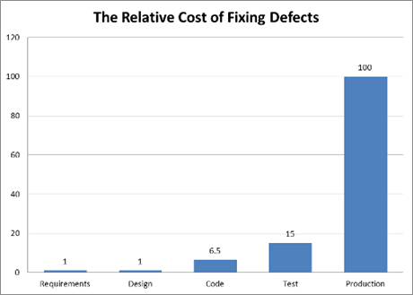

图1.3-1 不同阶段修复缺陷的相对成本

Rosenberg， L.， Hyatt，L.， Hammer， T.， Huffman， L. and Wilson， W. (1998)
Testing Metrics for Requirement Quality， presented at the Eleventh
International Software Quality Week， San Francisco， CA.

尽早测试的另外一个原因是，很多缺陷其实都是来自于需求，可能是需求不完整、遗漏等。根据图1.3-2所示的统计数据，有超过一半的缺陷其实都是来源于需求，真正在代码阶段引入的缺陷只有7%。所以测试必须尽早开展，从需求阶段就应该开始静态测试。

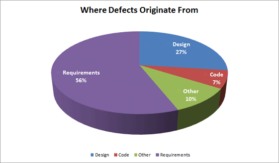

图1.3-2 缺陷的来源

Ramachandran， M. (1996) Requirements-Driven Software Test: Process-Oriented
Approach， ACM SIGSOFT Software Engineering Notes， Vol. 21， Issue 4， pp. 66 –
70.

**4. 缺陷集群效应**

二八定律又名80/20定律、帕累托法则（Pareto‘s
principle）也叫巴莱特定律、朱伦法则（Juran's Principle）、关键少数法则（Vital
FeRule）、不重要多数法则（Trivial Many
Rule）最省力的法则、不平衡原则等，被广泛应用于社会学及企业管理学等。是19世纪末20世纪初意大利经济学家帕累托发现的。他认为，在任何一组东西中，最重要的只占其中一小部分，约20%，其余80%尽管是多数，却是次要的，因此又称二八定律。([https://baike.baidu.com/item/二八定律](https://baike.baidu.com/item/%E4%BA%8C%E5%85%AB%E5%AE%9A%E5%BE%8B))

在测试中也存在这样的二八定律。即80%的缺陷集中在20%的模块中，这就是缺陷集群效应。这里的80%和20%的概念没有那么绝对。但是这种集群效应确实是存在的。我们知道了缺陷的集群效应，可以：

-   事前预测，尽量预防：在产品测试之前，可以根据对开发人员、过程、业务复杂度等方面进行分析，对可能存在缺陷集群的模块进行预测，一方面可以提前和开发人员一起，争取尽早发现缺陷，一方面也可以提前针对可能存在缺陷集群的模块安排更多的测试；

-   事中分析，及时调整：事前的预测可能存在一定的偏差，在测试进行过程中，要不断的对每个模块发现的缺陷进行分析，如果发现了新的缺陷集群，要及时调整测试资源，重点关注这些存在缺陷集群的模块；

-   事后分析，下次改进：整个产品测试完成后，对所有测试过程中发现的缺陷进行分析，对存在缺陷集群的模块，要找到造成缺陷集群的根本原因，从而避免以后的产品出现同样的问题。

**5. 杀虫剂悖论**

杀虫剂悖论是Boris Beizer在他1990年出版的《Software Testing
Techniques》一书中最先提出来的。当农民发现农作物有病虫害的时候，就需要喷洒杀虫剂，以消除病虫害。通常可以杀死绝大部分的害虫，但是非常不幸的是，总会有少量的虫子活下来。存活下来的虫子对该杀虫剂就产生了抗药性，如果来年农民还是用同样的杀虫剂的话，那么对害虫的杀伤力将会大大降低。农民伯伯需要不断地使用新的杀虫剂来对付具有抗药性的害虫，否则农作物就会被害虫吃掉。

杀虫剂悖论对应到软件测试也是一样的。害虫就是测试团队要找到并消灭的缺陷。但是如果测试团队一直使用相同的测试用例，那么显然随着测试用例反复的执行，这些测试用例发现缺陷的效果就会越来越差。当然不仅仅是测试用例存在这样的问题，测试方法和策略也存在同样的问题。随着整个开发团队的能力的不断改进，被测试对象中存在的缺陷也会不断变化，甚至越来越不容易发现。如果反复执行同样的测试，最终这些测试将无法发现任何新的缺陷。为了检测新的缺陷，需要更新测试和测试数据，以及编写新的测试用例。

上面提到的是测试用例，同样的，相同的测试人员测试同一个模块（功能），因长时间测试，形成了思维定式，因此也容易产生懈怠，忽视一些缺陷的存在，也容易导致杀虫剂悖论。解决办法就是采用交叉测试，不同的测试人员，有不同的测试思路和技巧，容易发现被忽视的缺陷。

**6. 测试依赖于上下文**

有个专门的网站是介绍上下文驱动的测试（<http://context-driven-testing.com/>）。下面是其中提到的上下文驱动测试的七个原则：

1.  任何实践的价值依赖于它的上下文。The value of any practice depends on its
    context.

2.  上下文中存在好的实践，但是不存在最佳实践。There are good practices in
    context， but there are no best practices.

3.  一起工作的人是任何项目上下文中最重要的环节。People， working together， are
    the most important part of any project’s context.

4.  随着时间的推移，项目往往以不可预测的方式进行。Projects unfold over time in
    ways that are often not predictable.

5.  产品是一种解决方案。如果对应的问题没有解决，那么这个产品也就没有起作用。The
    product is a solution. If the problem isn’t solved， the product doesn’t
    work.

6.  好的软件测试是一个对智力不断挑战的过程。Good software testing is a
    challenging intellectual process.

7.  只有在整个项目中综合应用判断和技能，我们才能够在正确的时间做正确的事情以有效的测试我们的产品。Only
    through judgment and skill， exercised cooperatively throughout the entire
    project， are we able to do the right things at the right times to
    effectively test our products.

不同上下文需要进行不同的测试。例如：

-   安全关键的工业控制软件的测试和电子商务移动APP的测试：这两个测试的上下文不同，导致他们对测试技术的选择，测试成本的考量等都会不同。工业控制软件需要选择更严格的测试技术，更好的覆盖，而移动App可能对尽快上市有更高的要求；

-   敏捷项目中的测试和顺序生命周期项目中的测试：顺序模型中的测试虽然有不同的级别，但是每个级别通常只运行一次，而敏捷项目中每个级别的测试需要多次运行。其他更多的区别，参见2.1节。

**7. 没有错误的谬论（Absence-of-errors is a fallacy ）**

有些组织期望测试人员能够运行所有可能的测试并发现所有可能的缺陷，但是原则1和原则2告诉我们这是不可能的。此外，期望仅仅通过发现并修复大量的缺陷来保证系统的成功是不现实的。例如：完整测试所有描述的需求并修复所有发现的缺陷，仍然会制造出难以使用的系统，它无法满足用户的需要和期望，或比其他竞争类产品更差。

以当年的手机一哥诺基亚为例，曾经如日中天，在功能机的世界里面无人能敌。但是当智能机出现后，很快诺基亚就迎来来灾难性的销量下滑。这种情况是因为诺基亚的测试人员不努力造成的吗？显然不是。网上有很多段子都是用来“调侃”诺基亚的手机质量很高的，怎么用都不坏，甚至可以当砖头用。但是就是这样的质量，在新的时代到来后，没有及时把握用户需求的变化，没有及时感知时代的变迁，结果在智能手机普及的过程中一败涂地。

为了避免这种情况的发生，一方面测试团队需要从客户的角度来考虑产品，要尽可能的保证开发的产品是满足用户需求的；另外一方面，在整个产品开发过程中，要尽早并不断的收集客户反馈，避免只到整个产品都完成后才和最终用户沟通的情况。敏捷开发在很大程度上就可以达到这个目的。

*1.4测试过程*

为实现既定的测试目标，一些通用的测试活动集合就是测试过程。

1.4.1 基于上下文的测试过程

影响组织测试过程的因素包括但不限于：

-   软件开发生命周期和使用的项目方法

-   考虑的测试级别和测试类型

-   产品和项目风险

-   业务领域

-   运作时的限制，包括但不限于：

    -   预算和资源

    -   时间

    -   复杂度

    -   合同和法规

    -   要求

-   组织的方针和实践

-   要求的内部和外部标准测试过程

-   测试活动和任务

-   测试工作产品

-   测试依据和测试工作产品之间的可追踪性

针对测试依据（包括所有测试级别或类型）定义良好的度量覆盖率标准是非常有意义的。覆盖率标准能够作为关键绩效指标（KPIs）有效的驱动实现软件测试目标的活动。例如：针对移动应用，测试依据包括了需求列表和支持的移动设备列表。每个需求作为测试依据的一个元素，每个支持的设备也是测试依据的一个元素。覆盖率标准可以要求测试依据的每个元素（及元素的笛卡尔乘积）至少有一个测试用例。一旦执行之后，这些测试结果可以告诉利益相关者具体的需求是否满足，以及在支持的设备上是否发现了失效。

1.4.2 测试活动和任务

测试过程包括以下主要的活动组：

-   测试计划

-   测试监控

-   测试分析

-   测试设计

-   测试实现

-   测试执行

-   测试结束

每组活动都由一系列的活动组成，每个活动组中的活动可以包括多个独立的任务，这些任务在不同的项目或者发布中各有不同。此外，尽管很多时候这些活动组从逻辑上看是顺序的，但是它们也常常是迭代实现的。例如：敏捷开发涉及软件设计、构建和测试的小迭代，这些小迭代是基于持续的计划活动基础上持续发生的。因此，在这种开发方式中，测试活动也是迭代持续发生的。即使在顺序开发中，逻辑上顺序的活动也会有重叠、合并、并行或者忽略的情况，因此，通常需要在系统和项目的上下文中对这些主要活动进行裁剪。

**1. 测试计划**

测试计划涉及定义测试目标和在上下文约束下符合测试目标的方法（例如：指定合适的测试技术和任务，制订满足最后期限的测试进度）。测试计划可以根据监控活动的反馈进行更新。

**2.测试监控**

测试监视包括使用测试计划中定义的监控指标持续的将实际进度和计划进度做比较。测试监控涉及采取必要的行动以满足测试计划的目标（随着时间的推移可能会更新）。出口准则的评估可以为测试监控提供支持，出口准则评估在有些生命周期中被称为“完成的定义”。

例如，作为某测试级别的一部分，测试执行的出口准则评估包括：

-   根据指定的覆盖率标准检查测试结果和日志

-   根据测试结果和日志评估组件或系统的质量级别

-   决定是否需要更多的测试（例如：如果原本要求达到一定产品风险覆盖率的测试无法满足覆盖率要求，则需要编写和执行额外的测试）

在测试进度报告中向利益相关者通报测试进度，包括与计划的偏差，以及支持作出停止测试决定所需的信息。

**3.测试分析**

测试分析通过分析测试依据识别可测试的特性并定义相关的测试条件，即测试分析根据可度量的覆盖率标准确定“测试什么”。

测试分析包括以下主要活动：

-   根据所考虑的测试级别分析测试依据，例如：

    -   合同附件/技术附件，例如功能需求、非功能需求；验收测试需要以此为分析依据。

    -   需求规格说明，例如：业务需求、功能需求、系统需求、用户故事、史诗故事、用例，以及类似的指定想要的功能或者非功能组件或系统行为的工作产品；任何测试级别都需要分析需求规格说明，特别是系统测试。

    -   设计和实现信息，例如：系统或软件架构图或文档、设计规格说明、调用流程、建模图（例如：UML或实体关系图）、接口规格说明，以及类似的指定组件或系统结构的工作产品；单元测试、集成测试需要更多的关注设计和实现信息。

    -   组件或系统自身的实现，包括：代码、数据库元数据和查询，以及接口；单元测试和集成测试要更多关注组件的实现。

-   风险分析报告，其中会考虑组件或系统的功能、非功能和结构等方面

-   评估测试依据和测试条目识别各种类型的缺陷，例如：

    -   歧义

    -   遗漏

    -   不一致

    -   不准确

    -   矛盾

    -   多余的语句

-   识别要测试的特性和特性集

-   基于测试依据的分析定义每个特性的测试条件，并进行优先级排序，同时考虑功能、非功能和结构化的特征、其它的商业和技术因素以及风险的级别

-   获得测试依据中每个元素和相关测试条件之间的双向可追溯性

测试分析过程中使用黑盒、白盒和基于经验的测试技术，有助于减少遗漏重要测试条件的可能性，同时也有助于定义更加准确的测试条件。

在有些情况下，测试分析生成的测试条件可以用作测试章程中的测试目标。测试章程是有些基于经验的测试中典型的工作产品。当这些测试目标可以追溯到测试依据时，就可以度量基于经验的测试能达到的覆盖率。

测试分析过程中识别缺陷是一个重要的潜在收益，尤其是在没有使用其它评审过程和/或测试过程和评审过程紧密联系时。测试分析活动不仅验证需求是否一致、表达是否正确和完整，同时可以确认需求是否正确的反映客户、用户和其它利益相关者的需要。例如：像行为驱动开发（BDD）和验收测试驱动开发（ATDD）这样的技术，它们在编码前根据用户故事和验收准则生成测试条件和测试用例，同时也验证、确认和检测用户故事和验收准则中的缺陷（见ISTQB初级敏捷测试大纲）。

**4.测试设计**

测试设计过程中逐步将测试条件生成概要测试用例、概要测试用例集合和其它测试件。因此，测试分析回答“测试什么”的问题，而测试设计回答“如何测试”的问题。

测试设计包括如下主要活动：

-   设计测试用例和测试用例集并划分优先级

-   识别所需的测试数据以支持测试条件和测试用例

-   设计测试环境并识别任何需要的架构和工具

-   获得测试依据、测试条件、测试用例和测试规程之间的双向可追溯性

测试设计过程将测试条件逐步生成测试用例和测试用例集时，通常会使用各种测试技术。

与测试分析一样，测试设计也可能识别测试依据中类似的缺陷类型。同样，测试设计过程中识别缺陷也是一个重要的潜在收益。

**5.测试实现**

测试实现过程将为测试执行创建和/或完成所需的测试件，包括测试规程中测试用例的顺序。因此，测试设计回答“如何测试”的问题，而测试实现回答“运行测试需要的所有东西现在都有了吗？”的问题。

测试实现包括以下主要活动：

-   开发测试规程并划分优先级，创建自动化测试脚本

-   根据测试规程和自动化的测试脚本创建测试套件

-   在测试执行进度表中安排测试套件以保证高效的测试执行

-   构建测试环境（包括测试用具、虚拟化服务、模拟器和其它基础设施），并验证所需的东西都已正确搭建

-   准备测试数据，并确保它正确的加载到测试环境中

-   验证和更新测试依据、测试条件、测试用例、测试规程和测试套件之间的双向可追溯性。

测试设计和实现任务经常集成在一起。

在探索性测试和其它基于经验的测试中，测试设计和实现可能会发生在测试执行中，并记录为测试执行的一部分。探索性测试可以基于测试章程（测试分析输出的一部分），同时探索性的测试在它们设计和实现后立刻执行。

**6.测试执行**

测试执行时，测试套件按照测试执行进度表的安排运行。

测试执行包括以下主要活动：

-   记录测试条目或测试对象、测试工具和测试件的标识和版本

-   通过手工或者测试执行工具执行测试

-   比较实际结果和期望结果

-   分析异常以找到可能的原因（例如：由于代码中的缺陷导致的失效，但也可能是误报）

-   根据观察到的失效报告缺陷

-   记录测试执行的输出（例如：通过、失败、被阻塞）

-   作为针对异常采取的行动或者计划中测试的一部分，重复相关测试活动（例如：执行改正后的测试、确认测试和/或回归测试）

-   验证和更新测试依据、测试条件、测试用例、测试规程和测试结果之间的双向可追溯性。

**7.测试结束**

测试结束活动从已完成的测试活动中收集数据，从而对各种经验、测试件和其它相关信息进行固化。测试结束活动发生在项目里程碑点，例如：软件系统发布时、测试项目完成（或取消）时、敏捷项目迭代完成时（例如：作为回顾会议的一部分）、测试级别完成时，或维护版本完成时。

测试结束包括以下主要活动：

-   检查所有的缺陷报告是否已关闭，为测试执行结束时未解决的所有缺陷创建变更请求或者产品代办列表

-   创建用于和利益相关者沟通的测试总结报告

-   最终确定并归档测试环境、测试数据、测试基础设施和其它测试件，以便将来使用

-   将测试件移交给维护团队、其它项目团队，和/或其它能够从中受益的利益相关者

-   从完成的测试活动中分析经验教训，并确定在将来的迭代、发布和项目中的变更

-   利用收集的信息改进测试过程的成熟度

1.4.3 测试工作产品

创建的测试工作产品属于测试过程的一部分。就像组织实施测试过程的方式存在显著差异一样，测试过程中创建的工作产品、工作产品组织和管理的方式，以及工作产品的名称也是千差万别的。本大纲主要遵循上面提到的测试过程以及在本大纲和ISTQB术语表中描述的工作产品。ISO标准（ISO/IEC/IEEE
29119-3）可以作为测试工作产品的指南。

**1.测试计划工作产品**

测试计划工作产品通常包括一个或多个测试计划。测试计划包括测试依据的信息，而其他测试工作产品通过可追溯性信息与之关联，以及在测试监控时用到的出口准则（或者完成的定义）。

**2.测试监控工作产品**

测试监控工作产品通常包括各种类型的测试报告，包括测试进度报告（持续或者定期生成）和测试总结报告（在各种完成的里程碑点时生成）。所有测试报告应提供与受众相关的截至报告日期的测试进度细节，包括获得测试执行结果后的总结。

测试监控工作产品还应考虑项目管理方面的问题，如任务完成、资源分配和使用以及工作量。

本书第5.3节进一步解释了测试监控以及在这些活动期间生成的工作产品。

**3.测试分析工作产品**

测试分析工作产品包括定义并排好优先级的测试条件，理想情况下这些测试条件可以双向追溯到具体测试依据的条目。针对探索性测试，测试分析可能包括创建测试章程。测试分析也可能发现并报告测试依据中存在的缺陷。

**4.测试设计工作产品**

通过测试设计得到测试用例和测试用例组以覆盖测试分析识别的测试条件。设计没有输入数据和预期结果的概要测试用例，通常是一个好的实践。通过使用不同的具体数据，概要测试用例可以在多个测试周期中复用，同时确保测试用例的范围被充分文档化。理想情况下，每个测试用例可以双向追溯到它所覆盖的测试条件。

测试设计的同时还包括设计和/或识别必要的测试数据、设计测试环境的以及确定基础设施和工具，但是文档化这些结果的详细程度差别很大。

测试分析过程中识别的测试条件会在测试设计过程中得到进一步细化。

**5.测试实现工作产品**

测试实现工作产品主要包括：

-   测试规程和测试规程中的执行顺序

-   测试套件

-   测试执行进度计划

理想情况下，一旦测试实现完成，就可以通过测试用例和测试条件，以及测试规程和测试依据中的条目之间的双向可追溯性，展示测试计划中制定的覆盖标准的实现。

在某些情况下，测试实现涉及使用工具创建工作产品或创建工具所使用的工作产品。例如，服务虚拟化和自动化测试脚本。

测试实现也包括测试数据和测试环境的创建和验证。数据和/或环境验证结果文档化的完整性可能有很大差异。

测试数据用于确定测试用例的输入和预期结果的具体的值。具体的值加上其用法可以将概要测试用例转变成可执行的详细测试用例。在测试对象的不同版本执行时，同样的概要测试用例可以使用不同的测试数据。与详细测试数据关联的详细预期结果，可以通过使用测试准则得到。

探索性测试中，尽管探索性测试（以及对测试依据中特定条目的可追溯性）的文档化程度可能会有很大差异，但一些测试设计和实现工作产品仍会在测试执行阶段生成。

测试分析阶段识别的测试条件，可能会在测试实现阶段得到进一步的细化。

**6.测试执行工作产品**

测试执行工作产品主要包括：

-   文档化每个测试用例或测试规程的状态（例如：准备运行、通过、失败、被阻塞、有意跳过等）

-   缺陷报告

-   文档化测试过程中包含的测试条目、测试对象、测试工具和测试件

理想情况下，一旦测试执行完成，就可以通过与相关测试规程的双向可追溯性来确定和报告测试依据中的每个条目状态。例如：我们可以说哪些需求已经通过了所有计划中的测试，哪些需求存在测试失败和/或与之相关的缺陷，以及哪些需求还有计划中的测试等待运行。这些有助于验证否达到了覆盖标准，并能够以利益相关者可以理解的方式汇报测试结果。

**7.测试结束工作产品**

测试结束工作产品包括测试总结报告、后续项目或迭代的改进行动计划（例如：在项目回顾之后）、变更请求或产品待办条目，以及最终确定的测试软件。

1.4.4 测试依据与测试工作产品的可追溯性

如第1.4.3节所述，测试工作产品和它们的名称差别很大。不管如何变化，为了实施有效的测试监控，在整个测试过程中，必须在测试依据的每个元素和与该元素相关的各种测试工作产品之间建立和保持可追溯性。除了测试覆盖率的评估，好的可追溯性还能支持：

-   分析变更影响：例如建立了从需求到测试用例的可追溯性后，一旦需求有变化，就能够知道有哪些测试用例需要更新

-   使测试可审计

-   包含测试依据元素的状态（例如：通过测试的需求、测试失败的需求和延迟测试的需求），有助于提高测试进度报告和测试总结报告的易理解性

-   以利益相关者可以理解的方式关联测试技术

-   根据业务目标，为评估产品质量、过程能力和项目进度提供信息

有些测试管理工具提供了测试工作产品的模板，该模板与本节概述的部分或全部测试工作产品相匹配。有些组织建立自己的管理系统来组织工作产品并提供他们所需要的信息可追溯性。

*1.5测试心理学*

在整个软件生命周期中，有很多不同的活动，也涉及到很多流程和方法。虽然我们对各种活动进行了很详细的定义，但是具体的执行过程中仍然避不开人的因素。所以测试人员在具体执行的过程中，需要考虑到人的因素，了解一些心理学的知识，对于测试人员理解并解决工作中碰到的一些困难是非常有帮助的。

1.5.1 人类心理学与测试

人类心理学中有个概念叫“确认偏差”（confirmation
bias）。它指的是当一个人已经存在某种信仰或者假设，他会主动搜索、解释和回忆那些有利于解释这个信仰或者假设的信息，而忽略那些不利信息。这是一种认知偏差和归纳推理的系统性错误。

（参见https://en.wikipedia.org/wiki/Confirmation_bias）

人类心理学中存在的确认偏差，会使人们难以接受与目前所持信仰相悖的信息。例如：由于开发人员期望他们的代码是正确的，所以他们的确认偏差使得他很难接受代码是不正确的。这样一方面开发人员自己测试自己代码的时候，经常有盲点；另一方面，当测试人员发现缺陷的时候，开发人员的第一反应就是抵触。这里提到开发人员的确认偏差，并不是要批评开发人员。而是希望测试人员能够更好的面对开发人员的一些反应。其实测试人员自己也存在确认偏差，测试人员无论是制定测试计划，还是编写测试用例，或者提交缺陷报告的时候都同样可能出现确认偏差。这是大部分人的一种正常心理状态。想要完全避免是很困难的，我们要做的是更好的应对。

测试人员经常会提交各种缺陷，或者带来很多关于产品质量的坏消息。这些都可能使得测试人员作为坏消息的传递者而受到指责。

为了应对工作中可能出现的各种负面影响，测试人员除了专心做事以外，也要注意“做人”方面的锻炼。测试人员和测试经理需要有良好的人际交往技巧，以便能够有效地沟通缺陷、失效、测试结果、测试进度和风险，并与同事建立积极的关系。良好的沟通方式包括以下例子：

-   以合作而非争斗的方式开始。提醒大家的共同目标是更高质量的系统。

-   强调测试的收益。例如：对作者而言，缺陷信息可以帮助他们改进他们的工作产品和技能。对组织而言，在测试过程中发现并修复的缺陷将节省时间和金钱，降低产品质量的整体风险。

-   以中立、注重事实的方式传达测试结果和其他发现，而不是批评引入缺陷的人。编写客观和基于事实的缺陷报告和评审意见。

-   设法了解对方的感受以及他们可能对信息作出消极反应的原因。

-   确认对方已理解所说的话，反之亦然。

前面讨论了典型的测试目标（见1.1节）。明确定义正确的测试目标集具有重要的心理影响。大多数人倾向于将他们的计划和行为与团队、管理层和其他利益相关者设定的目标协调一致。测试人员以最小的个人偏见坚持这些目标也很重要。

1.5.2测试人员和开发人员的思维模式

通常认为软件开发是建设性行为，他们的首要目标是设计和构建；而软件测试则是破坏性行为，是寻找开发人员在设计和构建过程存在的问题。

“开发人员可以测试他们自己开发的程序么？”是一个经常被问到的问题。对这个问题没有一个标准的答案。理想情况当然最好是开发人员自己一个人同时完成开发和测试任务，开发人员首先利用建设性的思维设计并开发一个系统，然后用破坏性的思维来验证和确认这个系统。不论这样的人是否广泛存在，但看前后从建设性思维到破坏性思维的切换，就可以想象要求一个开发人员做到这种程度是非常有挑战的。这要求开发人员能够不断的自我颠覆，在一定程度上可以说这是违背人性的。又有谁愿意去寻找自己辛辛苦苦开发出来的系统的错误呢？他们更多的宁愿证明自己的源代码工作如何出色。

开发人员测试的最大弱点在于每个必须测试自己程序的开发人员往往过于乐观。这样就蕴含一种危险：由于开发人员对开发程序比测试更有兴趣，或者测试进行得非常肤浅而忘记了执行合理的测试用例。

如果开发人员引入了一个基础的设计错误，例如：他们对一个概念的描述有误解，那么他们很有可能无法检测出自己的错误。甚至他们都不会想到合适的测试用例去揭示这样的错误。减少这种“对自己错误视而不见”问题的一种可能方法是结对工作，即由同事来检查自己的程序。

当然从另一方面来说，开发人员对自己的测试对象非常了解是它的一个优势。测试时由于不需要再去了解测试对象，因而节省了时间。管理者必须决定是选择对自己错误视而不见的不利条件，还是选择节省时间这种优势。这种决策必须对测试对象的重要程度和相关的失效风险进行综合考虑。

一个独立的测试团队会提高测试的质量和对测试的理解力。测试人员可以毫无偏见的看待测试对象。因为这不是“他们”的产品，而且对于开发人员的可能的假设和误解对测试人员不再是障碍。为了创建测试用例，测试人员会花费相应的时间成本来了解测试对象，然后测试人员具有比较深厚的测试知识基础，这是开发人员一般不具备或者当需要时不得不临时补充的知识。更多关于测试独立性的内容，参加5.1.1节。

就像1.3节中提到的一个关于测试依赖于上下文的原则一样，很多时候并不是一个非黑即白的问题。开发人员自测有自己的优势，也存在一定的局限。所以最终开发人员和测试人员合作是一个非常好的解决方案。当然测试任务的这个平衡点是偏向开发人员一些还是偏向测试人员多一些，显然要根据各个不同的项目场景来决定。

2. 贯穿软件开发生命周期的测试

**关键字**

验收测试(acceptance testing)， alpha测试 (alpha testing)， beta 测试(beta
testing)， 商业现货软件(commercial off-the-shelf (COTS))，
组件集成测试(component integration testing)， 组件测试(component testing)，
确认测试(confirmation testing)， 合同验收测试(contractual acceptance testing)，
功能测试(functional testing)， 影响分析(impact analysis)， 集成测试(integration
testing)， 维护测试(maintenance testing)， 非功能测试(non-functional testing)，
运行验收测试(operational acceptance testing)， 回归测试(regression testing)，
法规验收测试(regulatory acceptance testing)， 顺序开发模型(sequential
development model)， 系统集成测试(system integration testing)， 系统测试(system
testing)， 测试依据(test basis)， 测试用例(test case)， 测试环境(test
environment)， 测试级别(test level)， 测试对象(test object)， 测试目标(test
objective)， 测试类型(test type)， 用户验收测试(user acceptance testing)，
白盒测试(white-box testing)

**贯穿软件开发生命周期的测试的学习目标**

**2.1 软件开发生命周期模型**

FL-2.1.1 (K2)解释软件开发活动与软件开发生命周期中测试活动之间的关系

FL-2.1.2 (K1)识别软件开发生命周期模型必须适应项目和产品特点的原因

**2.2 测试级别**

FL-2.2.1 (K2)
从目标、测试依据、测试对象、典型缺陷和失效、方法和职责的角度比较不同的测试级别

**2.3 测试类型**

FL-2.3.1 (K2)比较功能测试、非功能测试和白盒测试

FL-2.3.2 (K1)认识到功能测试、非功能测试和白盒测试可以在任何测试级别进行

FL-2.3.3 (K2)比较确认测试和回归测试的目的

**2.4 维护测试**

FL-2.4.1 (K2)总结维护测试的触发因素

FL-2.4.2 (K2)描述维护测试中影响分析的角色

*2.1 软件开发生命周期模型*

2.1.1 软件开发和软件测试

为了能够进行适当的测试活动，熟悉常见的软件开发生命周期模型是测试人员职责的重要组成部分。

在任何软件开发生命周期模型中，好的测试都有以下特点：

-   每个开发活动都有对应的测试活动

-   每个测试级别都有与该级别对应的特有测试目标

-   在相应的开发活动中开始对给定的测试级别进行测试分析和设计

-   测试人员参加讨论，以确定和完善需求和设计，并在初稿完成后立即参与评审工作产品(如需求、设计、用户故事等)

无论选择哪种软件开发生命周期模型，测试活动都应该在生命周期的早期阶段开始，以遵循测试尽早介入的原则。

这里将常见的软件开发生命周期模型分类如下：

-   顺序开发模型

-   迭代增量开发模型

顺序开发模型将软件开发过程描述为线性且按照顺序的活动次序。这意味着开发过程的任何阶段都应在前一阶段完成时开始。理论上阶段没有重叠，但在实践中，从下一阶段得到早期反馈是有益的。

**2.1.1.1 顺序开发模型**

**1.瀑布模型**

瀑布模型最早由Winston W.
Royce在1970年提出，在软件工程中占有重要的地位，它提供了软件开发的基本框架。从测试的角度而言，瀑布模型最大的缺点是，测试是软件开发过程中的一个阶段，测试被看做是对软件产品的最终检查，类似于制造业中将产品交付给客户之前的检查。

图2.1.1-1显示了一个传统的瀑布模型，它将软件开发生命周期划分为系统需求(System
Requirment)、软件需求(Software Requirement)、分析(Analysis)、程序设计(Program
Design)、编码(Coding)、测试(Testing)和运行(Operations)七个基本阶段，并且规定了它们自上而下、相互衔接的固定次序，如同瀑布流水，逐级下落。从本质来说，它是一个软件开发架构，开发过程是通过一系列阶段顺序展开的，只有当一个开发阶段完成后，下一个开发阶段才会开始。 

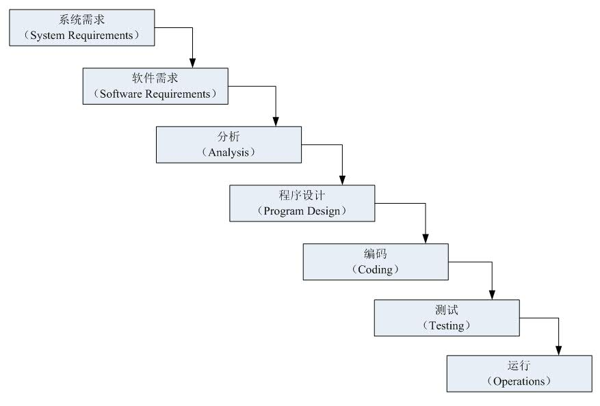

图2.1.1-1 瀑布模型

尽管瀑布模型由于存在一些缺点而招致很多的批评，但是它对很多类型的项目而言依然是有效的。如果瀑布模型能够正确使用，可以节省大量的时间和金钱。是否采用瀑布模型，主要取决于是否能够充分理解客户的需求，以及在项目开发过程中这些需求是否经常发生变更。对于需求经常发生变更的项目，采用瀑布模型是不合适的，这时候就需要考虑其他类型的软件开发生命周期模型。

Royce， W.， Managing the Development of Large Software Systems: Concepts and
Techniques， Proc. IEEE WESCON， 1970

**2.V模型**

与瀑布模型不同，V模型在整个开发过程中集成了测试过程，践行了尽早测试的原则。此外，V模型还包括与每个相应开发阶段对应的测试级别，这进一步支持了尽早测试（关于测试级别的讨论见第2.2节）。在此模型中，与每个测试级别相关联的测试的执行按照顺序方式进行，但在某些情况下会发生重叠。

V模型是瀑布模型的变种，它体现的主要思想是：开发任务和测试任务是相互对等的活动且同等重要。V模型的左右两侧组成字母V的两个边，形象地体现了这一点。V模型的左侧代表软件开发过程，在软件开发过程中，系统是逐步设计完善的，编码是最后一步。V模型的右侧描述了集成和测试的过程，通过不断组合程序组件，形成更大的子系统（集成），并对它们的功能和非功能进行测试。根据这个模型，开发得到的整个系统将以验收测试作为系统集成和测试活动的结束点。

图2.1.1-2显示了由开发活动和测试活动共同组成的一个V模型，V模型主要的开发活动有需求规格说明、系统功能设计、系统技术设计、组件规格说明和编码，相应的测试级别有组件测试、集成测试、系统测试和验收测试。在不同资料中，V模型的左边各个活动可能略有不同，但是其思想都是一致的。其中，构成V模型左侧的活动就是人们熟知的瀑布模型中的活动：

-   需求规格说明：从客户或将来的系统用户中收集，并对它们进行详细描述，最终得到批准的要求和需求。需求规格说明定义了开发系统的目的和需要实现的特性和功能。

-   系统功能设计：将需求映射到系统的功能和框图上。

-   系统技术设计：设计系统的具体实现方式。这个阶段包括定义系统环境的接口，同时将整个系统分解成更小且容易理解的子系统（系统架构），从而可以对每个子系统进行独立的开发。

-   组件规格说明：定义每个子系统的任务、行为、内部结构以及与其他子系统的接口。

-   编码：通过编程语言实现所有已经定义的组件（例如：模块、单元、类）。

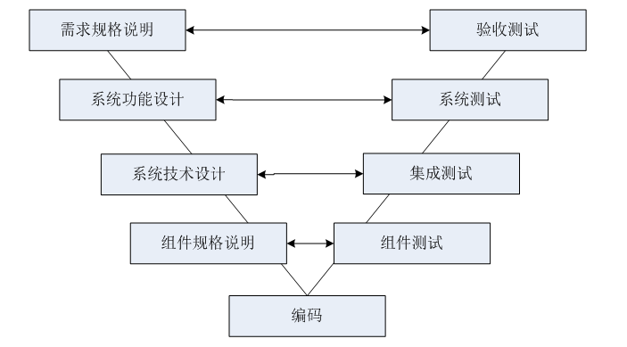

图2.1.1-2 V模型

在V模型中，随着整个构建阶段的进行，软件系统的描述越来越详细。通常来说，在某个构建中引入的错误最容易在本构建阶段中发现。因而，对于每个构建阶段，V模型的右边定义了相应的测试级别。在每个测试级别，都要检查开发的输出是否满足具体的要求，或者是否满足这些特定阶段相关的要求。

-   组件测试：验证软件组件是否按照组件规格说明（详细设计说明）正确执行，即保证每个最小的单元能够正常运行。组件测试一般由开发人员来执行，首先设定最小的测试单元，然后通过设计相应的测试用例来验证各个组件功能的正确性。

-   集成测试：检查多个组件是否按照系统技术设计描述的方式协同工作。集成测试的主要关注点是系统能够成功编译，实现了主要的业务功能，系统各个模块之间数据能够正常通信等。

-   系统测试：验证整个系统是否满足需求规格说明。

-   验收测试：从用户的角度检查系统是否满足合同中定义的需求或者用户需求。

ANDREAS SPILLNER，TILO LINZ，HANS SCHAEFER，SOFTWARE TESTING
FOUNDATIONS，人民邮电出版社，2008-4-1

2.1.1.2 增量开发模型

顺序开发模型交付的软件包含了全套的功能，但通常需要几个月或几年的时间才能交付给利益相关者和用户。增量开发涉及到建立需求、设计、构建和测试部分系统，这意味着软件的特性逐渐增加。这些特性逐步增加的大小各不相同，有些方法增加的大一些，有些方法小一些。增加的特性可以小到对一个用户接口界面的修改或者一个新的查询选项。

这里面首先要说一下“增量”和“迭代”的区别。迭代，就是在实现软件的每一功能时反复求精的过程，是提升软件质量的过程，是从模糊到清晰的过程；而增量，则是强调软件在发布不同的版本时，每次都多发布一点点，是软件功能数量渐增地发布的过程。二者的对比如图2.1.1-3所示。

图2.1.1-3 增量和迭代的区别

https://blog.csdn.net/l12345678/article/details/5642851

现在大部分软件开发其实都是既有增量又有迭代。在日常工作中，这两个概念混用的比较多。

迭代开发发生在多个特性在一系列周期中一起被指定、设计、构建和测试的时候，通常是固定的时间周期。迭代可能涉及到对早期迭代中开发的特性的更改，以及项目范围的更改。每次迭代都交付工作软件，这是整个特性集中不断增长的一个子集，直到最终软件交付或开发停止。

迭代开发的例子包括：

-   Rational统一过程RUP：每次迭代相对较长（例如：两到三个月），特性增加相应较大，例如两组或三组相关特性

-   SCRUM：每次迭代都较短（例如：几个小时、几天或几个星期），相应的特性增加较小，例如一些增强和（或）两三个新特性

-   看板：实现时使用或不使用固定长度的迭代，这种迭代可以在完成时交付单个增强或特性，也可以将特性组合在一起立即发布

-   螺旋式（或原型）：包括创造实验性增量，其中一些可能被大量返工，甚至在后续的开发工作中被放弃

下面介绍一下螺旋模型。螺旋模型由Barry
W.Boehm于1988年提出。螺旋模型是增量迭代开发模型的一种，如图2.1.1-4所示，它兼顾了快速原型迭代的特征以及瀑布模型的系统化与严格监控。螺旋模型最大的特点在于引入了其他模型不具备的风险分析，使软件在无法排除重大风险时有机会停止，以减小损失。在每个迭代阶段构建原型是螺旋模型用以减小风险的途径。螺旋模型更适合大型的系统级的软件应用。

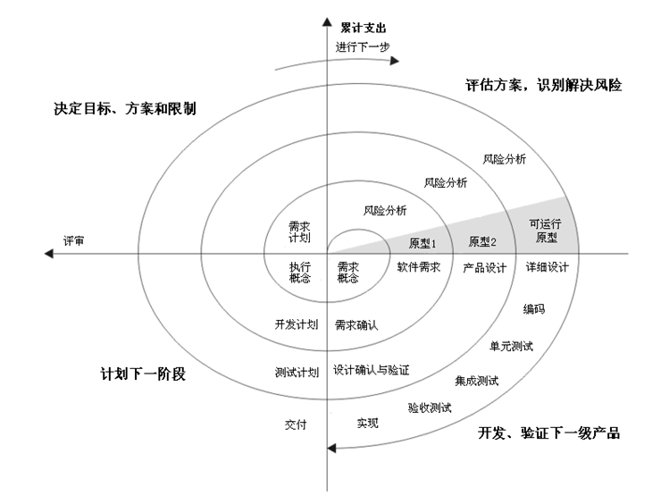

图2.1.1-4 螺旋模型

螺旋模型中一个典型的迭代包括以下步骤：

>   1.   明确本次迭代的目标、备选方案以及应用备选方案的限制；

>   2.   对备选方案进行评估，明确并解决存在的风险，建立原型；

>   3.   当风险得到很好的评估与解决后，应用瀑布模型进行本次迭代的开发与测试；

>   4.   对下一迭代进行计划与部署；

>   5.   项目利益相关者对本次迭代的交付物进行评审，同时检查下一阶段的计划。

螺旋模型的优点是它在引入了风险驱动方法的同时，兼顾了原型开发和瀑布模型等开发模型的优点。在一定条件下，螺旋模型能够演变成其他的开发模型，例如：如果项目获得错误用户接口或无法满足性能需求等方面的风险很低，而同时它在控制成本和进度方面的风险很高的情况，螺旋模型将会演化成瀑布模型。除了这个优点以外，螺旋模型还具有以下优点：

-   可以在项目前期考虑对已经存在的软件进行重用；

-   在软件产品开发过程中考虑了软件质量目标；

-   关注于缺陷预防，并能够尽早的发现缺陷；

-   更好的控制项目活动的资源和相关成本；

螺旋模型在很多领域得到了广泛的引用，但是螺旋模型也存在一定的不足，包括：

-   过分依赖风险评估，一旦在风险管理过程中出现偏差将造成重大损失；

-   过于灵活的开发过程不适合开发者和客户之间有明确合同约定的情况；

该模型本身的文档化和推广需要大量的工作量。

Barry W.Boehm， A spiral model of software development and enhancement ， ACM
SIGSOFT SOFTWARE ENGINEERING NOTES vol 11 no 4 ，Aug 1988

<http://zh.wikipedia.org/wiki/>螺旋模型

在整个开发过程中，使用这些方法开发的组件或系统往往涉及到测试级别的重叠和迭代。理想的情况是，每个特性在交付之前，在多个测试级别上进行测试。在某些情况下，团队使用持续交付或持续部署，这两者都涉及到作为其交付过程一部分的多个测试级别的大量自动化。许多使用这些方法的开发工作量还包括自组织团队的概念，它可以改变测试工作的组织方式以及测试人员和开发人员之间的关系。

这些方法形成了一个不断发展的系统，它可以按照特性、迭代，或者以更传统的主版本发布方式交付给最终用户。无论软件增量是否发布给最终用户，随着系统的增强回归测试变得越来越重要。

与顺序模型不同，增量开发模型可以在几周甚至几天内交付可用的软件，但只能在几个月甚至几年内交付全套需求产品。

有关敏捷开发背景下的软件测试的更多信息，请参见ISTQB-AT基础级敏捷测试扩展大纲。

2.1.2 基于上下文的软件开发生命周期模型

前面的1.3节就提到一个测试原则“测试依赖上下文”。在软件工程的发展历史中，出现了很多的软件开发模型，从刚开始的瀑布模型和V模型等线性模型，到后来的螺旋模型和Scrum等增量迭代模型等。目前有些观点认为越是最新的开发模型越好，这种想法是错误的。不同的模型适合不同的上下文场景。软件开发生命周期模型必须根据项目和产品的特点选择和调整。应根据项目目标、正在开发的产品类型、业务重点(如市场要求时间)以及已识别的产品和项目风险，选择和调整合适的软件开发生命周期模型。例如：小型内部管理系统的开发和测试，应与汽车制动控制系统等安全关键系统的开发和测试有所不同。另一个例子是，在某些情况下，组织和文化问题可能会阻碍团队成员之间的交流，从而阻碍迭代开发。

根据项目的背景，可能需要合并或重组测试级别和/或测试活动。例如：为了将现成的商用现货软件产品集成到更大的系统中，购买者可以在系统集成测试级别（例如：与基础设施和其他系统的集成)和验收测试级别(功能测试和非功能测试，以及用户验收测试和操作验收测试)
上进行互操作性测试。关于测试级别的讨论见第2.2节，关于测试类型的讨论见第2.3节。

此外，软件开发生命周期模型本身也可以合并。例如：V模型可用于开发和测试后端系统及其集成，而敏捷开发模型可用于开发和测试前端用户界面（UI）和功能。在项目早期可以使用原型，在试验阶段完成后采用增量开发模型。

物联网（IoT）系统由许多不同的对象组成，如设备、产品和服务，通常为每个对象应用单独的软件开发生命周期模型。这对物联网系统版本的开发提出了特殊的挑战。另外，这些对象的软件开发生命周期更强调在它们运行使用（例如：运行、更新和退役阶段）之后的软件开发生命周期的后期阶段。

*2.2测试级别*

测试级别是一组共同组织和管理的测试活动。每个测试级别都是测试过程的实例，由1.4节所述的活动组成，在特定软件开发级别上开展，从单元或组件到完整的系统，或在特定情况下的综合系统。测试级别按ISTQB大纲规定有：组件测试、集成测试、系统测试、验收测试，这与V模型（如图2.1.1-2所示）正好一致。

对于每个测试级别，都需要明确：测试的总体目标、测试的依据、测试的对象（即测试什么）、发现的典型缺陷和失效、测试工具的支持（测试工具介绍见第六章）、专门的方法和职责等。

2.2.1 组件测试

组件测试，也就是我们常说的单元测试。首要得搞清楚单元的含义，根据项目和编程语言的不同，单元可能代表的内容也不同，可能是组件、类、函数、代码块、数据结构等。更加清晰的说，单元可以理解成：实现独立的、可测试的特定功能，其粒度根据应用的上下文可大可小，边界也是随着测试设计的深入可以调节。

组件测试的典型测试对象包括：

-   组件、单元或模块

-   代码和数据结构

-   类

-   数据模块

组件测试，最好是将组件隔离出来独立测试，主要关注组件内部的行为，组件之间的接口在这一测试级别不受关注（集成测试考虑的范畴），在测试中，经常会使用到桩、驱动器和模拟器等，这些都不是软件产品的组成部分，而且也是需要一定的开发费用；

组件测试的目标包括：

-   减少风险

-   验证组件的功能和非功能行为是否符合设计和规定

-   建立对组件质量的信心

-   发现组件的缺陷

-   防止缺陷遗漏到更高的测试级别

组件测试依据主要是详细设计，也可依据开发编写的代码、数据模型或者组件规格说明。组件测试的主要关注点也是经常出现错误的点：

-   组件的接口参数：这是组件测试的基础，只有数据能正确流入、流出组件，其他的测试才有意义，而且这也是实际测试中最容易忽略漏测的地方；

-   局部数据结构：例如，不正确或不一致的数据类型声明、未赋值或初始化的变量、变量名拼写错误或不符合编码规范等；

-   独立路径：应对路径进行覆盖测试，例如，保证组件中每条语句至少执行一次，发现误解或者用错了算符优先级、混合类型运算等；

-   控制流相关：例如，不同数据类型对象间的比较、死循环等；

-   出错处理：例如，出错描述难以理解、异常处理不当或者没有处理、显示的异常与实际场景不符合等；

通常情况下，组件测试由开发人员执行，发现的缺陷也可以立即得到修复，不需要正式的缺陷管理。但测试至少需要深入到被测代码中。开发人员可以将组件开发与发现和修复缺陷交替进行。开发人员通常会在编写了组件代码之后编写和执行测试。然而，特别是在敏捷开发中，编写自动化组件测试用例可能先于编写应用程序代码。例如：考虑测试驱动开发（TDD）。测试驱动开发是高度迭代的，基于开发自动化测试用例，构建和集成小段代码，然后执行组件测试，再纠正任何问题并重构代码的循环。该过程一直持续到组件完全构建完成并且所有组件测试都通过为止。测试驱动开发是一个测试优先方法的例子。虽然测试驱动开发起源于极限编程（XP），但它已经推广到了其他形式的敏捷以及顺序生命周期（见ISTQB
-AT基础级敏捷测试扩展教学大纲）。

2.2.2 集成测试

集成测试是对组件之间的接口进行测试，以及测试一个系统内不同部分的相互作用，比如操作系统、文件系统、硬件系统之间的接口。

本文描述的集成测试有两个不同的层次，可以在不同规模的测试对象上进行，具体如下：

-   组件集成测试：通常组件集成测试在组件测试之后进行，也就是说集成测试开展前，组件测试已经完成。如果组件测试未完成或者测试不充分，遗留的问题将会在集成测试阶段付出更大的代价，从而导致集成效果不佳。组件集成通常是自动化的。在迭代和增量开发中，组件集成测试通常是持续集成过程的一部分。

-   系统集成测试：对不同系统之间的相互作用进行测试，一般在系统测试之后。在这种情况下，开发组织/团体通常只能控制自己开发的这部分接口，所以变更可能是不稳定的。按照工作流执行的业务操作可能包含一系列系统，因此跨平台的问题对于系统集成测试至关重要。特别是如今的系统架构设计的越来越复杂，为了业务隔离、容量、效率等考虑划分的子系统以及对外的第三方系统越来越多，这类跨平台的端到端测试能力对功能测试人员提出来了更高的要求。

集成测试的目标主要揭示被集成部分之间的接口、配合或者冲突问题，验证接口功能和非功能行为（接口的处理性能、容量等）是否符合设计和规定。

系统化集成的策略可以根据系统结构（例如自顶向下或自底向上）、功能任务集、事务处理顺序或系统和组件的其他方面等来制定。为了减少在生命周期后期才发现缺陷而产生的风险，集成程度应逐步增加，而不是一下子将系统集成为“Big-Bang”来进行测试。

2.2.3 系统测试

系统测试关注的是在开发项目或程序中定义的一个完整的系统/产品的行为。系统测试的目的是验证最终软件系统是否满足用户规定的需求。

在系统测试中，测试环境应该尽量和最终的目标或生产环境相一致，从而减少不能发现和环境相关的失效的风险。

系统测试的测试目标：

-   减少风险

-   验证系统的功能和非功能行为是否符合设计和规定

-   验证系统是否完整并按预期工作

-   建立对整个系统质量的信心

-   发现缺陷

-   防止缺陷遗漏到更高的测试级别或生产环境

系统测试可能包含基于不同方面的测试：根据风险评估的、根据需求规格说明的、根据业务过程的、基于用例的、或根据其他对系统行为的更高级别描述的、根据与操作系统的相互作用的、根据系统资源的等。

系统测试一般由独立的测试团队进行。

2.2.4 验收测试

验收测试通常是由使用系统的用户或客户来进行，同时系统的其他利益相关者也可能参与其中。验收测试是向未来的用户表明系统能够像预定要求那样工作。

类似系统测试，验收测试通常侧重于整个系统或产品的行为和能力。验收测试的目标包括：

-   建立对整个系统质量的信心

-   确认系统是否完整并将按预期工作

-   验证系统的功能和非功能行为符合规定

验收测试可以用来评估系统对于部署和使用的准备情况，但是验收测试不一定是最后级别的测试。比如，可能会在某个系统验收测试之后，进行大规模的系统集成测试

验收测试可以在多个测试级别上进行，比如：

-   商业现货软件产品可以在安装或集成时进行验收测试

-   组件的可用性验收测试可以在组件测试中进行

-   增加新功能的验收测试可以在系统测试之前进行

验收测试的内容取决于应用风险（彻底的验收测试、简单的验收测试、互操作验收等）。

验收测试类型包括：

-   用户验收测试

-   操作验收测试

-   合同和法规验收测试

-   Alpha测试和Beta测试

上面提到的这些验收测试类型看起来有点混乱，其实是从不同的维度分别来看验收测试而引起的。这些验收测试在具体的执行中，各有特点，但是他们的主要区别可以从以下方面考虑：

1.  谁来执行验收测试：如果是用户，那么就是用户验收测试；如果是系统管理员，那么就是操作验收测试。用户和系统管理员在验收测试的关注点显然是不同的。例如：我们作为微信的用户，我们更关注微信面向终端用户的功能是否能够正常使用，是否好用；但是如果你是微信的管理员，那么你可能就会更关注数据备份恢复、系统性能、安全性和用户管理等方面的测试。

2.  验收测试的依据是什么：合同和法规验收测试这种就是从验收测试依据这个维度来看验收测试的。顾名思义，这种验收测试是根据合同和法规来验收的。

3.  验收测试在什么地方执行：Alpha测试和Beta测试最显著的区别就是执行验收测试的地点不同。Alpha测试在开发组织所在地点进行的，而Beta测试是潜在的或现有的客户，和/或操作人员在他们自己所在地点进行。

上述三个维度可以帮助大家理解这几个验收测试内容的主要区别，更加具体的内容，可以参考大纲。

*2.3测试类型*

2.3.1 功能测试

系统的功能测试也称为行为测试，通常根据工作产品，如业务需求规格说明、用户故事、用例或功能规格说明中对产品特性、操作描述等应执行的功能进行评估的测试。功能测试是为了确保程序以期望的方式运行，通过对系统的所有特性和功能进行测试以确保符合需求和规范。而非功能测试是用来评估系统和软件的非功能性，是测试系统表现得“多好”。

功能测试既可以使用白盒技术，也可以使用黑盒技术。黑盒技术常用来获取组件或系统功能的测试条件和测试用例，常见的黑盒测试技术有等价类划分、边界值分析、决策表测试、状态转换测试、错误推测法和综合策略（详见4.2节）。与黑盒测试相对应的是白盒测试，与黑盒测试不同的是，白盒测试需要考虑软件产品的内部结构和处理过程，它是在已知产品的内部工作过程情况下，测试某种内部操作是否按照设计规格说明实现。常见的白盒测试技术有语句覆盖测试、判定覆盖测试。

功能测试应该在所有测试级别上执行，尽管每个测试级别的关注点不同。例如：基于组件测试规格说明的组件测试，其测试目标之一就是验证组件的功能和非功能行为是否符合设计和规定；集成测试的测试目标之一，即验证接口功能和非功能行为是否符合设计和规定。（详见2.2节）

功能测试的完整性可以通过功能覆盖来衡量。功能覆盖是指某种类型的功能元素在多大程度上已通过测试得到检查，并以所覆盖的元素类型的百分比表示。例如：利用测试和功能需求之间的可追溯性，可以计算通过测试覆盖需求的百分比，从而识别覆盖的差距。

功能测试设计和执行会涉及特殊技能或知识，例如对软件所解决的特定商业问题的了解（例如石油和天然气工业的地质建模软件）或软件所发挥的特定作用（例如提供互动娱乐的电脑游戏）。

在《GB/T 25000.10-2016 系统与软件工程
系统与软件质量要求和评价（SQuaRE）第10部分：系统与软件质量模型》（对应的国际标准是ISO/IEC
25010:2011， System and software enginerring-Systems and software Quality
Reuirements and Evaluation(SQuaRE)-System and software quality
models）中产品质量模型将系统/软件产品质量属性划分成的8个特性中，功能性属于功能质量特性。功能性是指在指定条件下使用时，产品或系统提供满足明确和隐含要求的功能的程度。功能性质量特性包括:功能完备性、功能正确性、功能适合性和功能性的依从性。

1.功能完备性：系统/软件产品对指定的任务和用户目标提供一组相应功能的能力以及覆盖程度。功能的完备性既包括软件产品提供明确的功能的能力，也包括提供隐含要求的能力。明确的功能能力，如需求规格说明中描述的功能要求，根据功能要求分解所获得的功能项的完成程度，若某些功能尚存在缺陷，则不能认为其功能已完成；隐含要求的能力，如需求规格说明中未明确说明的隐含需求功能项。

2.功能正确性：系统/软件产品提供具有所需精度的正确的结果的程度。功能的正确性包括所测试功能的准确性和稳定性，如功能的精度要求、或数值计算的正确性，持续运行某一功能不出现异常、正确完成功能要求的能力。

3.功能适合性：系统/软件产品为促使指定的任务和目标实现的程度。功能适合性包括测试环境的软硬件要求、人员要求的适合性，以及所测试功能对输入错误数据的处理能力。

4.功能性的依从性：系统/软件产品遵循与功能性相关的标准、约定或法规以及类似规定的程度。例如：所测试功能不属于软件使用地区的法律法规所禁止的功能。

2.3.2 非功能测试

系统的非功能测试用来评估系统和软件的非功能特性，是测试系统表现得“多好”，有一定的主观性。

按照测试原则，越早介入越好，非功能测试也应该尽早介入，尽早完成。

非功能测试可以且经常在所有测试级别上执行。例如：在单元测试阶段，单元接口的性能效率及可靠性要尽可能测试；代码的安全漏洞扫描、用户差错防御性检查要尽可能实施。做到性能从代码开始，安全从代码开始。

黑盒技术可用于获取非功能测试的测试条件和测试用例。例如边界值分析法，可以帮助定义压力条件。

非功能测试的完整性可以通过非功能覆盖来测量。非功能覆盖是指某种类型的非功能元素在多大程度上已通过测试得到检查，并以所涵盖的元素类型的百分比表示。例如某系统需要测试X（种操作系统）×Y（种浏览器）×Z（种分辨率），或者某APP需要测试N（种机型），可以计算通过测试的百分比从而确定潜在的覆盖差距。

非功能性测试的设计和执行会涉及到特殊技能或知识。例如信息安全性测试，可能会用到SQL注入、安全漏洞、内存溢出等技能或知识。

依据《GB/T 25000.10-2016》（ISO/IEC
25010:2011），质量模型包括使用质量模型及产品质量模型。一般在测试过程中，多采用产品质量模型。CNAS（中国合格评定国家认可委员会，英文名称为：China
National Accreditation Service for Conformity Assessment
英文缩写为：CNAS）软件检测实验室也遵循这个标准。

产品质量模型将系统/软件产品质量属性划分为8个特效：功能性、性能效率、兼容性、易用性、可靠性、信息安全性、维护性和可移植性。如图2.3.2-1：

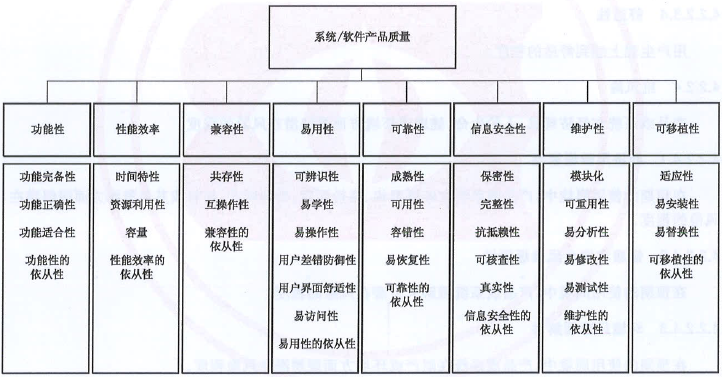

图2.3.2-1 质量模型

除了功能性外，其他质量特性都可划分到非功能质量特性。针对非功能质量特性的测试，可以称之为非功能测试。大家经常提及的性能测试就是属于非功能测试。接下来将结合实际工作探讨非功能测试所包含的内容。

**1.性能效率**

主要测试某个业务/功能点的处理效率以及对应的消耗。性能效率指标的度量可反映系统和软件目前达到的效率水平，性能与在指定条件下所使用的资源量有关。

-   时间特性：产品或系统执行其功能时，其响应时间、处理时间及吞吐率满足需求的程度。

-   资源利用性：产品或系统执行其功能时，所使用资源（可包括其他软件产品、系统的软件和硬件配置、以及原材料）数量和类型满足需求的程度。

-   容量：产品或系统参数（参数可包括存储数据项数量、并发用户数、通信带宽、交易吞吐量和数据库模式）的最大限量满足需求的程度。容量特性主要反映系统能够承受的最大并发用户数、最大的请求极限以及系统可能存在的最大事务吞吐量、最大数据容量和数据处理容量。在何种极端的情况下，测试系统出现缓冲区溢出、访问超时等问题。

**2.兼容性**

验证在共享相同的硬件或软件环境的条件下，产品、系统或组件能够与其他产品、系统或组件交换信息，和/或执行其所需的功能的程度。

-   共存性：在与其他产品共享通用的环境和资源的条件下，产品能够有效执行其所需的功能并且不会对其他产品造成负面影响的程度。共存性主要考察软件产品安装和运行时与正在运行的软件之间的共存性约束。

-   互操作性：两个或多个系统、产品或组件能够交换信息并使用已交换的信息的程度。例如数据格式的可交换性：软件互操作性表现为软件之间共享并交换信息，以便能够互相协作共同完成一项功能的能力，常见的测试点为导入导出；数据传输的交换接口：在与其他软件进行通信时，对于规定的数据传输，交换接口的功能是否能正确实现，常见的测试点为打印。

**3.易用性**

随着软件的广泛应用，越来越多的人在日常工作中大量的依赖于软件。易用性也越来越受到重视。例如：人体工程学、建模、浸入式体验等。

-   可辨识性：用户能够辨识产品或系统是否适合他们的要求的程度。可辨识性将取决于通过对产品或系统的初步印象和/或任何相关文档来辨识产品或系统功能的能力。产品或系统提供的信息可包括演示、教程、文档或网站的主页信息。常见的测试点如Logo，布局色系等。

-   易学性：在指定的使用周境中，产品或系统在有效性、效率、抗风险和满意度特性方面为了学习使用该产品或系统这一指定的目标可为指定用户使用的程度。易学性既可以被当作在指定使用周境中产品或系统在有效性、效率、抗风险和满意度特性方面为了学习使用该产品或系统这一指定的目标被指定用户使用的程度，也可以通过相当于ISO
    9241-110中定义的学习的适宜性的产品属性来进行指定或测量。常见的测试点如在线帮助等。

-   易操作性：产品或系统具有易于操作和控制的属性的程度。评估用户能否操作和控制系统或软件。产品或系统的提示信息易于理解，便于用户纠正使用中的错误。

-   用户差错防御性：系统预防用户犯错的程度。常见的测试点如删除操作是否有提示。

-   用户界面舒适性：用户界面提供令人愉悦和满意的交互的程度。体验经济的支撑。

-   易访问性：在指定的使用周境中，为了达到指定的目标，产品或系统被具有最广泛的特征和能力的个体所使用的程度。能力的范围包括与年龄有关的能力障碍。例如，有些人对特定的颜色无法正确识别，软件也需要考虑这样的用户。

**4.可靠性**

系统、产品或组件在指定条件下、指定时间内执行指定功能的程度。军方产品的可靠性要求非常严格。

-   成熟性：系统、产品或组件在正常运行时满足可靠性要求的程度。成熟性这个概念可以被用于其他质量特性中，以表明它们在正常运行时满足需求的程度。

-   可用性：系统、产品或组件在需要使用时能够进行操作和访问的程度。可用性可以通过系统、产品或组件在总时间中处于可用状态的百分比进行外部评估。

-   容错性：尽管存在硬件或软件故障，系统、产品或组件的运行符合预期的程度。在用户文档集陈述的限制范围之内对产品或系统进行操作，不应丢失数据。输入违反句法条件的信息，产品或系统给出提示信息，并且不能作为许可的输入加以处理。

-   易恢复性：在发生中断或失效时，产品或系统能够恢复直接受影响的数据并重建期望的系统状态的程度。

**5.信息安全性**

随着网络安全的重要性越来越大，信息安全性被单独列为一个质量特性，在ISO
25010之前的ISO
9126中，“安全保密性”作为功能性的一个子特性。验证产品或系统保护信息和数据的程度，以使用户、系统产品或系统具有与其授权类型和授权基本一致的数据访问度。

-   保密性：产品或系统确保数据只有在被授权时才能被访问的程度。

-   完整性：系统、产品或组件防止未授权访问、篡改计算机程序或数据的程度。

-   抗抵赖性：活动或事件发生后可以被证实且不可被否认的程度。

-   可核查性：实体的活动可以被唯一地追溯到该实体的程度。

-   真实性：对象或资源的身份标识能够被证实符合其声明的程度。

**6.维护性：**

产品或系统能够被预期的维护人员修改的有效性和效率的程度。

-   模块化：由多个独立组件组成的系统或计算机程序，其中一个组件的变更对其他组件的影响最小的程度。

-   可重用性：资产能够被用于多个系统，或其他资产建设的程度。

-   易分析性：可以评估预期变更（变更产品或系统的一个或多个部分）对产品或系统的影响、诊断产品的缺陷或失效原因、识别待修改部分的有效性和效率的程度。

-   易修改性：产品或系统可以被有效地、有效率地修改，且不会引入缺陷或降低现有产品质量的程度。

-   易测试性：能够为系统、产品或组件建立测试准则，并通过测试执行来确定测试准则是否被满足的有效性和效率的程度。

**7.可移植性**

系统、产品或组件能够从一种硬件、软件、或者其他运行（或使用）环境迁移到另一种环境的有效性和效率的程度。

-   适应性：产品或系统能够有效地、有效率地适应不同的或演变的硬件、软件、或者其他运行（或使用）环境的程度。适用性包括内部能力（例如屏幕域、表、实物量和报告格式等）的可伸缩性。

-   易安装性：在指定环境中，产品或系统能够成功地安装和/或卸载的有效性和效率的程度。如果系统或产品能被最终用户所安装，那么易安装性会影响到所产生的功能合适性和易操作性。

-   易替换性：在相同的环境中，产品能够替换另一个相同用途的指定软件产品的程度。软件产品的新版本的易替换性在升级时对于用户来说是重要的。易替换性可包括易安装性和适应性的属性。

2.3.3 白盒测试

白盒测试也称结构测试，除此之外有时也被称为透明盒测试、逻辑驱动测试或基于代码的测试。当然称为基于代码的测试其实不够准确，因为内部结构包括系统内的代码、架构、工作流和/或数据流(见4.3节)。白盒测试不仅基于代码，也可以基于架构或者工作流等。白盒测试按照程序内部的结构测试程序，通过测试来检测产品内部动作是否按照设计规格说明书的规定正常进行，检验程序中的每条通路是否都能按预定要求正确工作。

软件的白盒测试是基于过程细节的封闭检查。通过提供检查特定条件集合（或）循环的测试用例，测试贯穿软件的逻辑路径和构建间的协作。

白盒测试用例设计方法，利用作为构件层设计的一部分而描述的控制结构来生成测试用例。利用白盒测试方法，软件工程师设计的测试用例可以：

-   保证一个模块中的所有独立路径至少被执行一次

-   对所有的逻辑值均需测试真（true）和假（false）

-   在上下边界及可操作的范围内执行所有的循环

-   检验内部数据结构以确保有效性

（from：软件工程实践者的研究方法 原书第6版）

2.3.4 与变更相关的测试

软件在整个生命周期中不是一气呵成的，期间会不断的有各种变更。这里的变更可能是为了修复缺陷，也可能是功能的新增或加强。这些变更都会触发相应的测试。和变更相关的测试主要有下面两种：

-   确认测试：又称为再测试，缺陷修复后，所有因该缺陷而失败的测试用例都需要在软件中进行测试，并在新的软件版本上重新执行。确认测试通常是在软件修复了发现的缺陷后，执行之前没有通过的测试用例，以确认原来的缺陷已经被成功修复。但是有些缺陷的修复涉及到增加新的功能，这时候也可能会需要增加相应的测试用例。

-   回归测试：代码中某个部分的变更，无论是修复还是其他类型的变更，都有可能影响到代码其他部分的行为，不管是在同一个组件中，在同一系统的其他组件中，还是在其他系统中。变更包括环境的变化，例如操作系统或数据库管理系统的新版本。这种意外的影响叫做回归。回归测试包括运行测试以检测这种意外的影响。

确认测试和回归测试都属于和变更相关的测试。确认测试和回归测试可以在所有测试级别开展。但是两者的目的是不同的。确实测试的主要目的是验证之前发现的缺陷被成功修复；而回归测试是验证软件变更对已有软件中其他部分是否有影响。

随着增量迭代开发生命周期的广泛应用，与变更相关的测试越来越受到重视。新功能、已有特性的更改以及代码重构都会导致代码频繁变更，这也需要与变更相关的测试。和变更相关的测试的工作量越来越大。尤其是回归测试工作量随着迭代的不断进行，对测试团队的挑战越来越大。随着迭代的不断进行，每个迭代新增加的功能g规模可能是类似的，但是由于之前迭代积累的已有功能越来越多，回归测试的工作量随着迭代的进行也会越来越大。

回归测试套件通常需要运行多次，同时还会缓慢增加，因此回归测试非常适合进行自动化。这些测试的自动化应在项目早期就开始（见第6章）。谈到回归测试，就不可避免的面临回归测试用例的选择。如何选择合适的回归测试用例体现了测试团队对变更影响的理解。完美状态是，所有上一个迭代中的测试用例都能再重新运行一遍。在个别软件中，自动化程度很高，利用多个测试环境并行回归测试，可以实现所有测试用例都运行一遍。但是很多软件都做不到实际上，一个完整的回归测试通常非常耗时间，而且成本很高。因而需要寻找一些方法以帮助选择合适的测试用例，并能最大程度的减少系统存在缺陷的风险。在测试过程中，这通常意味着风险和成本的平衡。决定这种平衡的最好的办法就是对变更进行详细的风险分析，尽量确定负面影响可能在哪发生以及造成的影响。回归测试的范围可以根据软件修改引起的风险程度来决定。常用的方法有：

-   只重复执行测试计划中的高优先级的测试用例。

-   只针对系统的特定配置开展测试，比如针对英文版产品的测试或者针对一个操作系统版本的测试。

-   只针对特定子系统或测试级别的测试。

这些列出的策略通常主要针对系统测试。在更低的测试级别，回归测试策略可以同样基于设计或架构文档（例如，类继承）的测试级别。

2.3.5 测试类型和测试级别

这里将上面讲到的测试级别和测试类型总结如表2.3.5-1所示。

表2.3.5-1 测试级别和测试类型

这里罗列的所有测试类型都可以在任何测试级别开展。对于这个论述，很多人可能会有疑问。其中疑问比较多的地方有：

-   非功能测试不是在高级别的测试中进行吗？在实际的测试过程中，很多测试团队只有在像系统测试和验收测试中才会进行非功能测试，在前面的组件测试中只会进行功能测试。这并不是一个好的实践。我们都知道应该尽可能早的去发现缺陷，我们有什么理由让非功能相关的缺陷留到系统测试才发现呢？为什么不尽早在组件测试就开始进行非功能测试呢？成熟测试团队通常在需求阶段就关注非功能测试，而不是等到系统测试才开始非功能测试。否则就会出现在系统测试发现一些非功能的缺陷，例如：性能无法满足需求，但是受到系统设计和代码实现的限制，后期再修改的成本太高而不得不放弃。

-   白盒测试不是只用于组件测试吗？在系统测试中也可以用吗？如果我们看白盒测试的另外一个叫法，可能更容易理解。白盒测试也称为基于结构的测试。那么什么算是结构呢？代码当然算是一种结构，函数调用关系也算结构，系统测试中界面中菜单的导航也是一种结构。这里的白盒测试不仅仅针对代码，所有的结构都可以使用白盒测试，所以说白盒测试可以用于所有测试级别。

通过对上面两个经常出现的疑问的分析，我们应该可以更容易的理解测试级别和测试类型。他们是从两个不同的维度来划分测试活动，所以才会出现说这些测试类型都可以在任何测试级别上开展这样的说法。

下面以银行应用程序为例，描述功能测试、非功能测试、白盒测试和与变更相关测试在所有测试级别中的应用。首先从功能测试开始：

-   对于组件测试，测试的设计是基于组件是如何计算利息的。

-   对于组件集成测试，测试的设计是基于用户界面捕获的帐户信息如何传递到业务逻辑中。

-   对于系统测试，测试的设计是基于账户持有人如何在其支票账户上申请信贷额度。

-   对于系统集成测试，测试的设计是基于系统如何使用外部微服务来检查账户持有人的信用评分。

-   对于验收测试，测试的设计是基于银行如何处理批准或拒绝信贷申请。

以下是非功能测试的例子：

-   对于组件测试，性能测试的设计旨在评估执行复杂的总利息计算所需的CPU周期的数量。

-   对于组件集成测试，安全测试的设计是针对从用户界面传递到业务逻辑的数据所产生的缓冲区溢出漏洞。

-   对于系统测试，移植性测试的设计旨在检查表示层是否适用于所有支持的浏览器和移动设备。

-   对于系统集成测试，可靠性测试的设计用来评估在信用评分微服务没有响应时系统的健壮性。

-   对于验收测试，易用性测试的设计旨在评估银行信贷处理界面对残疾人的无障碍性。

以下是白盒测试的例子：

-   对于组件测试，测试的设计是为所有进行财务计算的组件实现完整的语句和判定覆盖（见第4.3节）。

-   对于组件集成测试，测试的设计是为了检查浏览器接口中的每个屏幕如何将数据传递到下一个屏幕和业务逻辑。

-   对于系统测试，测试的设计是为了覆盖信用额度应用中出现的网页序列。

-   对于系统集成测试，测试的设计是为了检查所有可能的查询类型发送到信用评分微服务。

-   对于验收测试，测试的设计是为了覆盖银行对银行转账所支持的所有财务数据文件结构和价值范围。

最后，以下是与变更相关的测试的例子：

-   对于组件测试，为每个组件构建自动回归测试，并将其纳入持续集成框架。

-   对于组件集成测试，测试的设计是为了确认与接口相关的缺陷已得到修复，当修复已集成到代码库时。

-   对于系统测试，假如工作流上的任何屏幕发生变更，则相关工作流的所有测试都将重新执行。

-   对于系统集成测试，每天重新进行应用程序与信用评分微服务之间交互的测试，并作为该微服务持续部署的一部分。

-   对于验收测试，在验收测试中发现的缺陷得到修复后，所有先前失败的测试都将重新执行。

虽然本节提供了各个级别的不同测试类型的示例，但对于所有软件来说，没有必要让每个级别包括所有测试类型。但是，必须在每个级别上运行适用的测试类型，特别是特定测试类型发生的最早级别。

*2.4维护测试*

要想弄明白维护测试首先需要搞清楚它的定义：针对运行系统的更改，或者新的环境对运行系统的影响而进行的测试。这个定义里面涉及到一个“运行系统”（operational
system)。所谓“运行系统“指的是这个系统已经在用户或者客户环境中使用了。那么相对应的，如果这个系统还只是在开发阶段，没有部署到客户环境中，那么就不是”运行系统“。一旦运行系统需要进行变更，或者运行系统的环境发生了变化，那么就需要进行维护测试。

所以纯粹从理论上来判断一个测试是否属于维护测试的关键是看被测试对象是否已经是运行系统。这里大家可以看到维护测试是一个新的测试活动维度，是从被测试对象是否是运行系统来区分的。这个维度和我们上面提到的测试类型和测试级别又是不同的。搞清楚他们的观察点不同后，我们可以很容易的知道：维护测试中可以用到上面提到的所有测试类型和测试级别。

根据维护版本的范围，维护测试可能需要在多个测试级别上进行各种测试类型的测试。维护测试的范围取决于：

-   变更的风险程度，例如：软件的变更区域与其他组件或系统通信的程度

-   已有系统的规模

-   变更的规模

2.4.1 维护的触发

针对一个运行的系统，什么时候会触发维护呢？常见的原因分类如下：

-   修改：计划中的增强改进(例如：基于版本的)、纠正和紧急变更、运行环境的改变(例如：计划中的操作系统或数据库升级)、COTS软件升级以及缺陷和漏洞的补丁；

-   移植：例如从一个平台迁移到另一个平台，这可能需要对新环境和已变更的软件进行操作测试，或者将来自另一个应用程序的数据迁移到正在维护的系统时进行数据转换测试；

-   退役，如应用程序到其生命周期结束时，当应用程序或系统退役时，如果需要较长的数据保存时间，则可能需要测试数据迁移或存档。可能还需要在长时间保存后进行恢复规程的测试。此外，可能需要进行回归测试，以确保任何仍在使用的功能依然有效。

对于物联网系统，维护测试可能是由于在整个系统中引入了全新的或经过修改的东西，如硬件设备和软件服务。这类系统的维护测试特别强调不同层面的集成测试(例如网络层面、应用层面和安全方面)，特别是与个人数据有关的方面。

2.4.2 维护的影响分析

影响分析针对维护版本的变更进行评估，以确定变更的预期后果以及变更的可能的副作用，并确定系统中将受变更影响的领域。

影响分析会很困难，常见的一些挑战包括：

-   规格说明（如业务需求、用户故事、架构）过时或缺失

-   测试用例没有文档化或过时

-   没有维护测试与测试依据之间的双向可追溯性

-   工具支持薄弱或不存在

-   参与的人员不具备领域和/或系统知识

-   开发过程中对软件的可维护性关注不够

为了更好的进行维护的影响分析，可以分别从下面两个方面来考虑：

-   从对已有的业务方面：这个方面的分析主要是从技术方向，针对变更，一方面对新修改、增加的地方进行全面测试；另一方面是分析这些变更对已有的系统的影响，从而确定需要回归测试的范围和深度；

-   从对已经在使用的用户方面：维护版本发布时，已经有用户在使用该系统了，那么就需要测试系统的变更对已经使用该系统的用户是否造成了不必要的影响。例如，需要对用户数据进行向前兼容等。

3静态测试

**关键词**

临时评审(ad hoc reviewing)， 基于检查表的评审(checklist-based reviewing)，
动态测试(dynamic testing)， 正式评审(formal review)， 非正式评审(informal
review)， 审查(inspection)， 基于视角的阅读(perspective-based reading)，
评审(review)， 基于角色的评审(role-based reviewing)，
基于场景的评审(scenario-based reviewing)， 静态分析(static analysis)，
静态测试(static testing)， 技术评审(technical review)， 走查(walkthrough)

**静态测试学习目标**

**3.1 静态测试基础**

FL-3.1.1 (K1)识别可通过不同静态测试技术检查的软件产品类型

FL-3.1.2 (K2)通过示例描述静态测试的价值

FL-3.1.3
(K2)解释静态技术和动态技术之间的区别，分别从目标、识别的缺陷类型以及这些技术在软件生命周期中的角色考虑

**3.2 评审过程**

FL-3.2.1 (K2)总结工作产品评审过程的活动

FL-3.2.2 (K1)识别正式评审中不同的角色和职责

FL-3.2.3 (K2)解释不同评审类型之间的区别：非正式评审、走查、技术评审和审查

FL-3.2.4 (K3)在工作产品中应用评审技术发现缺陷

FL-3.2.5 (K2)解释有助于评审成功的因素

*3.1静态测试基础*

与需要运行被测软件的动态测试不同，静态测试依赖于对工作产品的手工检查（即评审）或对代码或其他工作产品的工具驱动的评估（即静态分析）。静态测试的两种类型都评估代码或被测的其他工作产品，而不是实际运行被测代码或工作产品。和动态测试不同，静态测试不需要实际执行测试对象和输入测试数据，而是用阅读或分析替代具体的运行系统。也就是说，当利用静态测试技术进行测试的时候，并没有真正的运行被测对象，而是通过人工的方式或者自动化的方式对被测对象进行检查和分析。

静态测试可以是一个或多个人一起通过人工检查文档、代码（即评审），也可以使用特定的工具来完成检查（即静态分析）。软件开发项目中的所有文档和代码都可以通过人工方式来检查。对遵循特定规则的文档和代码可以通过工具进行静态分析。

评审是静态测试方法的重要组成部分。通过阅读分析可以检查和评估文档中的问题。它是对软件工作产品（包括代码）进行测试的一种方式，一般在动态测试之前进行。修改在软件生命周期的早期发现的缺陷，要比修改在后期的动态测试中才被发现的缺陷的成本要低的多，例如在早期评审过程中发现由于需求理解错误引起的缺陷，此时修改这个缺陷只要花费较低的代价，而如果等到完成设计工作并生成代码，再通过动态测试发现了此错误，然后再进行修改，此时可能要花费昂贵的代价，如果错误影响到系统的架构等核心部分，则可能需要返工，这时花费可能会更昂贵。

静态分析不仅对于安全关键的计算机系统（如航空、军工、医疗或核软件等）很重要，在其他环境中也变得越来越重要和普及。静态分析也经常被纳入自动化构建和交付系统，例如在敏捷开发、持续交付和持续部署中。

3.1.1 静态测试可以检查的工作产品

几乎所有工作产品都可以使用静态测试（评审和/或静态分析）来检查，例如：

-   规格说明，包括业务需求、功能需求和安全需求

-   史诗、用户故事和验收准则

-   架构和设计规格说明

-   代码

-   测试件，包括测试计划、测试用例、测试规程和自动测试脚本

-   用户指南

-   网页

-   合同、项目计划、时间进度表和预算

-   可用于基于模型测试的模型，如活动图

评审可以应用于参与者能阅读和理解的任何工作产品。在有适当的工具支持的情况下，静态分析可以有效地应用于任何具有正式结构（通常是代码或模型）的工作产品，假如针对这些工作产品存在适当的静态分析工具。静态分析通过工具，甚至可以应用在评估用自然语言写的工作产品上，例如需求（例如拼写、语法和可读性检查）。

和评审一样，静态分析的目的是发现文档或者代码中的缺陷或者可能存在的缺陷隐患。不同的是，静态分析一般是通过工具的支持来进行的。比如，拼写检查工具可以认为是静态分析的一种形式，它可以发现文档中的拼写错误，从而有利于文档质量的提高。静态分析的另外一个目的是得到度量数据，从而对测试对象的质量和复杂度进行度量和验证。例如，静态分析工具可以对
代码的圈复杂度、扇入和扇出进行具体的度量，来度量代码结构的复杂性。还可以对编码规范进行静态分析和扫描，来验证编码的规范性。 

在使用工具对文档进行分析和检查时，被分析的文档必须以特定的结构和标准来组织。正式的文档可以是代码、技术需求、软件架构或者软件设计等。比如UML中的类型图模型。HTML和XML格式产生的输出也可以通过工具支持来进行静态分析。也可以对设计阶段开发的正式模型进行分析，找到其中的不一致。目前，一般情况下只有程序代码是软件开发过程中可以进行正式静态分析的文档。

在组件测试或集成测试过程中，开发人员通常会使用静态分析工具，来检查被测对象是否满足编程指南或编程规范。集成测试过程中，需要分析测试对象是否满足接口说明。

3.1.2 静态测试的收益

静态测试技术可以带来各种好处。软件开发生命周期早期应用静态测试，可以在动态测试之前及早发现缺陷（例如：在需求或设计规格说明评审、产品代办列表改进等方面）。早期发现缺陷通常比生命周期后期发现缺陷的修复的成本低得多，特别是与软件部署和实际使用后发现的缺陷相比。使用静态测试技术发现缺陷，然后迅速修复这些缺陷，对组织而言几乎总是比使用动态测试发现测试对象中的缺陷然后修复它们要便宜得多，尤其是在考虑与更新其他工作产品和执行确认和回归测试相关的额外成本时。

静态测试的其他好处包括：

-   在动态测试执行之前更有效地检测和修复缺陷

-   识别在动态测试中不易发现的缺陷

-   通过发现需求中的不一致、模糊不清、矛盾、遗漏、不准确和冗余，防止设计或编码中出现缺陷

-   提高开发生产率（例如：由于改进了设计，使代码更易于维护）

-   减少开发成本和时间

-   减少测试成本和时间

-   在整个软件生命周期内降低总的质量成本，因为在生命周期后期或交付运行后出现的失效较少

-   在参与评审过程中改善团队成员之间的沟通

3.1.3 静态测试和动态的区别

静态测试和动态测试具有共同目标（见1.1.1节），例如评估工作产品的质量和尽早发现缺陷。静态和动态测试通过发现不同类型的缺陷来相互补充。

两者的主要区别之一是静态测试直接发现工作产品中的缺陷，而不是识别软件运行时由缺陷造成的失效。缺陷可以在工作产品中存在很长时间而不会导致失效。缺陷所在的路径可能很少被执行或很难到达，因此构建和执行动态测试以发现缺陷是一件不容易的事情。静态测试可以以更少的工作量发现缺陷。

两者的另一个区别是静态测试可以用来改进工作产品的一致性和内部质量，而动态测试通常侧重于外部可见的行为。

与动态测试相比，通过静态测试更容易发现和修复的典型缺陷包括：

-   需求缺陷(例如：不一致、模糊不清、矛盾、遗漏、不准确和冗余)

-   设计缺陷（例如：算法或数据库结构效率低下、高耦合、低内聚）

-   编码缺陷（例如：未定义值的变量、已声明但从未使用的变量、无法到达的代码、重复的代码）

-   偏离标准(例如：不遵守编码标准)

-   不正确的接口规格说明（例如：呼叫系统使用的计量单位与被呼叫系统使用的计量单位不同）

-   安全漏洞(例如：易受缓冲溢出的影响)

-   测试依据可追溯性或覆盖率的不足或不准确(例如：针对验收准则缺少测试)

此外，大多数可维护性缺陷类型只能通过静态测试发现（例如：不适当的模块化，组件的重用性差，代码在不引入新缺陷的情况下难以分析和修改）。

*3.2评审过程*

评审可以从非正式到正式。非正式评审的特点是不遵循规定的过程，没有正式的文档化输出。正式评审的特点包括团队参与、文档化评审结果以及文档化开展评审的规程。评审过程的正式程度与下列因素有关：软件开发生命周期模型、开发过程的成熟度、被评审工作产品的复杂性、法律或监管要求以及/或审计要求。

评审的关注点依赖于评审的目标(例如：发现缺陷、获得理解、培训测试人员和新的团队成员等参与者，或讨论并达成一致)。

ISO标准（ISO/IEC
20246）包含了对工作产品评审过程的更深入的描述，包括角色和评审技术。

3.2.1 工作产品评审过程

典型的评审过程由五个阶段组成：计划、启动评审、个人评审（个人准备）、问题交流和分析、修改和报告。

**1.计划**

评审计划阶段的主要活动是管理者或评审组长选择主持人和评审员、分配角色、为正式的评审类型（比如审查）定义入口准则和出口准则以及选择需要进行评审的文档或文档章节。

评审首先需要进行计划。在整个项目计划过程中，管理者或评审组长必须确定软件开发过程中的哪些文档需要进行评审，谁将参与评审以及采用什么评审技术。在项目计划中必须估算评审的工作量。在评审计划期间，管理者或评审组长需要选择合适的评审员组成一个评审团队。通过和评审文档的作者一起，确保文档处于一个可评审的状态，即文档已经完备并且文档相关的工作已经完成。在更加正式的评审中，可能还需要设定和检查入口准则（以及设定相应的出口准则）。

通常情况下，从不同的角度对评审的文档进行阅读，或每个人只针对文档的某个方面进行评审，可能会使评审更加容易成功。在制订评审计划过程中就需要确定评审的角度或者评审的关注点。有时为了检查文档的基本质量，也可能不对整篇文档进行评审，而只针对风险最高的部分，或只对抽样部分进行评审。

计划阶段的主要任务如下：

-   定义范围，包括评审的目的、评审的文件或文件的组成部分以及应评估的质量特性

-   估算工作量和时间

-   识别评审特点，如基于角色、活动和检查列表的评审类型

-   选择参与评审的人并分配角色

-   为更正式的评审类型(例如审查)确定入口和出口准则

-   检查是否符合入口准则(针对更正式的评审类型)

**2.启动评审**

启动评审阶段的主要活动包括分发文档、向评审员解释评审的目标、过程和被评审的文档（针对更正式的评审类型）。此外评审标准（例如检查表）在支持结构化评审过程方面非常有用。

启动评审阶段的主要任务如下：

-   分发工作产品(实物或电子方式)和其他材料，如问题记录表、检查列表和相关工作产品

-   向参与者解释范围、目标、过程、角色和工作产品

-   回答与会者可能对评审提出的任何问题

**3.个人评审(即个人准备)**

个人阶段主要是评审人员学习评审对象，并根据提供的基础文档检查评审对象，然后记录文档的不足、问题或意见。评审人员的充分准备是成功进行评审的前提条件。

个人评审阶段的主要任务如下：

-   评审全部或部分工作产品

-   记录潜在的缺陷、建议和问题

**4.问题交流和分析**

问题交流和分析阶段主要是针对个人评审阶段发现的潜在缺陷或问题进行充分的讨论，如果确认是缺陷，那么作者需要进行相应的修改。当然也可能出现评审人员对评审对象理解有误的情况，也可以在此澄清。

问题交流和分析阶段的主要任务如下：

-   交流已识别的潜在缺陷(例如在审查会议上)

-   分析潜在的缺陷，并为其指定责任人和状态

-   评估和文档化质量特性

-   根据出口准则评估评审结果并作出评审决定(拒绝、需作出重大变更、接受、可能的话稍作变更)

**5.修改和报告**

修改和报告阶段需要对确认的问题进行修复。修复完成后还需要有人检查缺陷是否已解决、收集度量和检查出口准则（针对更正式的评审类型）。同时在正式的评审中，还需要对评审过程和评审结果进行评估，为评审的过程改进提供依据。在一定条件下修改评审检查表，并保持它们是最新的。为了达到这个目的，必须收集和评估评审相关的度量数据。

修改和报告阶段的主要任务如下：

-   为需要变更的发现创建缺陷报告

-   修复在被评审工作产品中发现的缺陷（通常由作者完成）

-   与合适的人员或团队沟通缺陷(在与被评审对象相关的工作产品中发现缺陷时)

-   记录缺陷的最新状态(在正式评审中)，通常需要缺陷发现者的同意

-   收集度量数据(用于更正式的评审类型)

-   检查是否符合出口准则(针对更正式的评审类型)

-   当满足出口准则时接受工作产品

如第3.2.3节所述，工作产品的评审结果因评审类型和正式程度不同而有所不同。

3.2.2 正式评审的角色与职责

在整个评审过程中，有各种不同的角色会参与其中。典型的正式评审包括以下角色：

**1.作者**

作者是提交评审的文档的创建者。如果多个人参与文档的创建，主要负责的那个人应该被指定为作者代表，由他来担任作者这个角色。

作者的主要职责是使评审对象满足它的评审入口准则（比如使文档处于合理的完成状态）；根据他们对文档内容的理解和相关知识，来支持文档的评审；进行文档评审以后的任何返工，并且使得评审对象满足它的评审出口准则。

对作者而言，重要的是不把评审员针对文档提出的问题看作是对他个人的批评。作者必须明白评审的目的是用来帮助改进产品的质量。

作者的主要职责是：

-   创建需要被评审的工作产品

-   修复在评审中发现的被评审工作产品中的缺陷

**2.管理者**

管理者决定文档或者代码是否需要进行评审，假如需要，在项目计划中保留和分配足够的时间和资源，同时判断是否达到评审的目标。

管理者的主要职责包括：

-   负责计划评审

-   决定评审的执行

-   分配人员、预算和时间

-   监视持续的成本效益

-   在结果不充分的情况下执行控制决定

**3.协调员（常称为主持人）**

协调员确保评审有序进行从而达到期望的目标。协调员需要进行不同观点之间的协调。

协调员对评审的成功至关重要。首先，他们必须擅长会议的组织和协调，通过选择合适的策略来引导会议有效地进行。其次，他们必须能够在不打击参与者积极性的情况下中止不必要的讨论，在评审员之间存在观点冲突的时候进行调解，以中立的立场来理解参与者之间的讨论。最后，他们必须保持中立，不对评审对象发表自己的看法。

协调员的主要职责包括：

-   确保评审会议(当举行时)的有效开展

-   必要时在各种观点之间进行协调

-   常常是评审成功的关键人物

**4.评审组长**

评审组长需要负责文档或文档集的评审活动，包括制定评审计划、召开会议和会议后对结果的跟踪，以及负责和评审有关的管理工作。

评审组长的主要职责包括：

-   全面负责评审

-   决定谁将参与评审，以及何时何地进行评审

**5.评审员**

评审员一般指具有专门技术或业务背景的人员，识别和描述被评审对象存在的问题（缺陷）。他们是涉及评审对象内容相关技术方面的专家。评审员应该在评审过程中代表不同的观点。

评审员应该识别评审对象中存在的问题，并对它们进行适当的描述。他们可以代表不同利益相关者的观点（例如项目发起人、需求分析人员、设计人员、编码人员、安全相关人员、测试人员等等），但是他们表达的观点必须和评审对象相关。

为了保证评审的有效覆盖率，有时候需要给一些评审员分配特定的评审主题。例如，有的评审员可以关注特定标准的一致性，有的关注语法，有的关注整体的一致性。主持人应该在计划评审的时候分配这些角色。

评审员的主要职责包括：

-   可以是专题专家、项目工作人员、对工作产品感兴趣的利益相关者和/或具有特定技术或业务背景的个人

-   识别被评审工作产品中的潜在缺陷

-   可以代表不同的观点（例如：测试人员、程序员、用户、操作人员、业务分析员、易用性专家等）

**6.抄写员(或记录员)**

抄写员记录所有在评审会议中提出的不足、问题（包括采取的措施、决定和建议等），以及在会议过程中标识的未解决的问题。抄写员必须能够以简短和准确的方式来记录评审中发现的问题，抓住评审过程中讨论的中心思想，清晰的表达问题。

抄写员主要职责包括：

-   收集个人评审活动中发现的潜在缺陷

-   记录新的潜在缺陷、未解决的问题和评审会议决定(当举行时)

有些评审类型中，一人可以扮演多个角色，与每个角色相关的活动也会因评审类型不同而有所不同。随着支持评审过程的工具的出现，特别是针对记录缺陷、未解决的问题和决策，往往不需要记录员。

此外，如ISO标准（ISO/IEC
20246）描述，还可能存在更细分的角色，例如：客户，技术组长等。

3.2.3 评审类型

虽然评审可以用于各种目的，但发现缺陷是其主要目的之一。所有评审类型都可以检测缺陷，评审类型的选择应基于项目需求、可用资源、产品类型和风险、业务领域和公司文化等。

评审可以根据不同的特点进行分类。下面列出四种最常见的评审类型及其相关特点。

**1.非正式评审(**例如：互相检查、结对、结对评审)

非正式评审是评审的精简版，它以一种简单的方式遵循评审的通用过程。通常情况下，文档作者发起非正式评审。评审计划局限在选择评审员和要求他们在规定时间范围内提交他们的意见和建议。非正式评审通常不会召开会议，也不在评审员之间交换各自发现的问题。在这种情况下，评审只是作者和读者之间的交互。非正式评审是一种由一个或多个同行完成的交叉阅读。评审的结果不需要明确的文档化，有一个评审清单或修订文档就足够了。

结对编程、结对测试、代码交换以及类似的工作形式都可以认为是非正式评审的一种。非正式评审非常普遍，并且由于工作量小而被广泛接受。

非正式评审的主要特点包括：

-   主要目的：发现潜在的缺陷

-   可能的其他目的：产生新的想法或解决办法，迅速解决小问题

-   不依赖于正式的(文档化的)过程

-   可能没有评审会议

-   可由作者的同事（伙伴检查）或更多人执行

-   结果可记录在案

-   根据评审人员的不同，其有效性各不相同

-   检查表的使用是可选的

-   在敏捷开发中经常使用

**2.走查**

走查可以是一种非常正式评审活动，也可能是非常不正式的评审活动。其形式通常是作者在评审会议上向评审员介绍文档的内容，参与者在这过程中提出问题并针对可能存在的错误给出意见。

走查的主要特点包括：

-   主要目的：发现缺陷、改进软件产品、考虑替代实现、评估是否符合标准和规范

-   可能的其他目的：针对技术或风格变化交换意见、培训参加者和达成共识

-   评审会议之前的个人准备是可选的

-   评审会议通常由工作产品的作者主持

-   记录员是必需的

-   检查表的使用是可选的

-   可能采取情景、预演或模拟的形式

-   可能生成缺陷记录和评审报告

-   实践中可以从非常不正式到非常正式

**3.技术评审**

在技术评审中，顾名思义评审是从技术层面考虑被评审的文档和规格说明。在准备阶段，评审员根据具体的评审标准对评审对象进行评审。

评审员必须是有资质的技术专家。为了避免项目盲点，参与评审的一些评审专家可以不是项目的参与者，管理层也不需要参与。评审的对象可以是正式的规格说明和技术文档。评审员写下他们的意见，并在评审会议前提交给主持人。主持人（理想状态是经过培训的人员）根据他们认为的重要性为所有的意见和建议设置优先级。评审会议上，只对选择的重要意见和建议做相关的讨论。

技术审查的主要特点包括：

-   主要目的：取得共识，发现潜在的缺陷

-   可能的其他目的：评价工作产品质量和建立信心、提出新的想法、激励作者并使其能够改进未来的工作产品、考虑其他实现办法

-   审评员应当是作者的技术同行，以及同一学科或其他学科的技术专家

-   评审会议之前的个人准备是必需的

-   评审会议是可选的，最好由受过培训的主持人（通常不是作者）主持

-   记录员是必需的，最好不是作者

-   检查表的使用是可选的

-   通常会生成潜在的缺陷记录和评审报告

**4.审查**

审查遵循正式严谨的评审过程。通常每个评审员都是从作者的直接同事或同行中选出，并且具有固定的角色，按照一定的规则要求定义评审过程。针对审查的不同对象，使用包括审查标准（正式的入口准则和出口准则）在内的检查表。

审查的重点是发现文档的不清晰要点和可能的缺陷、度量文档质量、改进产品质量和开发测试过程。审查计划阶段，需要确定审查的目的。审查开始之前，根据正式入口准则检查审查对象，以确定是否可以开始审查活动。评审员采用标准和检查表等手段来准备审查内容。

审查的主要特点包括：

-   主要目的：发现潜在的缺陷、评价工作产品质量和建立信心、通过作者学习和根本原因分析防止今后出现类似的缺陷

-   可能的其他目的：激励作者并使其能够改进未来的工作产品和软件开发过程、达成共识

-   基于规则和检查表，遵循有正式文档化输出的已定义过程

-   使用明确定义的角色，如第3.2.2节规定的强制性角色，并可包括专门的朗读者(在评审会议期间大声朗读工作产品)

-   评审会议之前的个人准备是必需的

-   评审员可以是作者的同行，或者与工作产品相关的其他学科的专家

-   使用已定义的入口和出口准则

-   记录员是必需的

-   评审会议由受过训练的主持人(不是作者)主持

-   作者不能担任评审负责人、朗读者或记录员

-   生成可能的缺陷记录和评审报告

-   收集和使用度量数据，以改进整个软件开发过程，包括评审过程

单个工作产品可以使用多种评审类型。如果使用一种以上的评审类型，其顺序可以是不同的。例如：可在技术评审之前进行非正式评审，以确保工作产品已准备好进行技术评审。

评审中发现的缺陷类型各不相同，特别取决于被评审的工作产品。关于不同工作产品评审中可以发现的缺陷的例子，见第3.1.3节。

3.2.4 应用评审技术

个人评审（即个人准备）活动中可以应用各种评审技术以发现缺陷。这些技术可以贯穿使用于上述评审类型。技术的有效性会随着使用的评审类型不同而不同。下文列举了针对各种评审类型的不同个人评审技术的例子。

**1.临时（Ad hoc）**

临时评审过程中，评审人员很少或根本得不到关于应如何执行这项任务的指导。评审员经常按顺序阅读工作产品，在遇到问题时对其进行识别和记录。临时评审是一种需要很少准备的常用技术。这种技术高度依赖于评审人员的技能，并可能导致不同的评审人员报告许多重复的问题。

**2.基于检查表**

基于检查表的评审是一种系统化的技术，评审人员根据在评审开始时分发的检查表(例如由主持人)来发现问题。评审检查表由一系列基于潜在缺陷的问题组成，这些问题可以来自于经验。检查表应适合所评审的工作产品类型，并应定期予以维护，以覆盖以往评审中遗漏的问题类型。基于检查表的技术的主要优点是对典型缺陷类型的系统化覆盖。需要注意的是，在个人评审中不应简单地遵循检查表，还应注意检查表之外的缺陷。

**3.场景和预演（Scenarios and dry runs）**

基于场景的评审中，向评审人员提供了关于如何通读工作产品的结构化指南。基于场景的方法支持评审员根据工作产品的预期使用情况对工作产品进行“预演”（如果工作产品以用例等适当格式记录）。与简单的检查表条目相比，这些场景为评审人员提供了更好的指南，有助于识别特定的缺陷类型。与基于检查表的评审一样，为了不遗漏其他缺陷类型（例如缺少功能），评审员不应受限于文档化的场景。

**4.基于角色**

基于角色的评审是评审人员从单个利益相关者的角度来评估工作产品的一种技术。典型的角色包括特定的最终用户类型（有经验、无经验、资深、儿童等），以及组织中的特定角色（用户管理员、系统管理员、性能测试人员等）。

**5.基于视角**

基于视角的阅读与基于角色的评审类似，评审员在个人评审过程中扮演不同利益相关者的视角。使用不同的利益相关者视角可以使个人评审更有深度，减少评审人员之间问题的重复。

典型的利益相关者视角包括：

-   业务分析人员

-   设计人员

-   市场

-   运维人员

-   程序员

-   测试人员

-   用户

此外，基于视角的阅读还要求评审人员尝试使用被评审的工作产品来生成他们自己的工作产品。例如：如果测试人员对需求规格说明进行基于视角的阅读，以了解其中是否包含了所有必要的信息，则测试人员将试图生成初步的验收测试。此外，基于视角的阅读也建议使用检查表。

研究表明，基于视角的阅读是评审需求规格说明和技术工作产品的最有效的通用技术。根据风险适当纳入和权衡不同的利益相关者的视角是关键成功因素之一。

3.2.5 评审的成功因素

前面讲到了评审过程、角色和职责、评审类型和各种评审技术。但是每次评审其实都没有一个严格的标准可以照搬，都需要针对每个评审的具体情况选择合适的过程和类型等。

项目中采用的评审类型更多的是由公司组织的结构来决定的。根据项目特殊的需求，对评审进行相应的裁减，这有助于提高评审的效率。

为了成功地进行评审，必须考虑适当的评审类型和使用的技术。此外，还有一些其他因素将影响评审的结果。

与组织相关的评审成功因素包括：

-   每次评审都有明确的目标，评审计划期间定义并使用可度量的出口准则

-   采用与目标相一致的评审类型，并适合软件工作产品和参与者的类型和水平

-   所使用的任何评审技术，如基于检查表的或基于角色的评审，都适合在被评审工作产品中进行有效的缺陷识别

-   使用的任何检查表都涉及主要风险，并与时俱进

-   将庞大的文件分成小块进行编写和评审，以便通过向作者提供关于缺陷的早期和频繁的反馈来进行质量控制

-   参加者有足够的时间准备

-   充分重视的情况下安排评审

-   管理层支持评审过程(例如在项目时间进度表中为评审活动留出足够的时间)

参与软件开发和测试项目人员之间的协同合作有利于项目质量的提高。假如每个人对各自的工作产品进行相互检查，就可以在早期发现一些缺陷和含糊不清的地方。从这个角度而言，极限编程中建议的结对编程，可以认为是两个人进行评审的一种固定模式。

对于分散的项目团队，组织一次评审会可能会比较困难，这种情况下可以采用的方式有网络评审方式、视频评审方式以及电话会议等。

与人相关的评审成功因素包括：

-   选择合适的人员参与评审以实现目标，例如具有不同技能或视角的人员，被评审的文档将作为他们工作的输入

-   测试员被视为有价值的评审人员，他们为评审做出贡献，并学习工作产品，从而使他们能够更有效并更早的准备测试

-   参与者投入足够的时间和精力研究细节

-   评审分小块进行，以便评审人员在个人评审和/或审查会议(当举行时)期间能集中注意力

-   发现的缺陷得到认可、赞赏和客观处理

-   会议管理良好，与会者认为这是有价值的使用他们的时间

-   评审应该在相互信任的气氛中进行；评审结果不用于评价参与者

-   参与者避免一些肢体语言和行为，这些语言和行为可能表明他们对其他参与者感到厌烦、恼怒或敌意

-   提供充分的培训，特别是为审查等更正式的评审类型提供培训

-   鼓励学习和过程改进文化

4测试技术

**关键词**

黑盒测试技术(black-box test technique)， 边界值分析(boundary value analysis)，
基于检查表的测试(checklist-based testing)， 覆盖(coverage)， 判定覆盖(decision
coverage)， 决策表测试(decision table testing)， 错误推测(error guessing)，
等价类划分(equivalence partitioning)， 基于经验的测试技术(experience-based test
technique)， 探索性测试(exploratory testing)， 状态转换测试(state transition
testing)， 语句覆盖(statement coverage)， 测试技术(test technique)，
用例测试(use case testing)， 白盒测试技术(white box test technique)

**测试技术的学习目标**

**4.1测试技术的分类**

FL-4.1.1
(k2)解释黑盒测试技术、白盒测试技术和基于经验的测试技术之间的特征、共同点和区别

**4.2黑盒测试技术**

FL-4.2.1 (k3)应用等价分从给定的需求中导出测试用例

FL-4.2.2 (k3)应用边值分析从给定的需求中导出测试用例

FL-4.2.3 (k3)应用决策表测试从给定的需求中导出测试用例

FL-4.2.4 (k3)应用状态转换测试从给定的需求中导出测试用例

FL-4.2.5 (k2)解释如何从用例推导出测试用例

**4.3白盒测试技术**

FL-4.3.1 (k2)解释语句覆盖

FL-4.3.2 (k2)解释判定覆盖

FL-4.3.3 (k2)说明语句覆盖和判定覆盖的价值

**4.4基于经验的测试技术**

FL-4.4.1 (k2)解释错误推测

FL-4.4.2 (k2)解释探索性测试

FL-4.4.3 (k2)解释基于检查表的测试

*4.1 测试技术分类*

4.1.1 测试技术分类和特性

本章主要讨论黑盒测试技术、白盒测试技术和基于经验的测试技术这三类。这三个类别和其中包含的具体测试技术如表4.1.1-1所示。

黑盒测试技术（又称行为或基于行为的技术）基于对适当的测试依据的分析（例如正式的需求文档、规格说明、用例、用户故事或业务流程），所以有些地方也把黑盒测试技术称为基于规格说明的技术。这些技术既适用于功能测试，也适用于非功能测试。黑盒测试技术关注在测试对象的输入和输出上，而不关注其内部结构。

白盒测试技术（又称结构或基于结构的技术）基于对测试对象的架构、详细设计、内部结构或代码的分析。与黑盒测试技术不同，白盒测试技术关注在测试对象的内部结构和处理。

基于经验的测试技术利用开发人员、测试人员和用户的经验来设计、实现和执行测试。这些技术通常与黑盒和白盒测试技术结合在一起。

表4.1.1-1 测试技术分类

| **测试技术分类**   | **测试技术**                                           |
|--------------------|--------------------------------------------------------|
| 黑盒测试技术       | 等价类划分 边界值分析 决策表测试 状态转换测试 用例测试 |
| 白盒测试技术       | 语句测试 判定测试                                      |
| 基于经验的测试技术 | 错误推测 探索性测试 基于检查表的测试                   |

黑盒测试技术的共同特点包括：

-   测试条件、测试用例和测试数据来自于以下测试依据：软件需求、规格说明、用例和用户故事等

-   测试用例可用来发现需求与需求实现之间的差距，以及与需求之间的偏离情况

-   覆盖率的度量基于测试依据中被测试的条目和应用于测试依据的技术

白盒测试技术的共同特点包括：

-   测试条件、测试用例和测试数据来自于以下测试依据：代码、软件架构、详细设计或任何其他有关软件结构的信息来源

-   覆盖率的度量基于选定结构（例如代码或接口）内被测试的条目

-   规格说明常常被用作额外的信息来源，以确定测试用例的预期结果

基于经验的测试技术的共同特点包括：

-   测试条件、测试用例和测试数据来自于以下测试依据：测试人员、开发人员、用户和其他利益相关者的知识和经验

上面的分析，可以说明黑盒、白盒和基于经验的测试技术在测试依据的来源上有本质的区别，从而导致它们对应的覆盖率相关的度量也是不同的。基于经验的测试技术由于和相关人员的经验有关，在可度量方面最弱。但是基于经验的技术可以和其他两种相结合，在进行基于经验的测试时，可以灵活的使用黑盒或者白盒技术。

4.1.2 选择测试技术

本章讲到的各种测试技术产生的历史都很悠久，都是非常基础的测试技术。很多读者看到这些技术会觉得非常熟悉，理解起来也很简单。但是在实际应用中，很多人都会发现这些技术都用不上，进而就觉得这些技术没有用。很多人再学习了一些测试技术后，很快又回到了他们没有学习之前的状态。

这些技术有用吗？答案是肯定的。在实际测试中，这些技术不好用。一方面是因为，很多人还没有能够灵活的掌握这些技术，不能做到活学活用；另外也需要认识到，没有一种技术是可以包治百病的，每种技术都有它适合的场景。

下面是一段关于银行借记卡转账的费用描述：

柜台、ATM：

跨行转账手续费：每笔0.2万元以下(含0.2万元)，收费2元;0.2万—0.5万元(含0.5万元)，收费5元;0.5万—1万元(含1万元)，收费10元;1万—5万元(含5万元)，收费15元;5万元以上，按转账汇款金额的0.03%收取，最高收费50元。

网上银行：

跨行转账手续费：每笔0.2万元以下(含0.2万元)，收费1元;0.2万—0.5万元(含0.5万元)，收费2.5元;0.5万—1万元(含1万元)，收费5元;1万—5万元(含5万元)，收费7.5元;5万元以上，按转账汇款金额的0.015%收取，最高收费25元。2014年8月1日-2015年6月30日，同城普通跨行转账每笔按1元收费。

上面的这段描述的费用说明，并不是特别复杂。在各种纷繁复杂的银行业务中，这个应该是比较容易测试的。拿到这段需求以后，测试人员如何测试用例呢？大家不妨拿出笔来自己亲手设计一下。这段简短的说明，要想测试的比较充分，显然需要用到后面讲到的等价类、边界值和决策表等方法。

一般应该根据如下各种不同的情况来具体选择不同的技术：

-   测试对象类型：不同的程序，它们的复杂度也截然不同。应该根据测试对象选择合适的测试技术。比如，程序中的判定是由多个原子条件组合而成的，那么分支覆盖测试是不充分的，应该选择合适的测试技术来检查程序中的条件，例如条件组合覆盖。具体选择哪种技术依赖于失效情况下的风险。

-   文档和工具的可用性：如果有详细的规格说明或者模型信息，这些就可以直接作为测试设计的输入，从而得到具体的测试用例。这样就可以极大地减少测试设计的工作量。

-   符合标准的要求
    ：行业标准和法律法规会要求使用特定的测试技术和覆盖准则，特别是安全关键系统或者高完整性级别的软件。

-   测试人员的经验：
    具有不同经验的测试人员会选择不同的测试技术。例如，测试人员会倾向使用以前找到过严重失效的技术。

-   客户的期望：客户可能会要求采用特殊的测试技术和达到一定的测试覆盖率（当使用白盒测试设计技术的时候）。这是种比较好的做法，因为它一般能降低测试工作量，保证在客户或验收测试时，残留更少的缺陷。

-   风险分析：通过风险分析来指导测试工作，即选择具体测试技术和确定测试执行的强度。对于高风险的区域应该进行更彻底的测试。

-   其他因素：比如规格说明和其他文档的可用性，测试人员的知识、技能和个性，时间和预算的限制，测试级别和以前的经验，如哪些缺陷发生的比较频繁，通过什么测试技术发现了这些缺陷等。这些都会很大程度地影响测试技术的选择。

*4.2黑盒测试技术*

4.2.1 等价类划分

等价类划分是把所有可能的输入数据，即程序的输入域划分成若干部分（子集），然后从每一个子集中选取少数具有代表性的数据作为测试用例。该方法是一种重要的，常用的黑盒测试用例设计方法。

等价类是指某个输入域的子集合。在该子集合中，各个输入数据对于揭露程序中的错误都是等效的，并合理地假定：测试某等价类的代表值就等效于对这一类中其它值的测试。因此，可以把全部输入数据合理划分为若干等价类，在每一个等价类中取一个数据作为测试的输入条件，就可以用少量代表性的测试数据取得较好的测试结果。等价类通常包括有效等价类和无效等价类：

-   有效等价类：是指对于程序的规格说明来说是合理的，有意义的输入数据构成的集合。利用有效等价类可检验程序是否实现了规格说明中所规定的功能和非功能特性。

-   无效等价类：与有效等价类的定义恰巧相反，该等价类中包括的是程序认为无效的数据。

设计测试用例时，要同时考虑这两种等价类。因为软件不仅要能接收合理的数据，也要能经受意外的考验。这样的测试才能确保软件具有更高的可靠性。

**1.划分等价类的方法**

下面给出六条确定等价类的原则：

-   在输入条件规定了取值范围或值的个数的情况下，则可以确立一个有效等价类和两个无效等价类。例如：网站上某商品的库存范围为1到99，那么针对商品库存的有效等价类是1到99，两个无效等价类分别是小于1和大于99。

-   在输入条件是一个布尔量的情况下，可确定一个有效等价类和一个无效等价类。
    有效等价类是真和假，其他所有输入构成了无效等价类。

-   在规定了输入数据的一组值（假定n个），并且程序要对每一个输入值分别处理的情况下，可确立n个有效等价类和一个无效等价类。例如：公园门票针对老人、成年人和小孩分别有不同的票价，那么就可以生成3个有效等价类（老人、成年人和小孩），以及一个无效等价类（不属于上述三类人）

-   在规定了输入数据必须遵守的规则的情况下，可确立一个有效等价类（符合规则）和若干个无效等价类（从不同角度违反规则）。例如：某公司规定服务年限大于五年的女性员工在妇女节那天可以放假一天，那么有效等价类显然就是同时满足服务年限大于5年并且是女性的员工，而无效等价类有两个，一个是服务年限没有超过5年，另外一个是女性员工。

在确知已划分的等价类中各元素在程序处理中的方式不同的情况下，则应再将该等价类进一步的划分为更小的等价类。

**2.设计测试用例**

在确立了等价类后，可建立等价类表，列出所有划分出的等价类。初始的表格如表4.2.1-1所示。

>   表4.2.1-1 等价类初始表格

| 输入条件 | 有效等价类 | 无效等价类 |
|----------|------------|------------|
|          |            |            |
|          |            |            |

例如：为了覆盖所有的有效等价类和无效等价类，可以从划分出的等价类中按以下三个原则设计测试用例：

①为每一个等价类规定一个唯一的编号。

②设计一个新的测试用例，使其尽可能多地覆盖尚未被覆盖地有效等价类，重复这一步。直到所有的有效等价类都被覆盖为止.。

③设计一个新的测试用例，使其仅覆盖一个尚未被覆盖的无效等价类，重复这一步。直到所有的无效等价类都被覆盖为止。

**3.等价类案例**

某商店为购买不同数量商品的顾客报出不同的价格，其报价规则如表4.2.1-2所示。

表4.2.1-2 等价类案例描述

| **购买数量**                | **单价（单位：元）** |
|-----------------------------|----------------------|
| 前5件（第1件到第5件）       | 20                   |
| 第二个5件（第6件到第10件）  | 18                   |
| 第三个5件（第11件到第15件） | 15                   |
| 超过15件                    | 12                   |

如买8件需要支付5\*20+3\*18=154元，买20件需要支付5\*20+5\*18+5\*15+5\*12=325元。现在该商家开发一个软件，输入为商品数C（1≤C≤50），输出为应付价钱P。采用等价类划分法为该软件设计测试用例（不考虑C为非整数的情况）。

表4.2.1-3 利用等价类获得的输入数据

| 序号 | 输入C                              | 输出P |
|------|------------------------------------|-------|
| 1    | 0（任意小于1的数）                 | N/A   |
| 2    | 80（任意大于50的数）               | N/A   |
| 3    | 3（任意大于等于1小于等于5的数）    | 60    |
| 4    | 8（任意大于等于6小于等于10的数）   | 154   |
| 5    | 12（任意大于等于11小于等于15的数） | 220   |
| 6    | 18（任意大于等于16小于等于50的数） | 301   |

等价类划分法是把程序的输入域按规则划分为若干子集，然后从每个子集中选取一具有代表性的数据作为测试用例。上例规定了C的取值范围（1
≤C≤50)，按规则可以划分为一个有效等价类{C\|1 ≤C ≤50}和两个无效等价类{C\|C\<
1}、{C\|C\>
50}。表中对C取不同值有不同的处理，因此上述有效等价类还可以进一步细分为4个等价类{C\|1
≤C ≤5}、{C\| 6 ≤C ≤10}、{C\|11 ≤C ≤15}、{C\|16 ≤C
≤50}。这样一共得到6个等价类，包括4个有效等价类{C\|1 ≤C ≤5}、{C\| 6 ≤C
≤10}、{C\|11 ≤C ≤15}、{C\|16 ≤C
≤50}和两个无效等价类{C\|C\<1}、{C\|C\>50}。设计用例时从这6个等价类中任选一个代表数据即可。

4.2.2 边界值分析

边界值分析（Boundary Value
Analysis）方法的理论基础，是假定大多数的错误是发生在各种输入条件的边界上，如果在边界附近的取值不会导致程序出错，那么其它的取值导致程序错误的可能性也很小。

当测试对象的输入条件明确了一个值的取值范围，规定了值的个数，或者明确了一个有序集合，我们就可以使用边界值分析方法。

边界值是一种非常重要的测试技术，它有如下的特点：

-   价值：边界值分析技术可以显著的减少测试用例数量。边界值上是最容易发现缺陷的地方；边界值分析技术应该和等价类划分技术紧密结合使用。

-   局限/困难：精确性取决于等价类划分的精确性，它的局限和困难与等价类相仿。必须注意有效数据和无效数据的增幅以便于精确地定义测试数据。只有有序的等价类可以做边界值分析，但这并不妨碍对某个范围内有效输入的分析。例如，测试电子表格支持的单元格数量，一个包含可以允许的最大单元格数量（边界）的等价类，而另一个等价类则从超过这个边界1
    个单元格（超过边界）开始 。

-   覆盖率：等于测试的边界条件总数除以识别的边界条件总数（二值测试法或三值测试法）。这就提供了边界测试的覆盖百分率。

边界值分析总能发现边界的位移或遗漏，也可能会发现额外的边界情况。这种技术可用于发现处理边界值，尤其是小于和大于逻辑错误（即位移）的缺陷。它也可以用来寻找非功能性缺陷，例如负载限制的容差（如，系统支持10,000个并发用户）。

有两种边界值分析法：二值测试法、三值测试法。二值测试法，就是在边界上取两个值，分别在不同的等价类里面。例如，如果等价类的值域是1到10，步长是0.5，上界的边界值为10和10.5，下界的边界值为1和0.5。三值测试法，就是找到边界，边界值加上最小步长，以及边界值减去最小步长。在上面的例子中，上界为
9.5、10和10.5，下界为：1.5、1 和
0.5。采用二值测试法还是三值测试法取决于被测项的风险大小。风险高的采用三值测试法。

**1.设计原则：**

-   如果输入条件规定了值的范围，按照二值法，则应取刚达到这个范围的边界的值，以及刚刚超越这个范围边界的值作为测试输入数据。例如：如果软件的规格说明中规定：“重量在10公斤至50公斤范围内的邮件，其邮费计算公式为……，重量精确到小数点后2位”。设计基于边界值的测试用例，如果采用二值法，我们应取10、50，还应取9.99及50.01等。

-   如果输入条件规定了值的个数，在二值法的情况，则用最大个数,最小个数,比最小个数少1，比最大个数多1的数作为测试数据。例如：一个输入文件可存储1\~255个记录。测试用例可取1和255，还应取0及256等。

-   尽量选择非常庞大的数据结构、列表和表格等作为边界值分析的数据。例如：那些能使内存溢出、文件和数据存储到达边界的数据，来检查测试对象在这种极端情形下的行为。

-   对于列表和表格，空列表和满列表以及列表的第一个元素和最后一个元素都是应该作为分析的对象，因为测试它们常常可以发现由于编程错误而导致的失效。

**2.设计步骤**

边界值分析使用与等价类划分法相同的划分，只是边界值分析假定错误更多地存在于划分的边界上，因此在等价类的边界上以及两侧的情况设计测试用例。

-   将软件的输入或者输出参数进行等价类划分

-   在等价类的基础之上进行边界值分析。一般情况下，假如边界值已经由等价类划分覆盖，则可以不予考虑

-   将边界值进行组合，作为测试用例的输入数据

**3.渐进健壮**

在利用边界值分析技术的时候，大部分情况面对的都是两个或两个以上的变量。那么情况比只有单个变量要复杂。同时，在进行了基本的边界值分析的基础上，可以根据情况适当增加更多的测试。图4.2.2-1展示的是两个变量X1,X2。它们的有效取值区间分别为[a,b]，[c,d]。除了基准测试之外，还可以进行其他各种更进一步的测试。

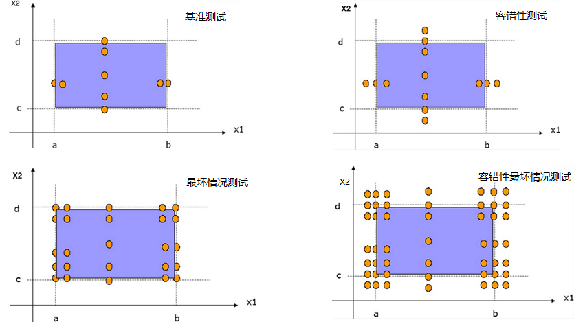

图4.2.2-2 边界值分析的渐进健壮

**对于有n个输入变量的程序，基准测试边界值分析的测试用例个数为4n+1。**

前面讲到的边界值测试分析采用了可靠性理论的单缺陷假设。

-   优点：简便易行；生成测试数据的成本很低

-   局限性：测试用例不充分；不能发现测试变量之间的依赖关系；不考虑含义和性质；

-   结论：只能作为初步测试用例使用

容错性/健壮性是指在异常情况下，软件还能正常运行的能力。健壮性考虑的主要部分是预期输出，而不是输入。健壮性测试是边界值分析的一种简单扩展。除了变量的5
个边界分析取值还要考虑略超过最大值（max）和略小于最小值（min）时的情况。健壮性测试的最大价值在于观察处理异常情况，它是检测软件系统容错性的重要手段。如图4.2.2-1所示。

**对于有n个输入变量的程序，健壮性测试的测试用例个数为6n+1。**

**对于有n个输入变量的程序，最坏情况测试的测试用例个数为5\^n。**

**对于有n个输入变量的程序，健壮最坏情况测试的测试用例个数为7\^n。**

**4.次边界**

对系统越了解，你就越能发现系统的边界；对相关的背景知识越了解，你就能越能发现系统的“次边界”。次边界是由具体实现产生的，例如，计算机本身的限制，数据存储的限制，协议的限制，操作系统的限制等。例如，在32位操作系统中，整形的最大值65536，支持的内存最大4GB；电话线传输速率小于光纤传输速率等。

4.2.3 决策表测试

决策表可以方便的获取特定的系统需求和记录测试对象的内部实现，可以用来记录测试对象的各种复杂规则，同时它可以有效的指导测试用例的设计。尽管决策表测试对于测试人员而言非常重要，但是许多测试人员并不熟悉这种技术。

决策表是分析和表达多逻辑条件下执行不同操作的表格。决策表能够将复杂的问题按照各种可能的情况全部列举出来，以避免测试需求的遗漏。因此，利用决策表可以设计出比较完整的测试用例集合。决策表测试技术特别适用于下面的使用场景：针对不同的逻辑条件的组合，测试对象需要执行不同的操作。

决策表有四个部分组成，分别是条件桩（Condition Stub）、动作桩（Action
Stub）、条件项（Condition Entry）和动作项（Action
Entry），具体格式如表4.2.3-1所示。决策表四个组成部分的含义如下：

-   条件桩：列出了测试对象的所有条件。一般情况下，列出的条件的次序不会影响测试对象的动作。

-   动作桩：列出了测试对象所有可能执行的操作。一般情况下，这些执行的操作没有先后顺序的约束。

-   条件项：列出针对特定条件的取值，即条件的真假值。

-   动作项：列出在不同条件项的各种取值组合情况下，测试对象应该执行的动作。

UDO W. POOCH,Translation of Decision Tables,Computing Surveys, Vol. 6, No. 2,
June 1974

表4.2.3-1 决策表模板

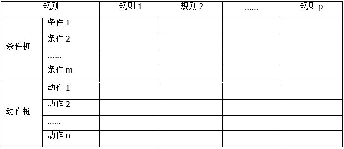

使用决策表进行测试的步骤为：

（1）列出所有的条件桩和动作桩

（2）填入条件项

（3）填入动作项，制定初始判定表

（4）简化、合并相似规则或者相同动作

下面通过具体的案例分析，阐述决策表测试的基本概念和步骤。

**三角形类型的判断**

测试对象从输入对话框中读取三个整数值a、b和c，这三个整数值代表了三角形三条边的长度。测试对象根据输入的三个整数显示提示信息，指出这样的三条边构成的是不规则三角形、等腰三角形、等边三角形还是非三角形。要求测试人员针对该场景，应用决策表测试技术设计相应的测试用例。

该三角形的例子生成的决策表如表4.2.3-2所示。

表4.2.3-2 三角形完整决策表

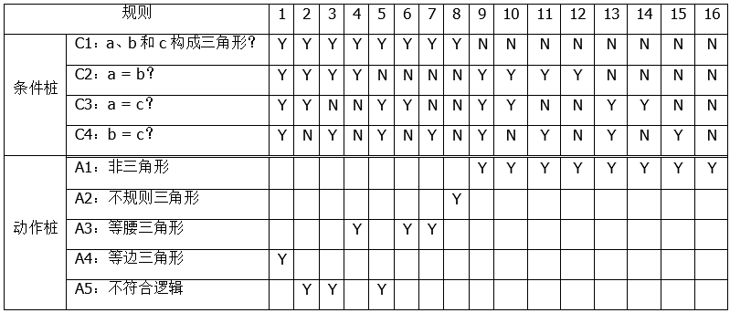

首先我们看规则9到规则16，这8条决策表是可以合并成一条的。就是当C1为N的时候，不管其他条件是什么，得到的都是A1：非三角形。

这样决策表经过上面这个8合一的优化后就变成9条规则了。

这个里面还需要去掉规则2、规则3和规则5这三条不符合逻辑的，因为这三条规则不符合逻辑，无法根据这些规则生成测试用例，所以去处。

这样经过8合一并去掉三个不符合逻辑的规则后，优化后的决策表就只有6条了。优化后的决策表如表4.2.3-3所示。

表4.2.3-3 三角形优化后的决策表

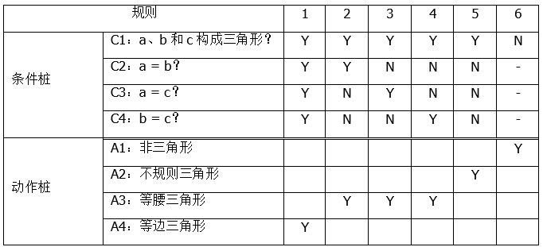

4.2.4 状态转换测试

很多情况下，测试对象的输出和行为方式不仅受当前输入数据的影响，同时还与测试对象之前的执行情况，或者之前的事件以及之前的输入数据有关。为了说明测试对象和历史数据之间关系，引入了状态图。状态图是进行状态转换测试设计的基础。

状态转换测试方法，是一种黑盒测试技术。其应用模式是被测组件拥有多个状态，各个状态之间的转换由事件来触发，各个状态之间的转换还可能导致一些动作的产生。在面向对象系统的测试尤其有用，因为在面向对象系统中，对象可以有不同的状态，操作对象的方法必须能根据不同的状态做出相应的反应。同时这种测试技术也常常用于嵌入式软件行业中。

>   **1、状态转换图的组成**

-   状态：以圆圈表示，开始和结束是特殊状态；

-   转换：由于事件的驱动，系统从一个状态到另一个状态；

-   事件：以系统的相关接口触发，和特定的转换关联；

-   活动：活动由状态转换触发；

-   条件：说明状态转换只有在满足这个条件后进行。

>   **2、适用场景**

-   涉及多种状态，最好是针对一个对象的多个状态。否则把多个对象的多个状态都放在一个模型中，容易引起混淆；

-   各种状态间可以由于某种事件的发生相互转换；

-   用于测试有定义的状态和引起状态转换的事件（比如变化的屏幕）的软件。嵌入式软件，web软件和任何类型的状态转换软件都是这类测试技术的理想候选对象。控制系统，比如交通信号控制系统，也是这类测试的理想对象；

-   可以用于任一测试级别。

>   **3、覆盖策略**

状态转换测试中的覆盖率还会涉及到“N-Swtich”的概念（中文通常翻译成“N-切换”）。状态转换测试的覆盖率可以是1-Switch、2-Switch，可以一直深入取更大的N以达到更好的覆盖率，当然测试的工作量也会更大。N-Swtich是由TSUN
S.
CHOW在1978年提出的，他将N-Switch定义为程序图中长度为n+1的连续的边或弧线（通常在状态图中表示循环）的序列。所以单独的一条边（或者转换）就是一个0-Switch，两条连续的边的序列就是1-Switch。

下面以图 4.2.1-1所示的状态机分别说明0-Switch和1-Switch的概念和区别。

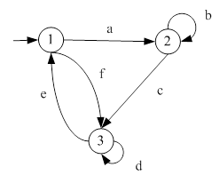

图 4.2.4-1 状态机示例图

如图4.2.4-1所示的状态机示例，其中圆圈表示状态，带箭头的边表示转换，同时为每个转换定义了一个英文字母的标识。根据0-Switch的定义，该状态机对应的所有的0-Switch为：a、b、c、d、e、f。再来看一下1-Switch。根据1-Switch的定义，该状态机对应的所有1-Switch为：ab、ac、bb、bc、cd、ce、dd、de、ea、ef、fd、fe。

TSUN S. CHOW, Testing Software Design Modeled by Finite-State Machines, Software
Engineering, IEEE Transactions on Volume: SE-4 , Issue: 3, 1978.

使用状态转换测试时，可以根据项目情况选择合适的覆盖，例如：

-   覆盖每个状态和每一个转换。100％的转换覆盖（又称100％的0-切换覆盖或100％的逻辑分支覆盖）将保证访问了每个状态和遍历每个状态转换，除非系统设计或状态转换模型（图或表）有缺陷。根据状态和转换之间的关系，它可能需要不止一次穿越一些转换以执行一次其他转换。

-   “N-切换覆盖”指覆盖状态转换的数目。比如：100%的1-切换覆盖要求每个由两次成功转换组成的有效序列至少被测试了一次。这样的测试可以发现100%的0-切换覆盖遗漏的失效。

-   “往返覆盖”在转换序列形成循环的情况下适用。实现100％往返覆盖意味着从任何状态出发又回到原来相同状态的所有循环被测试到。这必须测试循环中包含的所有状态。

-   尝试包括所有无效的转换可以达到一个更高的覆盖率。覆盖要求和状态转换测试的覆盖集必须确定是否包括无效的转换。

如果测试对象有很多状态和状态转换，这就需要更多的测试工作量，在可能的情况下应该寻找对策来简化测试对象。

>   **4、应用步骤**

>   1）绘制状态转换图

>   2）使用“N-SWITCH”覆盖方式生成用例

>   3）扩展用例

>   **5、举例：**QQ通讯工具的状态切换：在线，忙碌，离开，隐身，离线

>   1）将各状态之间事件画出来。完成的状态转换图如图4.2.4-1所示。

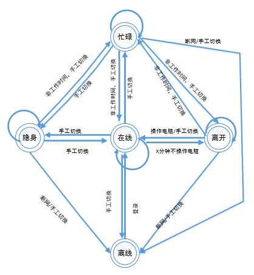

图4.2.4-1 QQ状态转换图

>   2）列出穿越0个状态的测试用例（状态自身的）

>   根据图4.2.4-1中的状态转换图，可以生成如表4.2.4-1所示的状态转换表。

表4.2.4-1 QQ状态转换表

| **编号** | **前提** | **事件**                 | **结果** |
|----------|----------|--------------------------|----------|
| 1        | 忙碌     | 手工切换忙碌             | 忙碌     |
| 2        | 忙碌     | 断网或手工切换离线       | 离线     |
| 3        | 忙碌     | 非工作时间手工切换离开   | 离开     |
| 4        | 忙碌     | 手工切换在线             | 在线     |
| 5        | 忙碌     | 手工切换隐身             | 隐身     |
| 6        | 隐身     | 非工作时间手工切换忙碌   | 忙碌     |
| 7        | 隐身     | 手工切换在线             | 在线     |
| 8        | 隐身     | 断网或手工切换离线       | 离线     |
| 9        | 隐身     | 手工切换隐身             | 隐身     |
| 10       | 在线     | 手工切换在线             | 在线     |
| 11       | 在线     | 非工作时间手工切换忙碌   | 忙碌     |
| 12       | 在线     | X分钟不操作电脑          | 离开     |
| 13       | 在线     | 手工切换离线             | 离线     |
| 14       | 在线     | 手工切换隐身             | 隐身     |
| 15       | 离开     | 手工切换离开             | 离开     |
| 16       | 离开     | 手工切换在线或操作电脑   | 在线     |
| 17       | 离开     | 非工作时间，手工切换忙碌 | 忙碌     |
| 18       | 离开     | 断网或手工切换           | 离线     |
| 19       | 离线     | 登录                     | 在线     |

>   3）列出穿越1个状态的（一个状态，两个事件）

这里的穿越1个状态指的是从状态A开始，经过状态B，到达状态C。由于这个里面涉及到了从状态A到状态B，又涉及到了从状态B到状态C。这样的情况也可以称为“1
Switch”（也称为“1切换”）。（这部分内容在ISTQB高级测试分析师中有更详细的描述）

表4.2.4-2 QQ状态1 Switch测试（部分用例）

| **编号** | **前提** | **测试用例描述**                                                                                     | **预期结果** |
|----------|----------|------------------------------------------------------------------------------------------------------|--------------|
| 1        | 忙碌     | 处于忙碌状态下，处于非工作时间手工切换离开，到达**离开**状态，再通过非工作时间手工切换**忙碌**       | 忙碌         |
| 2        | 忙碌     | 处于忙碌状态下，处于非工作时间手工切换离开，到达**离开**状态，手工切换在线或操作电脑，到**在线**状态 | 在线         |
| 3        | 忙碌     | 处于忙碌状态下，处于非工作时间手工切换离开，到达**离开**状态，断网或手动切换至离线状态               | 离线         |
| 4        | 在线     | 处于在线状态下，X分钟不操作电脑，到达**离开**状态，断网或手动切换至**离线**状态                      | 离线         |
| 5        | 在线     | 处于在线状态下，X分钟不操作电脑，到达**离开**状态，手工切换**在线**或操作电脑                        | 在线         |
| 6        | 在线     | 处于在线状态，X分钟不操作电脑，到达**离开**状态，通过非工作时间手工切换**忙碌**                      | 忙碌         |

>   **6、局限/困难：**

定义状态表或状态图时确定状态往往是最困难的部分。当软件有一个用户界面，为用户显示的各种画面经常被用来定义状态。嵌入式软件，状态可能会依赖于硬件所处的状态。

>   **7、注意事项**

-   开始写规格说明的时候，就从测试的角度来评估测试对象的状态转换图

    -   假如测试对象有很多状态和状态转换，表明需要更多的测试工作量，可能的情况下应该寻找对策简化测试对象

-   检查规格说明，确保测试对象状态容易识别，且这些状态不是由大量不同变量组合构成的；保证从外部可以比较容易地访问状态变量。

-   在测试过程中如能使用设置状态/重设状态函数以及读取状态值函数等将会给测试带来很大益处。

-   定义状态需要考虑的信息

    -   状态转换之前的状态

    -   触发状态转换的触发事件

    -   在状态转换时触发的期望反应

    -   接下来的期望状态

>   **8、总结：**

-   状态是一个抽象的概念

-   状态是由事件触发一个转换

-   前一个状态或当前条件影响下一个状态

-   如果一个事件，触发来自相同状态的两个或多个不同的转换，会有一个守护条件作限制

-   状态图中只显示有效的转换，会排除无效的转换

-   测试用例要覆盖一个典型的状态序列，包含有效的或无效的

4.2.5 用例测试

说到用例测试，那么首先要了解用例以及基于用例的开发。随着面向对象软件开发方法应用的增多，统一建模语言UML的使用越来越频繁（UML定义了可以在软件开发过程中使用的10多种图形符号）。其中用例是UML规范中标准化的需求表述体系，用例方法最早是由Iva
Jackboson博士提出的。

Pan-Wei Ng， Ivar Jacobson，December 2004，Aspect-Oriented Software Development
with Use Cases

用例是描述系统需求的一种方法，使用用例的方法来描述系统需求的过程就是用例建模。用例方法可以解决传统的需求描述方式（例如：需求规格说明）的一些缺点，例如：传统的需求规格说明非常容易混淆需求和设计的界限，导致不知道系统需求应该详细到何种程度；另一个缺点是需求分割了各个系统功能的应用环境，使人很难了解到这些功能是如何相互关联来实现一个完整的系统服务。

从用户的角度来看，他们并不想了解系统的内部结构和具体设计，用户更关心的是系统所能够提供的服务，也就是被开发出来的系统将是如何使用的，这就是用例方法的核心思想。用例模型主要由以下模型元素组成：

-   参与者（Actor）：存在于被定义系统外部，并与该系统发生交互的人或者其他系统，他们代表的是系统的使用者或者使用环境。

-   用例（Use
    Case）：用于表示系统所提供的服务，它定义了系统是如何被参与者所使用的，它描述的是参与者为了使用系统所提供的某个功能而与系统之间发生的一段“对话”。

-   通讯关联（Communication
    Association）：用于表示参与者和用例之间的对应关系，它表示参与者使用了系统中的哪些服务（用例），或者说系统所提供的服务（用例）是被哪些参与者所使用。

这三种元素在UML中的表述如图4.2.5-1所示。

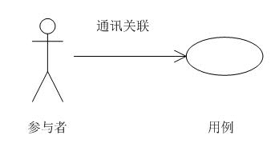

图4.2.5-1 UML基本元素

以银行的自动取款机ATM为例，它的主要功能可以由图4.2.5-2来表示。ATM的主要使用者是银行客户，银行客户主要使用ATM进行银行账号的查询、提款和转账交易等。

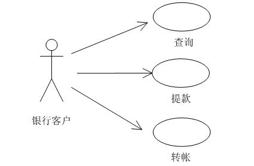

图4.2.5-2 ATM用例图

用例包括其基本行为的可能变化，同时也可以包括异常行为和错误处理（系统对编程、应用和通信错误的响应和恢复，例如：触发错误消息）。测试可以从用例中推导出来。设计的测试是为了验证已定义的行为（基本的、异常的或替代的，以及错误处理）。基于用例的测试在测试典型的用户系统相互作用方面非常有用。

*4.3白盒测试技术*

白盒测试技术是根据被测对象的结构系统化设计测试用例的一种方法，关注软件产品的内部细节和逻辑结构。如代码的结构（控制流图），数据的结构，菜单的结构，模块间相互调用的结构，业务流程的结构等。它把测试对象看作一个打开的盒子，盒子对应的是被测试的程序，测试人员通过全面了解程序内部逻辑结构，设计或选择测试用例，对所有逻辑路径进行测试，通过在不同点检查程序的状态，确定实际的状态是否与预期的状态一致。

（from：软件测试方法和技术 第3版 朱少民）

4.3.1 语句测试和覆盖

语句测试使用代码中的可执行语句。覆盖率以测试执行的语句数除以测试对象中可执行语句的总数来衡量，通常以百分比表示。

**1.语句覆盖**

选择足够多的测试数据，使被测程序中每个语句至少执行一次。

在保证每条语句都运行的前提下，测试用例应尽量少。

**2.源程序**

PRCEDURE  EXAMPLE(A，B:REAL; VAR X:REAL);

    READ

    BEGIN

    IF  (A\>1)  AND  (B=0)

          THEN    X:=X/A;

    IF  (A=2)   OR  (X\>1)

          THEN    X:=X+1;

    END;

**3.流程图**

针对上面的源代码可以生成如图4.3.1-1所示的控制流程图。

图4.3.1-1 控制流程图

**4.语句覆盖的测试用例**

表4.3.1-1是语句测试的测试用例。执行表中的测试用例，可以达到100%的语句覆盖。

表4.3.1-1 语句的测试用例

| 测试用例序号 （项目编号-项目版本号-模块号-测试用例编号） | 测试数据      | 说明                 | 覆盖路径 |
|----------------------------------------------------------|---------------|----------------------|----------|
| XX-V1-101-001                                            | A=2，B=0，X=4 | 两个判定表达式都取真 | sacbed   |

4.3.2 判定测试与覆盖

判定测试使用代码中的判定，并测试基于判定结果执行的代码。测试用例遵循从判定点出发的控制流(例如：对于IF语句，一个用于真的结果，一个用于假的结果；对于一个CASE语句，所有可能的结果都需要测试用例，包括默认结果）。

覆盖率通过测试执行的判定结果的数量除以测试对象中判定结果的总数来测量，通常以百分比表示。

**1.判定覆盖**

不仅每个语句必须至少执行一次，而且每个判定的每种可能的结果都应该至少执行一次，也就是每个判定的每个分支都至少执行一次。

**2.源程序**

PRCEDURE  EXAMPLE(A，B:REAL; VAR X:REAL);

    READ

    BEGIN

    IF  (A\>1)  AND  (B=0)

          THEN    X:=X/A;

    IF  (A=2)   OR  (X\>1)

          THEN    X:=X+1;

    END;

**3.流程图**

**4.判定覆盖的测试用例**

表4.3.1-2是判定覆盖的测试用例。执行表中的测试用例，可以达到100%的判定覆盖。当然满足100%判定覆盖的测试用例集合不是唯一的。

表4.3.1-2 判定覆盖的测试用例

| 测试用例序号  | 测试数据      | 说明                           | 覆盖路径 |
|---------------|---------------|--------------------------------|----------|
| XX-V1-101-001 | A=3，B=0，X=3 | 第一个判定表达式为真第二个为假 | sacbd    |
| XX-V1-101-002 | A=2，B=1，X=1 | 第一个判定表达式为假第二个为真 | sabed    |

4.3.3 语句与判定测试的价值

当实现100%的语句覆盖时，它确保代码中的所有可执行语句至少已测试过一次，但无法保证所有判定逻辑都已测试过。

当达到100%的判定覆盖率时，便会执行所有的判定结果，包括测试真的结果和假的结果，即使没有明确的假的语句（例如：没有ELSE的IF语句）。语句覆盖有助于发现代码中其他测试没有执行到的缺陷（如：有助于发现不可达代码）。判定覆盖有助于发现代码中的缺陷，在这些缺陷中，其他测试没有同时覆盖判定为真和假的情况。

达到100%的判定覆盖可以保证达到100%的语句覆盖（反之则不然）。

当然除了语句和判定覆盖之外，还有其他很多覆盖，在高级大纲中会覆盖。例如：条件覆盖。针对判定IF 
(A\>1)  AND 
(B=0)，虽然执行了表4.3.1-2中得测试用例，可以测试到该判定分别取真和假的情况，但是我们是否发现里面还有一些情况没有覆盖，那就是
(A\>1) 以及 (B=0）这两个条件的真和假是否都覆盖了呢？显然没有。

*4.4基于经验的测试技术*

基于经验的测试技术，顾名思义，就是凭借测试人员的直觉和经验设计测试用例的一种测试技术。测试人员在采用基于经验的测试技术设计测试用例时，带有一定的随机性，应用以往在类似应用或领域的知识，自由发挥、放开思路、灵活的设计测试用例。运用基于经验的测试技术，能够发现运用系统化的测试方法不能发现的问题，此技术实现的覆盖率和有效性也截然不同。基于经验的测试技术，往往难以评估覆盖率，也很难度量。在测试依据文档，如需求规格说明书不全、模糊，甚至没有任何需求文档的情况下，基于经验的测试将是一种比较适合的测试策略。

下面将分别介绍3种常用的基于经验的测试技术。

4.4.1 错误推测

错误推测法是测试人员在测试时，根据经验或直觉推测程序中可能存在的各种错误，从而有针对性地编写检查这些错误的测试用例的方法。错误推测法的基本思想是，列举出程序中所有可能存在的错误和容易发生错误的特殊情况，根据它们选择设计测试用例。例如，在单元测试时曾列出的许多在模块中常见的错误，以前产品测试中曾经发现的错误等，
这些就是经验的总结。

基于测试人员的知识和经验，利用错误推测法来预测错误、缺陷和失效发生的技术，包括：

-   应用程序在过去是如何运作的；

-   开发人员倾向于犯什么样的错误；

-   其他应用程序中已经发生的失效。

错误推测法的一种系统化方法是创建一个可能的错误、缺陷和失效列表，设计测试以发现失效以及导致失效的缺陷。这些错误、缺陷和失效列表的构建可以是基于经验、缺陷和失效数据，也可以建立在对软件失败原因的常识基础上。

利用错误推测法设计测试用例的常见工作依据有：

-   在单元测试时陈列出的许多在模块中常见的错误；

-   以前测试过程中曾经发现的错误；

-   已发现缺陷的测试方法的推广；

-   容易发生错误的情况，如：输入或输出为0的情况，输入为空格或输入表格只有一行，共享参数同时使用在几个模块中等；

-   补充等价类和边界值法遗漏的一些等价类组合；

-   一些位置使用了共享变量，设计测试用例，修改一个共享变量，看其他位置有没有同时做修改。

4.4.2 探索性测试

探索性测试是基于经验测试技术的一种类型，更强调测试人员的个人自由、主观能动性和职责，抛弃繁杂的测试计划和测试用例设计过程，强调在碰到问题时及时改变测试策略。探索性测试在测试执行期间动态的设计、执行、记录和评估非正式的测试结果，并将设计、执行和结果分析作为并行且相互支持的测试活动。对探索性测试更加直白的定义就是：同时设计测试和执行测试。探索性测试强调测试设计和测试执行的同时性，测试人员通过测试来不断学习被测系统，并把学习到的关于软件系统的更多信息通过综合的整理和分析，创造出更多的关于测试的主意。这个过程可以用图4.4.2-1来形象的描述。

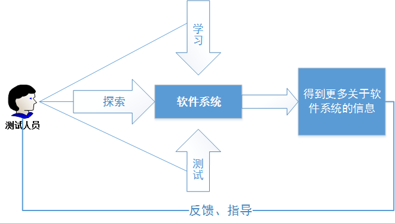

图4.4.2-1 探索性测试的过程

探索性测试分为自由式探索性测试、基于场景的探索性测试、基于策略的探索性测试和基于反馈的探索性测试，有时也会使用基于会话的测试来构建测试活动。在基于会话的测试中，探索性测试是在规定的时间内进行的，测试人员使用包含测试目标的测试章程来指导测试。测试人员可使用测试会话表记录所采取的步骤和发现。探索性测试的测试结果一般不容易度量，更多的是为了了解组件或系统，并为可能需要更多测试的区域创建测试。

Kaner, Cem; Bach, James; Pettichord, Bret (2001). Lessons Learned in Software
Testing. John Wiley & Sons

探索性测试一般适用于以下场景：

-   当测试人员是新手，可以一边训练一边测试

-   需要快速的对被测对象进行评估

-   在传统的测试脚本中发现新的问题需要快速验证

-   当有需要去确认另一位测试人员的工作状况

-   当团队内有熟悉相关领域知识的测试人员

-   当需要做冒烟测试

-   当被测对象设计完成后没有预先规划并准备好测试脚本

-   当项目采用敏捷软件开发过程

-   被测对象很复杂并且难以理解

-   当想要针对某个软件缺陷进行深入调查

-   当想要扩大脚本测试的多样性时 

-   当被测对象的规格说明很少或不充分的时候

-   当测试时间压力大的情况下

Itkonen, J.; Mäntylä, M. V.; Lassenius, C. (2013-05-01). "The Role of the
Tester's Knowledge in Exploratory Software Testing". IEEE Transactions on
Software Engineering. 39 (5): 707–724.

探索性测试是其他测试技术的有效补充，可以与其他黑盒、白盒和其他基于经验的技术结合使用。其优缺点如下：

-   优点

    -   鼓励创造性

    -   可增加机会找到新的、未知的缺陷

    -   允许测试人员花较多的时间去测试一些有趣或复杂的状况

    -   可较快速的对被测软件系统做出评估

    -   可让你知道被测对象是否容易使用

    -   可变通的，有弹性的

    -   它比脚本测试有趣，因为它不会一成不变

-   缺点

    -   不容易被协调及调整

    -   无法对被测对象作全面性的测试

    -   提供有限的测试可信度

    -   非常依靠测试人员的领域知识以及技术

    -   无法保证最重要的软件缺陷一定能被发现

    -   不适用要执行很久的测试（例如执行一整个晚上的测试）

https://baike.baidu.com/item/探索性测试/

4.4.3 基于检查表的测试

在基于检查表的测试中，测试人员设计、实现和执行测试，以覆盖检查表中的测试条件。在测试人员设计测试之前，可以创建一个新的检查表或基于现有的检查表进行扩展，以满足本产品或项目的检查项，若现有检查表已符合被测对象的检查要求，测试人员也可以直接使用现有的检查表，不做任何修改。

检查表一般建立在经验、了解什么对用户是重要的，或者理解软件为什么以及如何失败的基础之上，检查表中每一个检查项都需要确保是有效、可测量且有意义的。检查表可以支持各种测试类型，包括功能测试和非功能测试，需要对工作中的每一项都进行评估和测量。

在缺乏详细测试用例的情况下，基于检查表的测试可以提供指南和一定程度的一致性。由于这些是概要性的检查表，实际测试中可能会出现一些变化，从而扩大覆盖率，但降低重复性。例如：基于检查表的测试，可以包括如下检查点：对输入、编辑功能的验证检查点，查询功能检查点，删除功能检查点，上传附件检查点，影响操作性能的检查点，以及业务、数据流转检查点等。

5 测试管理

**关键词**

配置管理(configuration management)， 缺陷管理(defect management)，
入口准则(entry criteria)， 出口准则(exit criteria)， 产品风险(product risk)，
项目风险(project risk)， 风险(risk)， 风险级别(risk level)，
基于风险的测试(risk-based testing)， 测试方法(test approach)， 测试控制(test
control)， 测试估算(test estimation)， 测试经理(test manager)， 测试监视(test
monitoring)， 测试计划(test plan)， 测试规划(test planning)， 测试进度报告(test
progress report)， 测试策略(test strategy)， 测试总结报告(test summary report)，
测试人员(tester)

**测试管理的学习目标**

**5.1测试组织**

FL-5.1.1 (k2)解释独立测试的优点和缺点

FL-5.1.2 (k1)识别测试经理和测试人员的任务

**5.2测试规划和估算**

FL-5.2.1 (k2)总结测试计划的目的和内容

FL-5.2.2 (k2)区分各种测试策略

FL-5.2.3 (k2)举例说明可能的入口和出口准则

FL-5.2.4
(k3)应用优先级知识、技术和逻辑依赖关系，为给定的一组测试用例安排测试执行进度

FL-5.2.5 (k1)确定影响测试工作量的因素

FL-5.2.6 (k2)解释两种估算技术的区别：基于度量的技术和基于专家的技术

**5.3测试监视和控制**

FL-5.3.1(k1)记住用于测试的度量

FL-5.3.2(k2)总结测试报告的目的、内容和受众

**5.4配置管理**

FL-5.4.1 (k2)总结配置管理是如何支持测试的

**5.5风险和测试**

FL-5.5.1 (k1)基于可能性和严重程度定义风险级别

FL-5.5.2 (k2)区分项目风险和产品风险

FL-5.5.3 (k2)通过举例说明产品风险分析如何影响测试的完备性和范围

**5.6 缺陷管理**

FL-5.6.1 (k3)编写缺陷报告，以覆盖测试中发现的缺陷

*5.1测试组织*

测试活动贯穿于软件开发的整个生命周期，保障测试活动与开发活动的紧密配合、协作，测试活动与开发团队的接口统一、透明，是建立卓越测试组织的重要任务之一。本章将阐述组建测试团队的方式、测试团队内的不同角色和工作职责、独立测试的优缺点，以及测试经理和测试人员的任务。

5.1.1 测试的独立性

软件开发生命周期中的测试活动，与开发活动不同，有其独特的测试方法。测试工作可以由组织内特定角色的人员来完成，也可以由其他角色的人（如客户）来完成。一定程度的测试独立性(测试人员与开发/需求人员认知上的不一致)，可以使测试人员更有效地发现系统/软件产品的缺陷。然而，独立性不是完全替代性，并不是说开发人员就不用测试自己的代码了，相反的，开发人员通过自测，可以高效地在自己的代码中发现许多缺陷，有时甚至是比较隐蔽的缺陷。因此，需要根据组织的具体情况，选择合适的独立测试类型。

如图5.1.1-1所示，测试活动的独立性程度由低到高包括：

（1）没有独立的测试人员：开发人员负责测试，开发人员测试自己的代码。开发人员根据自己的理解对自己编写的代码进行测试，一旦发现缺陷，开发人员立即修复缺陷，这可以大大缩短解决问题的时间。但由于开发人员更愿意花更多的时间在开发活动上，所以留给测试的时间将很少，测试活动的质量无法得到有效的保障。例如，Gelperin和Hetzel模型，在初始的时期测试是被描述成面向调试的，在这个时期大多数的软件开发组织不清楚测试和调试的区别。测试是个模糊的活动，它跟调试一起是用来从程序中去除错误的。

（2）开发团队或项目团队中的独立开发人员或测试人员：测试活动被独立执行，但执行者是开发人员或者开发团队/项目团队中的测试人员。开发人员之间互相交叉测试其它同事开发的产品。测试活动的执行与管理均隶属于开发团队或者项目团队。

（3）组织内独立的测试团队：测试活动被独立执行，且执行者来自于独立的测试团队，测试团队向项目或组织汇报。

（4）来自业务部门或用户群体的独立测试人员，或专门从事特定类型测试的人员：如易用性、安全性、性能、监管/合规性或可移植性，即我们通常说的安全测试工程师、性能测试工程师等。此类型的测试活动，通常有其特定的测试目标，测试活动围绕测试目标执行。

（5）组织外部的独立测试人员，在现场工作(内包)，或在外部工作(外包)。此类型的测试活动，通常运用在软件的验收测试级别中。

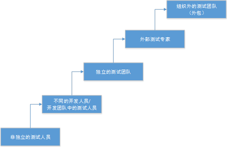

图5.1.1-1 测试人员独立性

对于大多数的项目类型，通常情况下最好有多个测试级别，其中一些级别由独立测试人员测试。开发人员应参与测试，特别是在测试级别比较低的时候，以便对自己的工作质量进行控制。但是开发人员往往缺乏测试的目的性和专业的测试技术、测试方法，这在一定程度上会限制开发人员的测试效率。

测试独立性的实现方式取决于软件开发生命周期模型的不同。例如：敏捷开发中，测试人员可能是开发团队的一部分。一些使用敏捷方法的组织中，测试人员也可能被认为是更大的独立测试团队的一部分。此外，在此类组织中，产品负责人（Product
owner）可以在每次迭代结束时执行验收测试以验证用户故事的实现。

独立测试的潜在优点包括：

（1）相对开发人员，独立的测试人员可以从与开发人员不同的视角去分析和测试系统/软件产品，由于不同的背景、技术视角和倾向，通常可以识别不同类型的失效；

（2）独立的测试团队与测试人员，其更加注重系统/软件产品的质量，尽可能多的发现缺陷是测试团队最重要的目标之一。如果是开发人员自己测试，则更多的会出于对自己编写代码的偏爱，而不会想方设法的去尽可能多的发现缺陷；

（3）独立的测试团队与测试人员，当发现系统/软件产品的缺陷时，可以对发现的缺陷进行客观的分析与评价，并给出合理的解决方案；

（4）独立的测试团队，由于整个团队都负责测试活动，测试团队可以从专业的视角去培养测试能力，使之成为专业的测试团队；

（5）独立的测试人员，可以利用专业的测试技能，核实、质疑或反驳利益相关者在系统规范和实现期间作出的假设。

对于庞大、复杂，或者安全关键系统，最好由独立的测试团队进行多个级别的测试。

当然，独立测试也有其潜在的缺点，包括：

（1）测试团队与开发团队隔离，从而导致缺乏合作，测试团队在向开发团队提供反馈方面可能会出现延误，或与开发团队形成敌对关系；

（2）开发人员可能会失去对质量的责任感；

（3）基于独立测试团队对质量的要求，独立的测试人员常常被看作是延迟发布的瓶颈或受到指责；

（4）由于测试团队独立于开发团队，测试人员的开发技能相对比较薄弱，对于系统的设计和代码的理解，往往需要投入更多的工作量；

（5）测试人员与开发人员，往往需要建立正式的沟通渠道，以解决发现缺陷后的沟通问题；

（6）独立测试人员可能缺乏一些重要信息，例如：关于测试对象的需求、设计，以及实现逻辑相关的一些信息。这点在许多组织中，测试通过尽早介入往往可以避免。

在实际执行过程中，许多组织能够成功地实现测试独立性的优点，并同时避免这些缺点。

5.1.2 测试经理和测试人员的任务

独立的测试团队中，通常有测试经理和测试人员两大角色。这两个角色所执行的活动和任务取决于项目和产品背景、该角色的技能以及组织。

测试经理在不同的组织中，有时也被称为测试组长或者测试协调人。测试经理作为测试管理角色，通常是测试团队的领军人物，其首要职责就是带领测试团队执行测试过程和测试活动，全面负责并保障测试过程和测试活动的成功；同时，测试经理还需要具备计划能力、协调能力、创新能力、授权能力、指挥能力等，以身作则，为团队带去正面影响力，并为他人提升价值。

测试经理的角色可以由专业的测试经理，也可以由项目经理、开发经理或质量保证经理担任。在比较大型的项目或组织中，可以分为多个测试小组，每个测试小组由测试组长或主要测试人员领导，多个测试小组团队向测试经理报告。

测试经理的主要任务包括：

-   为本组织制定或评审测试方针和测试策略

-   通过考虑上下文和理解测试目标和风险来规划测试活动。这可能包括选择测试方法、估算测试时间、工作量和成本、获取资源、定义测试级别和测试周期以及规划缺陷管理

-   编写和更新测试计划

-   与项目经理、产品所有人和其他人协调测试计划

-   与其他项目活动分享测试视角，例如集成规划

-   开始分析、设计、实现和执行测试，监视测试进度和结果，并检查出口准则(或已完成的定义)的状态

-   根据收集的信息准备和提交测试进度报告和测试总结报告

-   根据测试结果和进度情况调整规划(有时记录在测试进度报告和/或记录在测试总结报告中的其他已经完成的测试)，并为测试控制采取合适的行动

-   支持建立缺陷管理系统和针对测试件的适当的配置管理

-   采用合适的度量，测量测试进度，评估测试和产品的质量

-   支持工具的选择和实施以支持测试过程，包括工具选择(和可能购买和/或支持)所需的预算，为试点项目分配时间和工作量，并为工具的使用提供持续的支持

-   确定测试环境的实施

-   在组织内促进和激励测试人员、测试团队和测试专业化

-   发展测试人员的技能和职业(例如:通过培训计划、绩效评估、辅导等)

测试经理的主要任务，与软件开发生命周期模型有一定的关系，角色的执行方式取决于软件开发生命周期的不同。例如：敏捷开发中，上面提到的一些任务是由敏捷团队处理的，特别是那些与团队内进行的日常测试有关的任务，通常是由团队内的测试人员处理的。一些跨多个团队或整个组织的任务，或与人事管理有关的任务，可由开发团队以外的测试经理完成，他们有时被称为测试教练或测试协调人。

测试人员的主要任务包括：

-   参与测试计划评审，并提出可行性建议，协助测试经理保障测试计划的完整性、可执行性；

-   参与需求评审，从测试的视角提出可行性建议；

-   对需求规格进行充分的分析，分解出各种类型的需求（功能性需求、性能要求、其他需求等）；

-   充分理解用户故事和验收准则、规格说明、可测试性模型（即测试依据），输出测试需求；

-   识别和文档化测试条件，设计测试用例；

-   获取测试用例、测试条件和测试依据之间的可追溯性；

-   设计、建立和验证测试环境，并经常与系统管理员和网络管理员协调；

-   执行测试用例和测试规程；

-   准备和获取测试数据；

-   制定详细的测试执行时间进度表；

-   执行测试，评估结果，并文档化与预期结果之间的偏差；

-   使用适当的工具辅助、促进测试过程；

-   根据需要实现测试自动化（可能得到开发人员或测试自动化专家的支持）；

-   评估非功能性特性，如性能效率、可靠性、易用性、安全性、兼容性和可移植性等；

-   评审其他人员执行的测试；

-   参与测试总结会议，积累经验与教训。

从事测试分析、测试设计、特定测试类型或测试自动化工作的人可能是这些角色的专家。根据产品风险与项目风险，以及所选择的软件开发生命周期模型，不同的人会在不同的测试级别上承担测试人员的角色。例如：在组件测试级别和组件集成测试级别，测试人员的角色通常由开发人员完成。在验收测试级别，测试人员的角色通常由业务分析师、专家和用户完成。在系统测试级别和系统集成测试级别上，测试人员的角色通常由独立的测试团队完成。在运行验收测试级别，测试人员的角色通常由运维和/或系统管理人员完成。

*5.2 测试规划与估算*

5.2.1 测试计划的目的与内容

软件测试计划是对测试过程的整体设计。通过收集项目和产品相关的信息，对测试范围、测试风险进行分析，对测试用例、工作量、测试资源和时间等进行估算，对测试采用的策略、方法、环境、资源、进度等做出合理的安排。

软件测试技术大全：测试基础、流行工具、项目实践（第3版）

当项目或测试计划不断向前演进时，就可以根据不断获得的细节，补充进测试计划。所以测试计划是一项持续工作，并贯穿于整个产品生命周期（注意，产品的生命周期可能会从项目交付阶段延伸至运维阶段）。测试活动中获得的反馈可以用来识别变更风险，进而对测试计划进行调整。在设计测试计划文档时，可以分为主测试计划及对应于各个测试级别的单独测试计划，例如系统测试与验收测试。或者可以按不同的测试类型进行区分，例如可用性测试与性能测试。

**制定测试计划的目的**

-   管理者能够根据测试计划做宏观调控，进行相应资源配置等。

-   测试负责人可以根据测试计划跟踪测试进度。

-   测试人员能够了解整个项目测试情况，以及项目测试不同阶段需要进行的工作。

-   便于其他人员了解测试人员的工作内容，并配合测试的工作。

软件测试管理与实践 赵聚雪 杨鹏主编

**制定测试计划的相关活动（部分可以写入测试计划的内容中）**

-   确定测试的范围、目标和风险

-   确定测试的总体方法

-   将测试活动集成到整个软件生命周期活动中并加以协调

-   确定测试什么、进行各种测试活动所需的人员和其他资源，以及如何进行测试活动

-   按照特定的日期（例如：在顺序开发中）或在每个迭代的上下文中，针对测试分析、设计、实现、执行和结束活动制订时间进度表

-   选择测试监视和控制相关的度量

-   确定测试活动预算

-   确定测试文档的详细程度和结构(例如：通过提供模板或示例文档)

5.2.2 测试策略和测试方法

测试策略通常在产品或组织级别对测试过程进行了描述。常见的测试策略包括：

-   分析型：该类型测试策略基于对一些因素(例如需求或风险)进行分析。基于风险的测试是分析型方法的一个例子，根据风险级别设计测试并确定其优先级。

-   基于模型的：该类型的测试策略，测试的设计是基于产品某些方面的模型，如功能、业务流程、内部结构或非功能特性（如可靠性）。这类模型的例子包括业务流程模型、状态模型和可靠性增长模型。

-   方法型：该类型的测试策略依赖于系统化使用一些预定义的测试集或测试条件，如常见或可能的失效分类，重要质量特性的列表，或全公司的手机应用程序或网页的视觉和感觉标准。

-   符合过程(或标准)：该类测试策略基于外部规则和标准的测试分析、设计和实现测试，如特定行业标准，流程文档，严格标识和使用的测试依据，或组织主动或被动强制的过程或标准。

-   指导型(或咨询型)：该类测试策略主要通过利益相关者、业务领域专家或技术专家的建议、指导或指示驱动，他们可能来自测试小组或组织外。

-   回归避免：该类型的测试策略的动机是希望避免现有能力的回归。这个测试策略包括重用现有的测试件（特别是测试用例和测试数据）、回归测试的广泛自动化以及标准化测试套件。

-   应对型：该类型的测试策略是对正在测试的组件或系统以及在测试执行过程中发生的事件作出反应，而不是事先计划好的（如前面的策略）。设计和实现的测试，可能会根据以前测试结果中获得的知识立即得到执行。探索性测试是应对型策略中常用的一种技术。

这些典型的测试策略并不是孤立存在的。合适的测试策略通常是结合其中几种类型的测试策略来创建的。例如：基于风险的测试（分析型测试）可与探索性测试（应对型策略）相结合；它们相辅相成，并可在一起使用时实现更有效的测试。组织选定的测试策略应符合其需要，并可根据其特定的业务或项目特点进行合理的裁剪。

测试策略提供了测试过程的广义描述，而测试方法则针对特定项目或发布对测试策略进行裁剪。测试方法是选择测试技术、测试级别和测试类型的起点，也是定义入口准则和出口准则（或分别是已准备的定义和已完成的定义）的起点。根据项目的复杂性和目标、正在开发的产品类型以及产品风险分析作出的决定，对测试策略进行裁剪。选择的方法取决于上下文，并考虑风险、安全、可用资源和技能、技术、系统特点(例如：定制与COTS)、测试目标和法规等因素。

5.2.3 入口准则和出口准则（已准备的定义和已完成的定义）

为了有效控制软件和测试的质量，需要制定准则，定义特定测试活动何时开始，以及何时完成。入口准则（敏捷开发中通常称为已准备的定义）：定义了进行特定测试活动的先决条件。如果不符合入口准则，则该活动很可能会更困难、更耗时、更昂贵和风险更大。出口准则（敏捷开发中通常称为已完成的定义）：必须达到的条件，以声明一个测试级别或一组测试已经完成。针对每个测试级别和测试类型，都应该定义入口准则和出口准则，并根据测试目标而有所不同。

典型的入口准则包括：

-   待测试的需求、用户故事，和/或模型(例如：在采用基于模型的测试策略时)已准备好

-   已满足上一个测试级别出口准则的测试项

-   测试环境已完备

-   所需测试工具已准备好

-   测试数据和其他必要资源已准备好

典型的出口准则包括：

-   完成已计划测试的执行

-   已达到规定的覆盖率(如需求、用户故事、验收准则、风险、代码)

-   未解决的缺陷数目在商定的范围内

-   估计剩余的缺陷数量足够低

-   对可靠性、性能效率、易用性、安全性和其他相关质量特性的评估得到的级别，已经满足要求

即使没有满足出口准则，由于预算超支、计划完成的时间耗完，和/或产品推向市场的压力等原因，而减少测试活动也是常见的。如果项目利益相关者干系人和业务负责人都已经评审并接受不再进一步测试所带来的风险，此时结束测试是可接受的。

5.2.4 测试执行进度

测试执行是执行所有或部分选定的测试用例，并对结果进行分析的过程。测试执行活动是整个测试过程的核心环节，所有测试分析、测试设计、测试计划的结果都将在测试执行中得到最终的检验。

（from:软件测试管理与实践 赵聚雪 杨鹏 主编）

测试执行的主要目标是尽可能地发现产品的缺陷，而不是达到测试计划完成率。如果过分关注测试计划完成率，而不重视测试执行的质量，则会导致虽然已经完成测试，但是仍然不能确保产品质量。此时需要进行补救，增加重复测试，这样不但加大了测试冗余度，还会造成整体测试进度的延迟，更严重的是会遗留很多本来应该发现的缺陷。

因此，测试用例执行过程中除了关注测试进度外，还要全方位观察测试用例执行结果，加强测试过程的记录，及时确认发现的问题，及时更新测试用例，处理好与开发的关系，促进缺陷的解决。

测试执行的主要任务主要包括以下六个方面。

**1）测试启动评估：根据测试计划和待测试对象评估此次测试是否达到入口准则。**

不同的测试目的，其测试入口准则评估的条件不尽相同，要根据实际情况进行设置。入口准则一般会在测试计划中定义。

-   评估被测对象的完成程度以及质量能否达到测试启动的标准。例如：

    -   计划体现在发布版本上的功能模块以及所有项目集成在一起后的各功能点已实现，即需求已经100%完成；

    -   交付测试的版本已经完成所有基本的自动化测试，并且自动化测试脚本全部通过。

-   根据给定的版本测试时间及测试用例分配结果，结合测试执行能力，评估本轮测试需达到的覆盖率

-   根据覆盖率确定本轮应发现缺陷的阶段目标

-   评估各特性用例分配情况是否合理，是否存在极不均衡的现象，是否存在过度测试，是否存在部分特性无法完成测试

-   评估测试执行计划中时间安排的合理性

**2）指定测试用例：根据测试的阶段、任务选择执行全部或部分测试用例。**

**3）测试用例分配：将测试用例分配给测试工程师。**

-   识别此次要执行的测试用例的集合

-   考虑特性之间的交互关系

-   考虑测试用例的优先级

**4）执行测试：执行测试用例，记录原始数据，及时报告发现的缺陷。**

在执行过程中，测试用例是核心。为了方便统计和管理，测试用例在执行中有不同的状态。例如：

-   等待执行状态：测试用例等待执行

-   阻塞状态：由于其他原因导致测试用例暂时不能执行。比如某个功能模块不能启动，则该功能模块所有用例被阻塞；管理员账号登录失败，则所有管理员权限用例被阻塞

-   正在执行状态：测试用例正在执行中

-   通过状态：测试用例执行通过

-   失败状态：测试用例执行失败，此时要提交相应的缺陷

-   免执行状态：表示本次测试不执行该测试用例

**5）状态监控：根据测试执行情况以及缺陷情况，监控测试执行的进度以及遇到的问题，并及时解决测试中阻碍执行进度的相关问题。**

监控的任务和目的：

-   记录和管理测试用例的执行状态

-   根据当前的执行状态，判定测试用例的质量和执行效率

-   根据已发现缺陷的分布，判定结束测试的条件是否成熟

-   根据缺陷的数量、种类等信息评估被测试软件的质量

-   根据缺陷的分布、修复缺陷的时机、回归测试发现的缺陷梳理等评估开发过程的质量。

主要监控的内容包括：

-   控制进度监控：监控测试执行的进度与预期的偏差，及时分析原因并进行计划调整

-   用例质量监控：测试用例的有效性，能否发现关键问题等

-   测试覆盖度监控：测试是否全面

-   执行效率监控：测试执行的效率

-   研发质量监控：被测产品的质量如何

**6）及时汇报：及时向管理层汇报测试的进度、发现的主要问题等。**

一旦生成各种测试用例和测试规程（有些测试规程是自动化的）并组成测试套件，测试套件就可以安排在定义了它们执行顺序的测试执行进度中。测试执行进度应考虑到诸如优先级、依赖关系、确认测试、回归测试以及执行测试的最有效顺序等因素。理想情况下，测试用例应该是按照其优先级顺序进行执行的，通常是先执行优先级最高的测试用例。但是，如果测试用例具有依赖关系或正在测试的特性之间具有依赖关系，那该实践会不起作用。如果优先级较高的测试用例依赖于优先级较低的测试用例，则必须先执行优先级较低的测试用例。

同样，如果测试用例之间存在依赖关系，则必须适当地对它们进行排序，而不管它们的相对优先级如何。确认测试和回归测试也必须根据变更的快速反馈，进行优先级排序，但这里同样受依赖关系的影响。

在某些情况下，可能存在各种不同的测试顺序，不同的顺序之间的效率是不同。在这种情况下，必须在测试执行效率与优先级之间作出平衡。

5.2.5 影响测试工作量的因素

测试工作量估算包括针对特定项目、发布或迭代的测试目标，预测与测试相关工作量。影响测试工作量的因素包括产品特点、开发过程特点、人员特点和测试结果。具体内容如下：

**产品特点**

-   产品相关的风险

-   测试依据的质量

-   产品的规模

-   产品领域的复杂性

-   质量特性需求（例如安全性、可靠性）

-   测试文档所需的详细程度

-   遵守法律和法规的需求

**开发过程特点**

-   组织的稳定性和成熟性

-   正在使用的开发模型

-   测试方法

-   使用的工具

-   测试流程

-   时间压力

**人的特点**

-   参与人员的技能和经验，特别是类似项目和产品有关的技能和经验（如领域知识）

-   团队凝聚力和领导能力

**测试结果**

-   发现缺陷的数量和严重程度

-   需要的返工量

5.2.6 测试估算技术

在进行项目计划时，就要确定资源需求和安排进度，而这些工作依赖于对测试范围和工作量的估算。最常用的两种技术是：

-   基于度量的技术：根据以前类似项目的度量，或根据典型值估算测试工作量

-   基于专家的技术：根据测试任务责任人或专家的经验估算测试工作量

除此之外，估算技术还有很多，例如：经验估算法、对比分析法、工作任务分解方法和数学建模方法等。将良好的历史数据与系统化的技术结合起来能够提高估算的精确度。

下面分别从测试工作量估算、工作结构分解表、测试资源安排、测试里程碑和进度表几个方面来阐述测试估算。

**1.测试工作量估算**

测试的工作量是根据测试范围、测试任务和开发阶段来确定的。测试范围和测试任务是测试工作量估算的主要依据。测试任务是由质量需求、测试目标来决定的，质量要求越高，越要进行更深、更充分的测试，回归测试的次数和频率也要加大，测试的工作量也要增加。

处在不同的开发阶段，测试的工作量差异也很大。新产品的第一个版本的开发过程，相对于以后的版本来说，测试的工作量要大一些。但也不是绝对的。例如，第1个版本的功能较少，在第2、3个版本中，增加了较多的新功能，虽然新加的功能没有第1个版本的功能多，但是在第2、3个版本的测试中，不仅要完成新功能的测试，还要完成第1个版本的功能回归测试，以确保原有的功能正常。

在一般情况下，一个项目要进行两三次回归测试。所以，假定一轮（Round）功能测试需要100个人日，则完成一个项目所有的功能测试肯定就不止100个人日，往往需要200-300多个人日。可以采用以下公式计算：

W=Wo + Wo X R1 +Wo X R2 + Wo X R3

（1）W为总工作量，Wo为第一轮测试的工作量。

（2）R1、R2、R3为每轮的递减系数。

受不同的代码质量、开发流程和测试周期等影响，R1、R2、R3的值是不同的。

对于每一个公司来说，可以通过历史积累的数据获得经验值。

测试的工作量还受自动化测试程度、软件质量、开发模式等多种因素影响。在这些影响的因素中，软件质量是主要的。软件质量越低，测试的重复次数可能就越多。回归测试的范围，在这三次中可能各不相同，这取决于测试结果，即测试缺陷的分布情况。如果缺陷多且分布很广，所有的测试用例都要被再执行一遍。缺陷少且分布比较集中，可以选择部分或少数的测试用例作为回归测试所要执行的范围。

软件质量相对较低的情况下，假定R1、R2、R3的值分别为80%、60%、40%。若一轮功能测试的工作量是100个人日，则总的测试工作量为280个人日。如果代码质量高，一般只需要进行两轮回归测试，R1、R2值也将为60%、30%，则总的测试工作量为190个人日，工作量减少了32%以上。

工作量的估计比较复杂，针对不同的应用领域、程序设计技术、编程语言等，其估算方式是不同的。其估算可能要基于一些假定或定义：

-   效率假设：即测试队伍的工作效率。对于功能测试，这主要依赖于应用的复杂度、窗口的个数、每个窗口中的动作数目。对于容量测试，主要依赖于建立测试所需数据的工作量大小。

-   测试假设：目的是验证一个测试需求所需测试的动作数目，包括估计的每个测试用例所用的时间。

-   阶段假定：指所处测试周期不同阶段（测试设计、脚本开发、测试执行等）的划分，包括时间的长短。

-   复杂度假定：应用的复杂度指标和需求变化的影响程度决定了测试需求的维数。测试需求的维数越多，工作量就越大。

-   风险假定：一般考虑各种因素影响下所存在的风险，将这些风险带来的工作量设定为估算工作量之外的10%-20%。

**2.工作分解结构表方法**

要做好测试工作量的估算，需要对测试任务进行细化，对每项测试任务进行分解，然后根据分解后的子任务进行估算。通常来说，分解的粒度越小，估算精度越高。可以再加上10%-15%的浮动幅度，来确定实际所需的测试工作量。比较专业的方法是工作分解结构表（Work
Breakdown Structure，WBS），它按以下三个步骤来完成。

（1）列出本项目需要完成的各项任务，如测试计划、需求和设计评审、测试设计、脚本开发、测试执行等。

（2）对每个任务进一步细分，可进行多层次的细分，直到不能细分为止。如针对测试计划，首先可细分为：

-   确定测试目标

-   确定测试范围

-   确定测试资源和进度

-   测试计划写作

-   测试计划评审

（3）列出需要完成的所有任务之后，根据任务的层次给任务进行编号，就形成了完整的工作分解结构表。如表5.2.6-1所示

**表5.2.6-1 测试工作分解结构表**

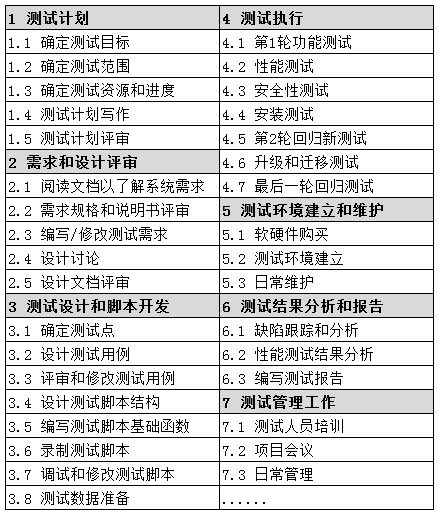

WBS除了用表格的方式表达之外，还可以采用结构图的方式，那样会更直观、方便。

当WBS完成之后，就拥有了制定日程安排、资源分配和预算编制的基础信息，这样不仅可获得总体的测试工作量，还包括各个阶段或各个任务的工作量，有利于资源分配和日程安排。所以，WBS方法不仅适合工作量的估算，还适合日程安排、资源分配等工作。

**3.测试人力资源安排**

资源管理的目的不仅要保证测试项目有足够的资源，同时，应能充分有效地利用现有资源，进行资源的优化组合，避免资源浪费。测试项目的资源，主要分为人力资源、系统资源（硬件和软件资源）以及环境资源。每一类资源都有4个特征来说明：资源描述、可用性说明、需要该资源的时间以及该资源被使用的持续时间。后两个特征可以看成是时间窗口，对于一个特定的窗口而言，资源的可用性必须在开发的最初期就建立起来。完成测试工作量估算之后就能基本确定一个软件测试项目所需的人员数量，并写入测试计划中。但是，仅知道人员数量是不够的，因为软件测试项目所需的人员和要求在各个阶段是不同的。

（1）在初期，也许只要测试组长介入进去，为测试项目提供总体方向、制定初步的测试计划，申请系统资源。

（2）在测试前期，需要一些资深的测试人员，详细了解项目所涉及的业务和技术，分析和评估测试需求，设计测试用例、开发测试脚本。

（3）在测试中期，主要是测试执行。如果测试自动化程度高，人力的投入没有明显的增加；如果测试自动化程度低，需要比较多的执行人员，他们也需要事先做好一定的准备。

（4）在测试后期，可以抽出部分资深的测试人员去准备新的项目。

从经验看，人力资源的管理难度主要有以下三个方面。

（1）资源需求的估计，依赖于工作量的估计和每个工程师的能力评估。

（2）资源的应急处理，预留10%的资源作为人力储备（Buffer）。

（3）资源在各个阶段或项目间平衡的艺术。

**4.测试里程碑和进度表**

里程碑（Milestone）是项目中完成阶段性工作的标志，即将一个过程性的任务用一个结论性的标志来描述任务结束的、明确的起止点，一系列的起止点就构成引导整个项目进展的里程碑。
一个里程碑标志着上一个阶段结束、下一个阶段开始，也就是定义当前阶段完成的标志（Exit
Criteria）下个阶段启动的条件或前提（Entry Criteria）。里程碑还具有下列特征：

（1）里程碑也是有层次的，在一个父里程碑内可以定义多个子里程碑；

（2）不用的项目，可能设置不同类型或不同数量的里程碑；

（3）不同规模项目的里程碑，其数量多少是不一样的，里程碑可以合并或分解。

例如，在软件测试周期中，建议定义6个父里程碑、十几个子里程碑。具体里程碑如下。

>   **M1：需求分析和设计的审查**

>   M11：市场/产品需求审查

>   M12：产品规格说明书的审查

>   M13：产品和技术知识传递

>   M14：系统/程序设计的审查

>   **M2：测试计划和设计**

>   M21：测试计划的确定

>   M22：测试计划的审查

>   M23：测试用例的设计

>   M24：测试用例的审查

>   M25：测试工具的设计和选择

>   M26：测试脚本的开发

>   **M3：代码（包括单元测试）完成**

>   **M4：测试执行**

>   M41：集成测试完成

>   M42：功能测试完成

>   M43：系统测试完成

>   M44：验收测试完成

>   M45：安装测试完成

>   **M5：代码冻结**

>   **M6：测试结束**

>   M61：为产品发布进行最后一轮测试

>   M62：写测试和质量报告

对每个里程碑，如果需要更加严格的控制，还可以定义更细的里程碑。

表5.2.6-2 是一个软件测试进度表的例子。

表5.2.6-2 软件测试进度表

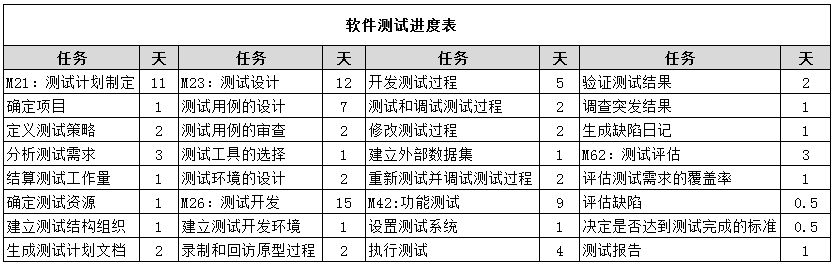

*5.3测试监控*

测试监控这里面其实包括两部分的内容。一个是监视，另外一个是控制。测试监视的目的是收集信息，并为测试活动提供反馈和可见性。测试控制是根据收集和（可能）报告的信息和度量，采取相应的指导或纠正行动。

测试监视需要通过手工或自动方式收集各种度量数据，这些数据可以用于评估测试进度、测试出口准则，或评估与敏捷项目的已完成定义相关的测试任务是否已完成，如达到产品风险、需要或验收准则的覆盖率要求。

一旦在测试监视过程中，发现当前的状态和期望的或计划的不符，就需要采取一定的控制活动。例如：

-   当识别的风险发生时重新确定测试的优先级(例如：软件延迟交付)

-   根据测试环境或其他资源是否可用，改变测试时间进度

-   重新评估某项测试项返工后是否还符合入口或出口准则

5.3.1 测试使用的度量

为了更好的进行测试监视，必须选择合适的度量指标。很多人对度量指标到底有哪些非常感兴趣。但是其实一套大而全的度量指标并不能解决测试监视的所有问题。相反，在面对很多度量指标可以选择的时候，如何选择合适自己当前组织或者项目的度量指标反而更有挑战。在日常工作中，一定要避免为了度量而度量的这种舍本求末的情况。所有的度量都是为了控制服务的，如果仅仅度量出来数据，但是根据这些数据，测试团队无法获得任何有用的信息，那么这个度量其实就是资源的浪费。

测试活动期间或结束时可以收集的度量包括：

-   时间进度和预算：用于评估当前的进度

-   测试对象的当前质量：质量是一个比较广泛的概念，测试团队需要进行细化，例如按照ISO
    25010中质量模型进行分类度量

-   测试方法的充分性：是否使用了各种不同的测试方法以达到测试目的，不同的测试方法涉及到测试技术、测试级别和测试类型等的选择，详细内容可以参考5.2.2节

-   基于目标的测试活动有效性：这里的度量和特定的目标相对应的，例如：如果为了通过代码评审减少系统测试中发现的基本功能存在的缺陷

通用测试度量包括：

-   测试用例准备阶段完成的已计划工作的百分比(或测试用例已实现占已计划的百分比)

-   测试环境准备阶段完成的已计划工作的百分比

-   测试用例执行(例如：运行/未运行的测试用例数目、通过/失败的测试用例数目，和/或通过/失败的测试条件数目)

-   缺陷信息（如缺陷密度、发现和修复的缺陷、失效率和确认测试结果）

-   需求、用户故事、验收准则、风险或代码的覆盖率

-   任务完成、资源分配和使用以及工作量

-   测试成本，包括发现下个缺陷的收益成本与执行下个测试的收益成本之间的比较

每个度量指标最终都要明确需要收集的数据和计算方法。例如：

-   测试用例执行的进度：测试用例执行的进度=已执行的数目/总数目。此数据只表明测试的执行进度，不表示测试的成功率。

-   缺陷的存活时间：缺陷的存活时间=缺陷从打开到关闭的时间（或者是从发现到解决的时间）。此数据表明修改缺陷的效率。

-   缺陷的趋势分析：按照测试执行的时间顺序（以月、周、天为时间单位），查看发现的缺陷数量的分布。一般说来是发现的缺陷越来越少。如果实际中发现的缺陷越来越少，趋近于0，则考虑结束测试执行。相反，如果发现缺陷的数量发生非正常波动，则说明可能存在以下的问题：代码修改引发新的缺陷；前一版本的测试存在覆盖率的问题；新的测试发现了原来未发现的缺陷；必须先修改某些缺陷后才能继续测试，然后才发现其他的缺陷。

-   缺陷分布密度：缺陷分布密度=某项需求的总缺陷数/该项需求的测试用例总数（或者功能点总数）。如果发现过多的缺陷集中在某项需求上，则要对需求进行分析和评估，然后根据分析结果进行测试调整。比如，该功能需求是否过于复杂，该项的需求设计、实现是否有问题，分配给该项的开发资源是否不足。需要注意的是，在分析缺陷的分布密度时要考虑缺陷的优先级和严重程度。

-   缺陷修改质量：缺陷修改质量=每次修改后发现的缺陷数量（包括重现的缺陷和由修改所引起的新缺陷）。该数据可以用来评价开发部门修复缺陷的质量，如果数值较高，测试部门应当及时通知开发部门查找原因，确保产品质量。

测试监控过程中，很多度量数据都会以图表的形式展示。图5.3.1-1是某项目测试用例设计进度。

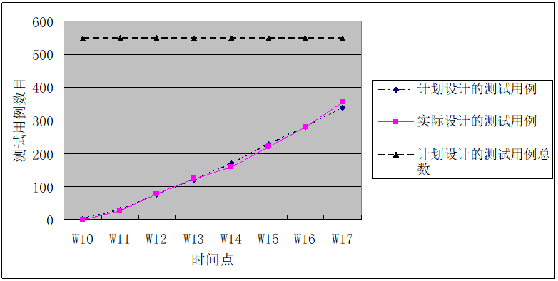

图5.3.1-1 项目测试用例设计进度

从测试度量数据结果来看（图5.3.1-1），当前（第17周）的测试用例设计比计划完成的测试用例还多一些，表明当前测试设计总体进度情况良好。而且从历史趋势来看，实际进度和计划的进度偏差不大，从侧面说明实际的测试设计进度比较稳定，当前总体的测试用例设计进度比较可控。

5.3.2 测试报告的目的、内容和受众

测试报告的目的是在测试活动期间和结束时（例如某测试级别），总结和交流测试活动的信息。ISO标准（ISO/IEC/IEEE
29119-3）指定了两种类型的测试报告，测试状态报告和测试完成报告（在ISTQB大纲中称为测试进度报告和测试总结报告），并包含了这两种不同类型报告的结构和示例。

测试活动期间准备的测试报告可称为测试进度报告（对应ISO/IEC/IEEE
29119-3中的测试状态报告），而在测试活动结束时编写的测试报告可称为测试总结报告（对应ISO/IEC/IEEE
29119-3中的测试完成报告）。

在测试监控期间，测试经理需定期为利益相关者发布测试进度报告。除了测试进度报告和测试总结报告中相同的内容外，典型的测试进度报告还可能包括：

-   对照测试计划，当前测试活动和进度的状态

-   阻碍进度的因素

-   针对下个汇报阶段的计划的测试

-   测试对象的质量

ISO/IEC/IEEE 29119-3中的测试状态报告内容如下表5.3.2-1所示。

表5.3.2-1 测试状态报告模板

| 章节 | 标题                 | 备注                                              |
|------|----------------------|---------------------------------------------------|
| 1    | 概述                 | 报告的概要描述                                    |
| 2    | 文档相关信息         |                                                   |
| 2.1  | 概述                 |                                                   |
| 2.2  | 文档标识             | 每个文档都应该有一个唯一的标识                    |
| 2.3  | 发布组织             | 明确准备和发布该文档的组织，也包括作者            |
| 2.4  | 审批者               | 评审和批准该报告的人                              |
| 2.5  | 变更历史             | 描述文档的历史变更记录                            |
| 3    | 介绍                 |                                                   |
| 3.1  | 范围                 | 描述该报告包括的内容、不包括的内容、假设和/限制等 |
| 3.2  | 参考资料             |                                                   |
| 3.3  | 术语                 |                                                   |
| 4    | 测试状态             |                                                   |
| 4.1  | 报告的时间段         |                                                   |
| 4.2  | 与测试计划对应的进度 |                                                   |
| 4.3  | 影响进度的因素       |                                                   |
| 4.4  | 测试度量             |                                                   |
| 4.5  | 新的和有变化的风险   |                                                   |
| 4.6  | 下阶段的测试计划     |                                                   |

当满足出口准则时，测试经理将发布测试总结报告。该报告根据最新的测试进度报告和其他相关信息，对进行的测试做了总结。

典型的测试进度报告及测试总结报告可能包括：

-   测试执行的总结

-   测试期间所发生的信息

-   与计划之间的偏离，包括测试活动的时间进度、持续时间或工作量的偏差

-   针对出口准则或已完成定义中的测试状态和产品质量

-   曾经阻碍或继续阻碍进度的因素

-   缺陷、测试用例、测试覆盖率、活动进度和资源消耗的度量(如5.3.1所述)

-   剩余风险(见第5.5节)

-   生成的可重用的测试工作产品

ISO/IEC/IEEE 29119-3中的测试完成报告的内容如下表5.3.2-2所示。

表5.3.2-2 测试完成报告模板

| 章节 | 标题             | 备注                                              |
|------|------------------|---------------------------------------------------|
| 1    | 概述             | 报告的概要描述                                    |
| 2    | 文档相关信息     |                                                   |
| 2.1  | 概述             |                                                   |
| 2.2  | 文档标识         |                                                   |
| 2.3  | 发布组织         |                                                   |
| 2.4  | 审批者           |                                                   |
| 2.5  | 变更历史         |                                                   |
| 3    | 介绍             |                                                   |
| 3.1  | 范围             | 描述该报告包括的内容、不包括的内容、假设和/限制等 |
| 3.2  | 参考资料         |                                                   |
| 3.3  | 术语             |                                                   |
| 4    | 执行的测试       |                                                   |
| 4.1  | 执行的测试的总结 |                                                   |
| 4.2  | 与计划的偏差     |                                                   |
| 4.3  | 测试完成评估     |                                                   |
| 4.4  | 影响进度的因素   |                                                   |
| 4.5  | 测试度量         |                                                   |
| 4.6  | 遗留风险         |                                                   |
| 4.7  | 测试交付物       | 例如：各种测试文档、脚本等                        |

测试报告的内容将根据项目、组织要求和软件开发生命周期而有所不同。例如：相对于快速软件升级，一个有许多利害相关者的复杂项目或受监管的项目可能需要更详细和更严格的报告。还例如：在敏捷开发中，测试进度报告可以被纳入任务板、缺陷摘要和燃尽图中，这些可以在每日的站立会议中讨论（见ISTQB-AT基础级敏捷测试人员扩展大纲）。

除了根据项目背景对测试报告进行裁剪之外，测试报告还应根据报告的受众进行调整。针对技术受众或测试团队所包含的信息类型和数量，可能不同于针对管理层的总结报告中的内容。在前一种情况下，关于缺陷类型和趋势的详细信息可能很重要。而在后一种情况下，概要的报告（例如：按优先顺序、预算、时间进度和通过/失败/未测试测试条件的摘要状态）可能更合适。

*5.4配置管理*

测试管理与项目管理密不可分，配置管理也源于项目管理。

配置管理，是一种管理思维，它将项目中各个因素建立起关系，并持续更新与维护这种关系的完整性。无论是项目的范围、时间、成本、人力资源等，都是可配置，可管理的对象。配置管理贯穿于项目产品的整个生命周期，从项目管理的角度来说，任何能够影响到项目的因素皆属于配置对象，都应进入配置管理系统进行有效的管理。

在软件项目开发过程中，需求的变更是经常发生的，或者随着对软件对象的理解的不断深入，需要对工作产品进行修改或者更新。这些变更，都会对测试工作产品产生影响。例如，不同的人对不同的文档进行创建和修改，如何对不同文档的版本进行控制将成为非常大的一个问题。下面举两个例子：

-   由于软件系统的两个功能需求发生了变更，需要测试人员A和B对相关的测试用例进行修改。测试经理将一个功能需求分配给了测试人员A，将另外一个功能需求分配给了测试人员B。他们需要对同一批测试用例进行修改。当测试人员A将修改的测试用例保存的时候，很不幸，将一天前测试人员B修改的内容覆盖掉了。

-   测试人员开始了测试执行。测试人员在执行测试用例的过程中，发现软件的输出和测试用例中的期望结果不一致，因此测试人员提交了一个事件报告给开发人员。开发人员看了以后，直接就拒绝了这个缺陷，理由是测试用例中提到的需求已经变更，现在的系统就应该是这样设计的。

以上的问题，在测试过程中会经常碰到。这就需要软件配置管理，它也是项目管理的重要组成部分，利用配置管理来控制测试过程中的变更，以避免这些问题的发生。

为了正确地支持测试，配置管理需要确保：

-   所有测试项都是唯一的标识、版本控制、变更跟踪和相互关联

-   测试件的所有条目都唯一的标识、版本控制、变更跟踪、相互关联并与测试项的版本关联，以便在整个测试过程中保持可追溯性

-   所有识别的文档和软件项在测试文档中明确引用

测试不是独立的阶段或者活动，它与项目管理紧密的关联，因此配置管理在测试过程中及其重要，对测试起到支持和支撑的作用；应该将所有已识别的所有文档，环境、测试对象以及过程的产出物纳入到管理范畴。所有文档包含但不限于需求文档、概要设计、详细设计、代码、用例、部署手册（环境或系统）；环境包含但不限于开发、测试、准生产以及生产环境。

配置管理，不断向前推进记录也可以回溯，查找问题。它是对整个项目的一个整体镜像，是项目的产出，组织过程资产；也是对任意时刻的一个切片，记录某一时刻各个元素的状态属性等。

在现在的项目中，通常会使用一些比较通用的管理系统来提供一个记录功能，记录用例、代码和文档等的版本信息，常见的如项目管理平台、版本管理系统、用例管理平台和缺陷管理平台等。

*5.5风险与测试*

5.5.1 风险定义

风险源于不确定性。风险涉及将来发生且具有负面后果的事件的可能性。该概念和PMBOK中的风险不太一致（项目风险是一种不确定的事件或条件，一旦发生，就会对一个或多个项目目标造成积极或消极的影响，如范围、进度、成本和质量。风险可能有一种或多种起因，一旦发生就可能造成一项或多项影响。风险的起因可以是已知或潜在的需求、假设条件、制约因素或某种状况，可能引起消极或积极结果）。

风险是一个概率，一种可能性，而且一定是将来的。已经发生的事件，不能称之为风险。

风险级别由事件的可能性/概率和该事件的影响（损害）决定。图5.5.1-1是一个概率和影响矩阵的例子。

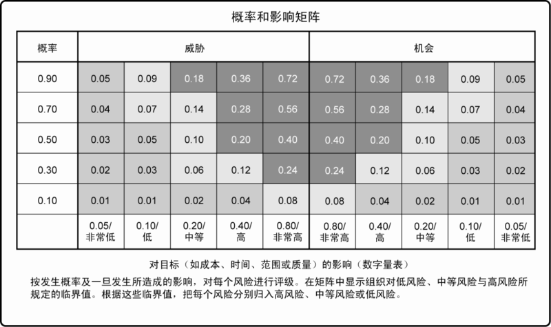

>   图片

>   图5.5.1-1 概率和影响矩阵

只有事件的严重性，或者只有事件的可能性，是不能决定风险的级别。两者缺一不可！

概率和影响矩阵，可以是数值，也可以是级别（例如非常高、高、中、低、非常低等定义）。

基于风险的测试，首先要识别风险并评估风险的级别（概率×影响）；然后依据风险级别，分配相应的测试资源；在测试的过程中，重新识别风险的级别；周而复始。

已知风险是指已经识别并分析过的风险，可以对这些风险规划应对措施。已知但又无法主动管理的风险，要分配一定的应急储备。未知风险无法进行主动管理，因此要分配一定的管理储备。

5.5.2 产品和项目风险

产品风险涉及工作产品可能无法满足其用户和/或利益相关方的合法要求。当产品风险与产品的特定质量特性（八大特性，见图2.3.2-1。功能性、性能效率、易用性、可靠性、兼容性、信息安全性、维护性、可移植性）相关联时，产品风险也称之为质量风险。例如：

-   软件无法按照规格说明完成其预期的功能

-   软件无法根据用户、客户和/或利益相关者的要求完成其预期功能

-   系统架构无法充分支持某些非功能性需求

-   在某些情况下，特定计算是错误的

-   循环控制结构编码不正确

-   对高性能事务处理系统而言，响应时间不够

-   用户体验反馈达不到产品预期

项目风险涉及的情况如果发生，会对项目实现其目标的能力产生负面影响。例如：

-   项目问题：

    -   在交付、任务完成或满足出口准则或已完成的定义方面出现延迟

    -   不准确的估算，将资金重新分配给更优先的项目，或组织中的费用削减导致资金不足

    -   很晚的变更导致实质性的返工

-   组织问题：

    -   没有足够的技能、培训和工作人员

    -   个人问题导致的冲突和问题

    -   由于业务优先级冲突，导致用户、业务人员或专题专家的不可用

-   行政（Political）问题：

    -   测试人员无法充分表达他们的要求和/或测试结果

    -   开发人员和/或测试人员无法跟踪测试和评审中发现的信息（例如：无法改进开发和测试实践）

    -   对测试不恰当的态度或期望（例如：不重视在测试过程中发现缺陷的价值）

-   技术问题：

    -   需求没有被很好的定义

    -   鉴于当前存在的限制，需求无法得到满足

    -   测试环境没有按时就绪

    -   数据转换、迁移规划及其工具支持出现延迟

    -   开发过程中的不足，影响项目工作产品的一致性或质量，如设计、代码、配置、测试数据和测试用例

    -   缺陷管理不善和类似问题导致缺陷的不断积累和其他技术债务

-   供应商问题：

    -   第三方无法提供必要的产品或服务

    -   破产、合同问题给项目带来问题

项目风险既影响开发活动，也会影响测试活动。在某些情况下，项目经理负责处理所有项目风险，但测试经理负责与测试有关的项目风险并不少见。

如何区分产品风险和项目风险？

-   产品风险，可以看成具体的BUG，是开发质量问题。只有最终交付给用户的产品可能出现的问题才是产品风险。任何开发过程中的需求、设计、编码或测试用例等质量可能出问题都是项目风险。

-   项目风险，可以看成BUG或者开发质量问题发生的原因，是项目上的问题（如成本、供应商、管理），或者研发过程中的问题（范围、进度、人力资源、沟通）。

5.5.3 基于风险的测试和产品质量

测试是用来降低不利事件发生的概率，或减少不利事件的影响。

测试作为一种风险缓解活动，为已识别的风险提供反馈，并提供剩余（未解决）风险的反馈。测试是一种反馈机制，向项目干系人反馈信心程度。

风险管理包括规划风险管理、识别风险、实施风险分析、规划风险应对和控制风险这些过程。

-   规划风险管理：定义如何实施风险管理活动的过程。

-   识别风险：判断哪些风险可能影响产品质量/项目并记录其特征的过程。

-   实施风险分析：包括实施定性风险分析（评估并综合分析风险的发生概率和影响，对风险进行优先排序，从而为后续分析或行动提供基础的过程）和实施定量风险分析（就已经识别的风险对项目整体目标的影响进行定量分析的过程）。

-   规划风险应对：针对项目目标，制定提高机会、降低威胁的方案和措施的过程。

-   控制风险：在整个项目中实施风险应对计划、跟踪已识别风险、监控残余风险、识别新风险，以及评估风险过程有效性的过程。

基于风险的测试方法为降低产品风险级别提供了积极主动的机会。它涉及产品风险分析，其中包括识别产品风险和评估每个风险的可能性和影响。获取的产品风险信息用于指导测试规划、规格说明、测试用例的准备和执行，以及测试监控。尽早分析产品风险有助于项目的成功。

在基于风险的方法中，产品风险分析的结果可用于风险应对：

-   确定应采用的测试技术

-   确定要进行的测试特定级别和类型（例如安全测试、辅助性测试）

-   确定要进行的测试范围

-   确定测试优先级，以尽早发现重要缺陷

-   确定除测试外是否还可采用其他活动来降低风险(例如：向缺乏经验的设计人员提供培训、追加资源（人力、时间）

基于风险的测试利用项目利益相关者的集体知识和洞察力来进行产品风险分析。为确保尽量降低产品失效的可能性，风险管理活动提供了原则性的方法：

-   识别风险：分析（并定期重新评估）哪些可能出错（风险）

-   实施定性/定量风险分析：确定哪些风险是重要的，需要处理

-   规划风险应对：制定应急计划，以应对风险变成实际的事件

-   控制风险：采取行动减轻这些风险

此外，测试还会识别新的风险，帮助确定应哪些风险应该缓解，并降低风险的不确定性。

*5.6缺陷管理*

测试过程中发现的缺陷应该予以记录。基于测试组件或系统的背景、不同测试级别和软件开发生命周期模型，记录缺陷的方式会有所不同。任何识别的缺陷都应该被分析，并跟踪从发现到分类解决问题的过程（例如：修复缺陷和成功验证解决方案、推迟到后续的发布、接受为永久性产品限制等）。

为了管理所有缺陷，组织应建立缺陷管理流程，其中包括工作流（缺陷状态流转）和分类规则。这个流程必须与参与缺陷管理的所有人达成一致，包括设计人员、开发人员、测试人员和产品所有者，因为这些相关干系人可能负责缺陷状态的流转、审阅。在一些组织中，缺陷记录和跟踪可能是非常不正式的。

在缺陷管理流程中，有一些缺陷会被定位为假阳性（误报），该失效并不是由于被测系统中的缺陷造成的。例如由于网络断联或超时造成的测试失败，这一现象并非是待测系统的缺陷导致的，而需要针对该异常进行分析。测试人员应该力争减少此类误报的数量。

系统经过测试后，由使用方发现的缺陷，这就是假阴性（漏报）。按照测试的基本原则，漏报是不可避免的。漏报的缺陷要纳入到缺陷管理中，进行跟踪。

从系统的需求阶段到上线使用阶段，整个产品生命周期中，都可以报告缺陷。缺陷不仅仅存在运行的系统或代码中，还存在于各种相关文档中，例如需求、用户故事和验收准则、开发文档、测试文档、用户手册或安装指南。为了构建有效和高效的缺陷管理流程，组织可以为缺陷的属性、分类和工作流定义标准。

典型的缺陷报告有以下目标：

-   向开发人员和其他当事方提供关于所发生的任何异常事件的信息，使他们能够识别具体影响，用最小的重现测试步骤将问题分离出来，并根据需要纠正潜在的缺陷，或以其他方式解决问题。

-   向测试管理人员提供一种手段，以跟踪工作产品的质量及其对测试的影响（例如：如果报告了大量缺陷，测试人员将花费大量时间报告这些缺陷，而不是进行测试，同时需要更多的确认测试）。

-   为改进开发和测试过程提供思路。根据缺陷的属性和分类，可以从多个维度进行统计分析，识别新风险。

在动态测试期间提交的缺陷报告通常包括：

-   标识符

-   标题和所报告缺陷的简短摘要

-   缺陷报告日期、发现的组织和作者

-   测试项(被测试的配置项)和环境的标识

-   发现缺陷的开发生命周期阶段

-   缺陷描述以便能够复现和修复，包括日志、数据库转储截图或录音(如果在测试执行期间发现)

-   预期和实际结果

-   缺陷对利益相关者的的影响范围或程度(严重程度)

-   修复的紧急程度/优先级

-   缺陷报告的状态(例如：打开、推迟、重复、等待修复、等待确认测试、重新打开、关闭)

-   结论、建议和核准

-   全局性问题，例如可能受到缺陷所引起的变更影响的其他领域

-   变更历史，如项目小组成员采取的行动顺序，从缺陷隔离、修复和到确认缺陷已修复

-   参考资料，包括发现问题的测试用例

图5.6-1是某缺陷报告截图（仅供参考）。

图5.6-1 缺陷报告的例子

缺陷报告中包含的信息越多，越有利于统计分析过程改进，但也会增加相应工作量，应做好平衡。

在使用缺陷管理工具时，上述细节中的一些内容可以自动生成或自动管理，例如工作过程中自动分配标识符、分配和更新缺陷状态等。静态测试中发现的缺陷，特别是评审，通常会以不同的方式记录，例如在评审会议记录中。

合理利用缺陷管理工具（付费、开源、Excel等），有助于从不同维度分析缺陷报告，更方便反馈质量信心。图5.6-2展示的是一个缺陷按照严重级别和状态分布的统计。

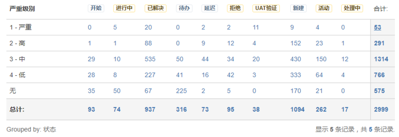

图5.6-2 缺陷按照严重级别和状态分布

图5.6-3展示的是随着项目的进行，提交和解决的缺陷统计缺陷。

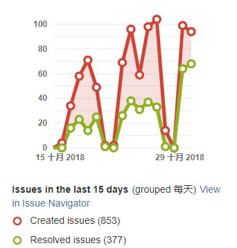

图5.6-3 缺陷按照时间统计曲线

缺陷报告内容的示例可在ISO标准（ISO/IEC/IEEE
29119-3）中找到（该标准将缺陷报告称为事件报告）。

6工具支持的测试

**关键词**

数据驱动的测试(data-driven testing)， 关键字驱动的测试(keyword-driven testing)，
性能测试工具(performance testing tool)， 测试自动化(test automation)，
测试执行工具(test execution tool)， 测试管理工具(test management tool)

**测试工具的学习目标**

**6.1测试工具的考虑**

FL-6.1.1 (k2)根据其用途和支持的测试活动对测试工具进行分类

FL-6.1.2 (k1)确定测试自动化的收益和风险

FL-6.1.3 (k1)牢记测试执行工具和测试管理工具的特殊考虑

6.2 有效使用工具

FL-6.2.1 (k1)识别选择工具的主要原则

FL-6.2.2 (k1)回顾利用试点项目引进工具的目标

FL-6.2.3 (k1)确定组织中评估、实施、部署和持续支持测试工具的成功因素

*6.1 测试工具的考虑*

6.1.1 测试工具分类

工具，顾名思义，是指工作时所需用的器具，后引申为达到、完成或促进某一事物的手段。工具是一个相对概念，因为其概念不是一个具体的物质，所以只要能使物质发生改变的物质，相对于那个能被它改变的物质而言就是工具。

百度百科上的解释（维基百科、谷歌）

以上，“权威”针对工具给出广袤而具体的解释。前面加上“测试”这个修饰语或者说是限定词，给缩小了工具的范围。应用于测试相关领域为达到、完成或促进某一事物的手段，即为测试工具，它是一个相对的概念，只要能完成或达到某一效果的“催化剂”或是手段都可以成为工具。

各种文章、测试相关书籍，以及
ISTQB初级、高级（测试管理、测试分析师、技术测试分析师）都含有关于测试工具的介绍。

认识到工具和技术之间的关系非常重要，技术是执行某个操作的过程，而工具是完成某个任务的方法。虽然软件测试技术有限，但是软件工具几乎是无限的。测试人员可以选择很多软件工具来完成指定的软件测试技术，就像木匠使用钉子、螺丝钉或粘合剂将两块木头固定在一起一样。可见，测试工具在测试执行、管理中的重要性。

引用《软件测试的有效方法》第三版，第四章第一节部分内容

那么测试工具究竟都有哪些，是怎么分类的呢？

工具可以按照多种规则进行分类，例如：目的、商业、免费/付费、开源、共享、使用的技术等。图6.1.1-1展示了软件测试工具的多样性。

图6.1.1-1 软件测试工具的类型

本文主要围绕测试工具所支持的测试活动来进行分类。一些工具提供的支持通常更适合开发人员（例如：在组件和集成测试期间使用的工具）。这些工具在以下各节中以"(D)"进行标识。

**测试和测试件管理的工具支持**

管理工具可适用于整个软件开发生命周期中的任何测试活动。支持测试和测试件管理的工具的例子包括：

-   测试管理工具和应用生命周期管理工具（ALM）

-   需求管理工具（例如：测试对象的可追溯性）

-   缺陷管理工具

-   配置管理工具

-   持续集成工具(D)

**静态测试的工具支持**

静态测试工具与第3章中描述的活动和收益相关联。这类工具的例子包括：

-   支持评审的工具

-   静态分析工具(D)

**测试设计与实现的工具支持**

测试设计工具有助于在测试设计和实现中创建可维护的工作产品，包括测试用例、测试规程和测试数据。这类工具的例子包括：

-   测试设计工具

-   基于模型的测试工具

-   测试数据准备工具

-   验收测试驱动开发（ATDD）和行为驱动开发（BDD）工具

-   测试驱动开发工具(TDD)（D）

在某些情况下，支持测试设计和实现的工具也可能支持测试执行和日志记录，或者将其输出直接提供给支持测试执行和日志记录的其他工具。

**测试执行与记录的工具支持**

有许多工具可以支持和增强测试执行和日志记录活动。这些工具的例子包括：

-   测试执行工具（例如：运行回归测试）

-   覆盖工具(例如：需求覆盖、代码覆盖(D))

-   测试用具(D)

-   单元测试框架工具(D)

**性能测量和动态分析的工具支持**

性能测量和动态分析工具对于支持性能和负载测试活动是必不可少的，因为这些活动不能有效地通过手工完成。这些工具的例子包括：

-   性能测试工具

-   监视工具

-   动态分析工具(D)

**特殊测试需要的工具支持**

除了支持一般测试过程的工具外，还有许多其他工具支持更具体的测试事件。其中包括侧重于以下方面的工具：

-   数据质量评估

-   数据转换和迁移

-   易用性测试

-   辅助性测试

-   本地化测试

-   安全性测试

-   可移植性测试（例如：在多个支持的平台上测试软件）

 6.1.2 测试自动化的收益与风险

当代社会，付出都要有回报，高大上一点儿的说就是讲究一个投资回报率。那么在投入大量的人工、时间、金钱的情况下，自动化测试的收益如何呢？接下来从企业投入产出的角度来对自动化回归测试的财务投入和财务产出进行量化的分析，让大家能够对自动化回归测试所带来的好处有个更直观的认识和了解。

下面介绍一个自动化收益分析的例子。

https://www.cnblogs.com/shadowicool/articles/1061219.html

*该案例中的自动化回归测试与手工回归测试经济效益分析数据的选取，是基于两个标准：*

1.  *所有工作量的估算数据都来自于多名5年以上测试经验工程师的建议。*

2.  *所有工作量的估算方法，都是以基于对厂商有利的原则。如：有意减少目前手工回归测试的工作量，加大自动化测试开发的时间和成本。希望在此基础上算出的数据也能让未开展自动化测试的厂商直观的看到开展自动化测试上在财务上仍然有着非常高的投入产出回报比。*

*分析数据的取样标准如下：*

1.  *人力成本估算标准：厂商研发成本计算标准1.5万人月( RMB )， 一个月的工作日为
    22天。*

2.  *工作量估算标准：模块单元以完成一个DHCP（动态主机设置协议，Dynamic Host
    Configuration
    Protocol）大小模块的工作量为一个模块单元，即1个模块单元的手工回归测试时间为16个工作小时（不含性能测试）。*

3.  *自动化开发标准：一个自动化测试模块的开发时间为手工测试时间的4倍。假设一个模块可自动化测试部分的手工测试执行时间为8小时。那么该模块的自动化测试开发时间＝手工测试执行时间8小时＋脚本开发时间
    8小时＋脚本调试时间16小时。*

*假设一个小型产品线大致有72个模块单元需要进行回归测试。*

*如果都是手工执行，完成一轮较全面的回归测试的成本：需要投入[(72个模块单元×16小时)/8]/22=6.5人月，对应的人力成本为6.5×1.5万＝9.75万。*

-   *如果有2人专门从事手工回归测试，完成一次较全面的回归测试需要3.25个月，一年可执行约4次全面回归测试。*

-   *如果有3人专门从事手工回归测试，完成一次较全面的回归测试需要2.17个月，一年可执行约6次全面回归测试。*

-   *如果有4人专门从事手工回归测试，完成一次较全面的回归测试需要1.625个月，一年可执行7次全面回归测试。*

*假设一半的功能可以转化为自动化测试，从测试执行的人力投入上可以从6.5个人月减少到3.25个人月。那么每次全面回归测试需要投入费用也减少3.25×1.5=4.875万。*

*此时完成一次较全面的回归测试：*

-   *如果有2人专门从事剩余的手工回归测试，需要约1.6个月，一年执行约7次全面回归测试。较未自动化测试前可多测试3次，同时人均生产率提高了约75％。*

-   *如果有3人专门从事剩余的手工回归测试，需要1个月，一年执行12次全面回归测试。较未自动化测试前可多测试6次，同时人均生产率提高了约50％。*

-   *如果有4人专门从事剩余的手工回归测试，需要0.8个月，一年执行15次全面回归测试。较未自动化测试前可多测试8次，同时人均生产率提高了约110％。*

*自动化测试开发成本计算（每个单元只有一半转化为自动化）：*

>   *总开发时间=72个模块单元×8×4/2＝1152小时＝288天/22＝6.5人月*

>   *自动化测试开发成本=6.5×1.5万＝9.75万*

*自动化测试过后，每轮手工回归测试直接节省的成本为原全手工测试成本的一半即每轮回归测试可节省9.75/2=4.875万。*

*因此两轮较全面的回归测试就可以收回所有的自动化测试的开发成本。*

总的规律是：一年中进行的全面手工回归测试的次数越多，自动化测试的投入产出比越高。以目前某顶尖网络设备企业为例，它的自动化回归测试程度可以达到一周2轮全面回归测试来保证产品的质量，48小时完成一轮回归测试，72小时输出所有报表。从而大大解放了测试工程师的生产力，让其可以专注于新模块和新方法的测试，同时不用担心老模块的质量问题。

在阐述自动化测试的优劣势和风险之前，先来说下对自动化测试的理解上的一些误区；

-   是不是所有测试用例都可以自动化：不是所有的测试用例和测试步骤都可以转化为自动化测试。在自动化测试投入较多的行业领先企业其自动化测试率有的能达到80％左右，但仍有20％左右的测试用例需要手工来进行测试。在国外通常从开发第一版测试用例时，就同步进行自动化测试脚本的开发。

-   自动化测试找不到bug：自动化测试不直接找bug，而是通过解放有经验的测试工程师的生产力，让其从重复的回归测试中解放出来，从事新测试方法和测试手段的研究。通过自动化测试解放出的生产力来间接找到更多更深层次的新bug，将产品质量再提高一个档次。

-   自动化测试一定会马上大量减少测试人员数量：自动化测试不会大量减少测试人员数量。因为开展自动化测试初期需要投入一定的人力进行自动化测试脚本开发，并逐渐将自动化测试脚本用于日常的测试中，逐步减少手工测试人员从事重复劳动的时间和人数。为了缩短自动化测试脚本的开发时间，可考虑将自动化测试脚本的开发工作借助外包的力量来早日实现大规模的自动化测试。

-   自动化测试能代替手工测试：自动化测试不适合新功能测试，而是适合用于软件质量稳定且经常需要被测试的模块。

-   只有性能测试才需要自动化：自动化测试不光进行性能测试，更被大量应用于功能测试验证，超过半数的自动化测试脚本都是用于功能验证测试。

通常自动化回归测试较手工回归测试有如下优势：

1.  大大缩短回归测试项目的时间，在减少了人力投入的同时，更能保证研发项目能按时市场发布。甚至能缩短研发周期，提前发布产品。

2.  在同样的产品研发时间内，能对产品进行更全面的多次测试，将新引入的问题尽可能的在产品发布前挖掘出来。

3.  能保障回归测试的质量。因为每次自动化回归测试都是保持同一个标准的步骤、环境和测试方法。所以测试结果具有一致性。

4.  让更有经验的测试工程师从回归测试中解放出来，专注于新的测试方法的研究，来发现更多产品深层次的问题。

5.  减少测试工程师人数，降低研发成本。因为实施自动化回归测试后，厂商就不用像以前一样保留大量的人力来专职进行回归测试。

6.  能避免测试人力和时间的紧张，而降低了回归测试的质量要求，导致引入了新问题而未被发现。

7.  没有在手工回归测试中因为测试工作的重复性和测试工程师对已测过功能的过于自信，而导致测试覆盖面不全，新引入问题没被发现的人为隐患。

8.  避免了部分工程师非主观的疏忽大意，没有发现新引入的问题。

9.  对程序的回归测试更方便。这可能是自动化测试最主要的任务，特别是在程序修改比较频繁时，效果是非常明显的。由于回归测试的动作和用例是完全设计好的，测试期望的结果也是完全可以预料的，将回归测试自动运行，可以极大提高测试效率，可以极大提高测试效率，缩短回归测试时间。

10. 可以运行更多更繁琐的测试。自动化的一个明显的好处是可以在较少的时间内运行更多的测试。

11. 可以执行一些手工测试困难或不可能进行的测试。比如，对于模拟大量用户的测试，不可能同时让足够多的测试人员同时进行测试，但是却可以通过自动化测试模拟同时有许多用户，从而达到测试的目的。

12. 更好地利用资源，将繁琐的任务自动化，可以提高准确性和测试人员的积极性，将测试技术人员解脱出来投入更多精力设计更好的测试用例。有些测试不适合于自动化测试，仅适用于手工测试，将可自动测试的测试自动化后，可以让测试人员专注于手工测试部分，提高手工测试的效率。

13. 测试具有一致性和可重复性。由于测试是自动执行的，每次测试的结果和执行的内容的一致性是可以得到保障的，从而达到测试的可重复的效果。

14. 测试的复用性。由于自动化测试通常采用脚本技术，这样就有可能只需要做少量的甚至不做修改，实现在不同的测试过程中使用相同的用例。

15. 增加软件信任度。由于测试是自动执行的，所以不存在执行过程中的疏忽和错误，完全取决于测试的设计质量。一旦软件通过了强有力的自动测试后，软件的信任度自然会增加。

自动化测试的缺点：  

1.  不能取代手工测试，有很多需要人脑判断结果的测试用例无法用自动工具实现，或者代价太大；

2.  手工测试比自动化测试发现的缺陷更多； 

3.  对测试质量的依懒性极大；

4.  测试自动化不能提高有效性；

5.  测试自动化可能会制约软件开发，由于自动测试比手动测试更脆弱，所以维护会受到限制，从而制约软件的开发；

6.  工具本身并无想象力。

综上所述，自动化测试完成不了的，手工测试可以弥补，两者有效的结合是测试质量保证的关键。 

6.1.3 测试执行与测试管理工具的特殊考虑

采用什么样的自动化测试方案，需要考虑以下几个方面的因素：

-   项目的影响：自动化测试能否对项目的进度、覆盖率、风险有所帮助，或者让开发更敏捷？

-   复杂度：自动化是否容易实现，包括数据和其他环境的影响。

-   时间：自动化测试的实现需要多少时间？

-   早期需求和代码的稳定性：需求或早期的代码是否能证明是在范围内变化的？

-   维护工作量：代码是否能长期保持相对稳定？功能特性是否会进化？

-   覆盖率：自动化测试能否覆盖程序的关键特性和功能？

-   资源：测试组是否拥有足够的人力资源、硬件资源和数据资源来运行自动化测试。

-   自动化测试的执行：负责执行自动化测试的小组是否拥有足够的技能和时间去运行自动化测试？

采用不同的项目开发模型对自动化测试有不同的影响。

-   瀑布模型：瀑布模型在需求定义方面做得很好，这对自动化测试是有益的，包括可以尽早选择合适的自动化测试策略，让自动化测试可以从高层次、整体进行计划。

-   增量迭代模型：意味着频繁的变更，自动化测试需要与开发策略紧密结合，关注早期构建、迭代的速度、风险、覆盖目标等。

Bob Galen，Sizing up Automation Candidates – Selecting Which Tests，When To
Automate Them，and Which To Take Off the Ticket Entirely

为了顺利和成功地实现自动化测试，在选择和集成测试执行和测试管理工具到组织中时，有许多事情需要考虑。

**测试执行工具**

测试执行工具使用自动化测试脚本执行测试对象。这类工具往往需要付出巨大的工作量，才能取得显著的收益。

通过记录手动测试人员的动作来捕获测试似乎很有吸引力，但是这种方法无法应用到大量测试脚本的情况。捕获的脚本是作为每个脚本一部分的带有特定数据和动作的线性表示。当不可预料的事件发生时，这种类型的脚本是不稳定的。最新一代的工具利用了"智能"图像捕捉技术，增强了这类工具的效用，尽管生成的脚本仍然需要随着系统用户界面的发展不断进行维护。

数据驱动的测试方法将测试输入和预期结果分离出来，通常放入电子表格中，并使用更通用的测试脚本，通过读取输入数据并使用不同的数据执行相同的测试脚本。不熟悉脚本语言的测试人员可以为这些预先定义的脚本创建新的测试数据。

在关键字驱动的测试方法中，通用脚本处理描述要采取的动作的关键字（也称为动作词），然后调用关键字脚本处理相关的测试数据。测试人员（即使他们不熟悉脚本语言）可以使用关键字和相关数据定义测试，这些关键字和相关数据可以根据正在测试的应用程序进行裁剪。数据驱动和关键字驱动的测试方法的进一步细节和例子，可以参考ISTQB-TAE高级测试自动化工程师大纲。

上述方法需要有人具备脚本语言的专门知识（测试人员、开发人员或测试自动化方面的专家）。无论使用何种脚本技术，每个测试的预期结果都需要与测试的实际结果进行比较，或者是动态的（在测试运行时），或者是存储供以后（执行后）比较。

基于模型的测试（MBT）工具能够以模型的形式捕获功能规格说明，例如活动图。此任务通常由系统设计人员执行。MBT工具解释模型以创建测试用例规格说明，然后保存在测试管理工具中和/或通过测试执行工具执行（见ISTQB-MBT基础级别基于模型的测试大纲）。

**测试管理工具**

测试管理工具经常由于各种原因需要与其他工具或电子表格相互交互，包括：

-   以适合本组织要求的格式提供有用的信息

-   对需求管理工具中的需求保持一致的可追溯性

-   在配置管理工具中与测试对象版本信息链接

*6.2有效使用工具*

6.2.1 工具选择的主要原则

>   **1、适用**

在选择工具的过程中，并不是说功能越多越好，适用才是根本，工具越适合于需完成的任务
，测试的过程就越有效。即主要考虑与测试对象进行交互的质量。主要考虑的因素包括：

-   能寻找测试对象的缺陷

-   节省测试时间

-   协助问题的诊断

-   能改进测试的机会

>   **2、工具引入的一致性**

了解测试对象使用的技术，选择与该技术兼容的工具。该工具是否适用于测试对象和开发环境？

要选择适合软件生命周期各阶段的测试工具。如：

-   基于嵌入式的测试可选择LDRA Testbed、GESTE、Logiscope等；

-   程序编码阶段可选择Tele2logic 公司的Logiscope 软件、Rational
    公司的Purify系列等;

-   测试和维护阶段可选择Compuware 的Dev2Partner 和Telelogic 的Logiscope 等。

>   **3、与现有开发环境的持续集成性**

考虑与已经使用的构建和其他工具持续集成的可能性。确保工具之间的兼容性和集成性。如果想避免自动化测试产生的延迟，团队最终会把工具放入持续集成的进程中。持续集成下的测试产生一个新的需求：测试需要对代码进行版本化。当创建新的代码分支时，我们会创建一个新的测试分支。这样，具有多个"正确"定义的多个持续集成管道可以同时运行。

>   **4、组织的能力**

主要从工具使用人员的技术能力、组织的资金、组织成熟度方面的优势、弱势等方面考虑。

-   考虑工具使用人员的技术能力，选择成熟度好、易于测试人员使用、方便上手、易于搭建的工具；

-   组织的资金，考虑购买成本、相关的培训、辅导费用。

>   **5、工具输出报告**

若测试工具没有对使用者输出有意义的东西，那它就是一项糟糕的投资。除非团队想要把测试结果推到另一个系统以获取更好的测试报告，否则输出的各种图表功能可能就没用。

随着时间的推移，跟踪测试也可能是一个非常强大的功能。不同层次的领导关心不同的结果。高水平的主管可能并不想知道成功失败比率的走向；中层管理人员希望了解工作流程；技术人员希望深入了解特定测试中出错的细节，如果可能的话，观看执行的视频。

>   **6、工具制造商的服务、可靠性、维护成本、价格以及使用期限**

如果长期使用，考虑成熟稳定的供应商提供的工具，供应商的支持人员能够正确解答各种疑难问题；如果短期使用，考虑开源的非商业工具的支持，此时注重完成测试的符合度。最重要的是工具带来的预期收益要大于购买和培训工具使用的费用。

6.2.2 组织内引入工具的试点项目

完成工具选择的理论分析后，要付诸实践，需要将该工具引入公司。为此要实施一个试点项目，以验证在实际的项目环境下是否确实能实现预期的优势和利益。试验项目不应该由参与评估的人员来进行，以防在解释评估结果时可能产生的利益冲突。

在工具的引入开始阶段，需要工具用户和相关人员大量且不断的投入，产生额外的工作量。因此在公司上下大范围内宣扬工具是不合适的，一般指导和培训有助于给将来的使用者带来信心。

运行试点项目，可以获取有关工具技术细节的信息、工具的实际使用经验、有关应用环境的经验，以及明确是否进行大范围的培训，培训到什么程度等问题。此外，还应该制定广泛使用工具的规范和规则。同时判定构建测试库是否合理，以便促进其他项目中的重要模块。

工具引入试点项目的成功因素有以下几点：

-   逐步引入。深入了解该工具，了解其优点和缺点

-   将工具集成到过程中，验证该工具在实际使用中与预期的符合度，并确定需要改变的地方

-   制定应用工具的规则并提供建议

-   接受培训和持续指导

-   收集使用经验并传授给所有用户相关的方法和技巧

-   监测工具的接受度并收集和评估成本效益数据。

一般的引入步骤：

1.  开展试点项目

2.  评估试点项目经验

3.  调整过程并制定使用规则

4.  接受培训

5.  逐步引入工具

6.  提供相应指导

6.2.3 使用工具的成功因素

如何让工具在组织内成功使用起来，使工具发挥其真正价值，给组织带来收益呢？正确的对工具进行评价、执行、部署以及持续支持等方面的工作。从以下几个方面考虑：

-   明确使用目标，并把目标细化，确保在技术和组织上能集成到组织的软件开发生命周期中，有助于工具使用的实施。

-   得到高层的支持，推广并使用起来，使参与者都积极参与进来。

-   使用过程中，调整、改进相关过程和规范，以适用工具的使用。

-   推广使用过程中，对工具进行培训和辅导。确保使用初期对工具能快速上手，快速掌握。使用过程中，遇到问题，及时辅导，消除使用过程中的障碍，提高使用信心。

-   在实际使用过程中，收集使用者的反馈信息。

-   对使用过程进行监视，对其收益随时进行预估和评价

-   收集使用经验和教训，整理，共享，使成为组织的过程资产。

7 参考资料

标准

ISO/IEC/IEEE 29119-1 (2013) Software and systems engineering - Software testing
- Part 1: Concepts and definitions

ISO/IEC/IEEE 29119-2 (2013) Software and systems engineering - Software testing
- Part 2: Test processes

ISO/IEC/IEEE 29119-3 (2013) Software and systems engineering - Software testing
- Part 3: Test documentation

ISO/IEC/IEEE 29119-4 (2015) Software and systems engineering - Software testing
- Part 4: Test techniques

ISO/IEC 25010， (2011) Systems and software engineering – Systems and software
Quality Requirements and Evaluation (SQuaRE) System and software quality models

ISO/IEC 20246: (2017) Software and systems engineering — Work product reviews

UML 2.5， Unified Modeling Language Reference Manual，
http://www.omg.org/spec/UML/2.5.1/， 2017

GBT 25000.10-2016-系统与软件工程
系统与软件质量要求和评价（SQuaRE）第10部分：系统与软件质量模型

GBT 25000.51-2016-系统与软件工程
系统与软件质量要求和评价（SQuaRE）第51部分：就绪可用软件产品（RUSP）的质量要求和测试细则

ISTQB 文档

ISTQB Glossary

ISTQB Foundation Level Overview 2018

ISTQB-MBT Foundation Level Model-Based Tester Extension Syllabus

ISTQB-AT Foundation Level Agile Tester Extension Syllabus

ISTQB-ATA Advanced Level Test Analyst Syllabus

ISTQB-ATM Advanced Level Test Manager Syllabus

ISTQB-SEC Advanced Level Security Tester Syllabus

ISTQB-TAE Advanced Level Test Automation Engineer Syllabus

ISTQB-ETM Expert Level Test Management Syllabus

ISTQB-EITP Expert Level Improving the Test Process Syllabus

书和文献

Beizer， B. (1990) Software Testing Techniques (2e)， Van Nostrand Reinhold:
Boston MA

Black， R. (2017) Agile Testing Foundations， BCS Learning & Development Ltd:
Swindon UK

Black， R. (2009) Managing the Testing Process (3e)， John Wiley & Sons: New
York NY

Buwalda， H. et al. (2001) Integrated Test Design and Automation， Addison
Wesley: Reading MA

Copeland， L. (2004) A Practitioner’s Guide to Software Test Design， Artech
House: Norwood MA

Craig， R. and Jaskiel， S. (2002) Systematic Software Testing， Artech House:
Norwood MA

Crispin， L. and Gregory， J. (2008) Agile Testing， Pearson Education: Boston
MA

Fewster， M. and Graham， D. (1999) Software Test Automation， Addison Wesley:
Harlow UK

Gilb， T. and Graham， D. (1993) Software Inspection， Addison Wesley: Reading
MA

Graham， D. and Fewster， M. (2012) Experiences of Test Automation， Pearson
Education: Boston MA

Gregory， J. and Crispin， L. (2015) More Agile Testing， Pearson Education:
Boston MA

Jorgensen， P. (2014) Software Testing， A Craftsman’s Approach (4e)， CRC
Press: Boca Raton FL

Kaner， C.， Bach， J. and Pettichord， B. (2002) Lessons Learned in Software
Testing， John Wiley & Sons:

New York NY

Kaner， C.， Padmanabhan， S. and Hoffman， D. (2013) The Domain Testing
Workbook， Context-Driven Press: New York NY

Kramer， A.， Legeard， B. (2016) Model-Based Testing Essentials: Guide to the
ISTQB Certified ModelBased Tester: Foundation Level， John Wiley & Sons: New
York NY

Myers， G. (2011) The Art of Software Testing， (3e)， John Wiley & Sons: New
York NY

Sauer， C. (2000) “The Effectiveness of Software Development Technical Reviews:
A Behaviorally

Motivated Program of Research，” IEEE Transactions on Software Engineering，
Volume 26， Issue 1， pp 1-

Shull， F.， Rus， I.， Basili， V. July 2000. “How Perspective-Based Reading
can Improve Requirement Inspections.” IEEE Computer， Volume 33， Issue 7， pp
73-79

van Veenendaal， E. (ed.) (2004) The Testing Practitioner (Chapters 8 - 10)，
UTN Publishers: The Netherlands

Wiegers， K. (2002) Peer Reviews in Software， Pearson Education: Boston MA

Weinberg， G. (2008) Perfect Software and Other Illusions about Testing， Dorset
House: New York NY

其他

Black， R.， van Veenendaal， E. and Graham， D. (2012) Foundations of Software
Testing: ISTQB Certification (3e)， Cengage Learning: London UK

Hetzel， W. (1993) Complete Guide to Software Testing (2e)， QED Information
Sciences: Wellesley MA

Spillner， A.， Linz， T.， and Schaefer， H. (2014) Software Testing
Foundations (4e)， Rocky Nook: San Rafael CA
